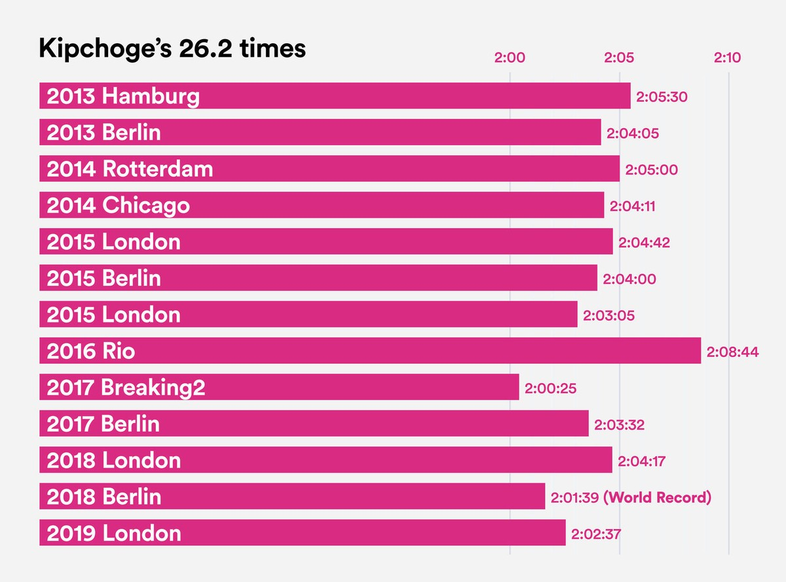
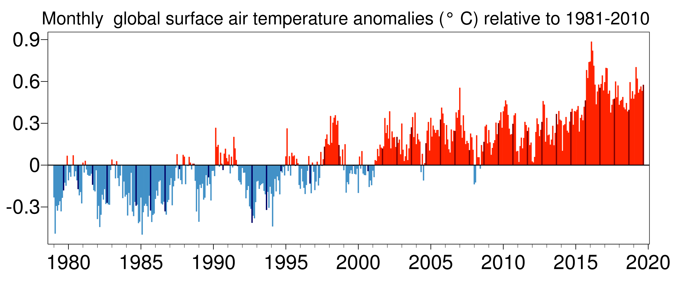

## Przemysław Chojecki


Jest to rozwiazanie pierwszej pracy domowej z Technik Wizualizacji Danych w ktorej moim zadaniem było przerysowanie w `ggplot2` znalezionej w internecie grafiki. Ze zwględu na problemy ze znalezeiniem odpowiednio skomplikowanej grafiki zdecydowałem się na stworzenie $2$ obrazków. Pierwsza wybrana przeze mnie grafika przedstawia wyniki czasów znanego biegacza maratonów Eliud'a Kipchoge'a. Dane na podstawie których powsał obrazek znalazłem na wikipedii. Drugi z wykresów przedstawia wykres zmian światowej temperatury w odpowiednich miesiącach.\

Żródła:\
artykuł pierwszy: https://www.highsnobiety.com/p/eliud-kipchoge-marathon-record-vienna/ \
dane: https://en.wikipedia.org/wiki/Eliud_Kipchoge \
artykuł drugi: https://spidersweb.pl/bizblog/wyzsze-temperatury-rekord/

### Oryginalny obrazek:\
{width=600px}


### Pobranie danych:
```{r}
library(RCurl)
library(XML)
library(dplyr)
library(stringi)

url <- "https://en.wikipedia.org/wiki/Eliud_Kipchoge"
strona <- readLines(url)
strona <- strona[728:920]

# do tabeli dane bede dopisywal informacje ze strony
dane <- matrix(nrow=14, ncol=6)
colnames(dane) <- c("Id", "Year", "Place", "Time", "Time_name", "WR")
dane <- tbl_df(dane)


# Id
dane$Id <- 14:1


# Year
indeksy_lat <- which(!(stri_extract_all_regex(strona, "</?td>(<i>)?20") %>%
                                                          unlist %>%
                                                          is.na)) # tylko zaczynajace sie od roku
indeksy_dat <- which(unlist(lapply(strona[indeksy_lat], FUN=nchar)) < 25) # indeksy dat
indeksy_lat <- indeksy_lat[indeksy_dat] # tylko interesujace mnie
# pozbycie sie miesiaca i dnia
dane$Year <- ifelse(nchar(strona[indeksy_lat])<20,
               strona[indeksy_lat] %>% substr(5, 8),
               strona[indeksy_lat] %>% substr(8, 11))


# Time_name
# tylko zaczynajace sie od czasu
indeksy_czasow <- which(!(stri_extract_all_regex(strona, "<td>(<i>)?(1|2):") %>%
                                                            unlist %>%
                                                            is.na)) # tylko zaczynajace sie od roku
# pozbycie sie pozostalosci po kodzie html
dane$Time_name <- ifelse(nchar(strona[indeksy_czasow])<15,
               strona[indeksy_czasow] %>% substr(5, 11),
               strona[indeksy_czasow] %>% substr(8, 14))


# Time
dane$Time <- integer(14)
# godziny
hours <- dane$Time_name %>% substr(1, 1) %>% strtoi
dane$Time <- dane$Time + hours * 60 * 60
# minuty
minutes <- dane$Time_name %>% substr(3, 4) %>% strtoi
minutes <- ifelse(is.na(minutes), 8, minutes) # zamiana NA na 8, bo odbywa sie pomylka # TODO
dane$Time <- dane$Time + minutes * 60
# sekundy
seconds <- dane$Time_name %>% substr(6, 7) %>% strtoi
dane$Time <- dane$Time + seconds


# Place
dane$Place <- strona[indeksy_czasow+2] # informacje o miescie sa o 2 dalej niz o czasie
dane$Place <- dane$Place %>% substr(5, nchar(dane$Place))
dane$Place <- dane$Place %>%
                startsWith("<i>") %>%
                ifelse(substr(dane$Place, 4, nchar(dane$Place)-4), dane$Place) # pozbycie sie <i>

# naprawianie pozostalych
dodatkowe_miasta <- dane$Place %>% stri_extract_all_regex("wiki[^\"]*") %>% unlist # wybor nazwy misat regex'em
dodatkowe_miasta <- dodatkowe_miasta %>% substr(6, nchar(dodatkowe_miasta))        # pozbycie sie pozostalosci
dane$Place <- dodatkowe_miasta %>% is.na %>% ifelse(dane$Place, dodatkowe_miasta)  # wpisanie do tabeli danych


# dodanie informacjii o rekordzie swiata
dane$WR <- character(14)
dane$WR[12] <- "(World Record)"
```


### Tworzenie obrazka:
```{r}
library(ggplot2)
przesuniecie <- function(x){
  # funkcja przesowa wektor, aby latwiej zauwarzyc roznice w czasach na obrazku
  (x-6000)
}


obrazek <- ggplot(data = dane, aes(x = Id)) + 
  geom_bar(stat= "identity", mapping = aes(y=przesuniecie(Time)), fill = "deeppink3", width=.75) + 
  coord_flip() +
  geom_text(aes(label = Time_name, y=przesuniecie(Time)+100, fontface="bold"), colour="deeppink3", size=3.5) +
  geom_text(aes(label = WR, y=przesuniecie(Time)+370, fontface="bold"), colour="deeppink3", size=3.5) + 
  geom_text(aes(label = paste(Year, Place), y=20, fontface="bold"), hjust=0, colour="white", size = 4.5) +
  ggtitle("Kipchoge's 26.2 times") + 
  scale_x_discrete(breaks=c()) + 
  scale_y_continuous(breaks=c(1200, 1500, 1800), labels=c("2:00", "2:05", "2:10")) +
  theme(plot.title = element_text(size=17, face="bold"),
        axis.title.x = element_text(color="white"),
        axis.title.y = element_text(color="white"),
        axis.text.x = element_text(face="bold", colour="deeppink3", size=10))
  
  
  

plot(obrazek)
```


Jak można zauwarzyć sam obrazek zaktualizowałem o najnowszy wynik biegacza.


### Drugi obrazek
{width=600px}


### Tworzenie obrazka:
```{r}
tbl <- read.csv("anomal.csv")

# destosowanie danych do rysunku
tbl$Year <- tbl$Month %>% as.character() %>% substr(1, 4)
tbl$Month <- tbl$Month %>% as.character() %>% substr(5, 6)
tbl$Id <- 1:dim(tbl)[1]
tbl <- tbl_df(tbl)


nazwy_x <- character(42)
nazwy_x[seq(2, 42, by=5)] <- seq(1980, 2020, 5) %>% as.character()
nazwy_y <- seq(-0.3, 0.9, by=0.3) %>% as.character()

ggplot(data=tbl, aes(x=Id, y=global)) +
  geom_bar(stat= "identity", fill=ifelse(tbl$global>0, "red", "blue")) +
  scale_x_continuous(breaks=seq(0, 492, by=12), labels=nazwy_x) + 
  scale_y_continuous(breaks=seq(-0.3, 0.9, by=0.3), labels=nazwy_y) + 
  ggtitle("Monthly global surface air temperature anomalies (\\circ C) relative to 1981-2010") + 
  theme(plot.title = element_text(size=14),
        panel.background = element_rect(fill = "white", colour = "grey50"),
        axis.title.x = element_text(color="white"),
        axis.title.y = element_text(color="white"),
        axis.text.x = element_text(size=15),
        axis.text.y = element_text(size=15))

```


