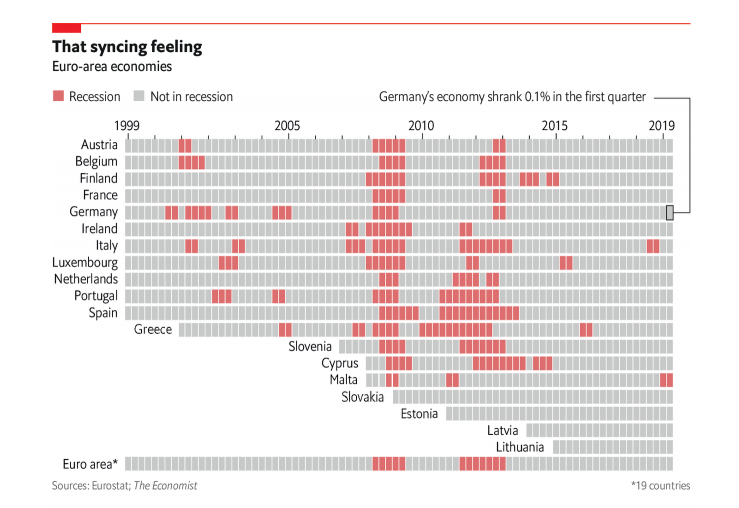

```{r setup, include=FALSE,cache=TRUE}
knitr::opts_chunk$set(echo = TRUE,cache=TRUE)
```


## Opis zadania

 Celem zadania było odtworzenie wykresu, który udało nam się znaleźć w internecie. 
Wykres w całości powinien być stworzony R oraz wykorzystywać bibliotekę ggplot. Po zbyt długich poszukiwaniach w internecie natrafiłem na ten wykres i własnie go będe odtwarzał. 

### Wzorzec
Wykres ten przedstawia na przestrzeni lat obecność zjawiska recesji w krajach których walutą jest euro. Pole czerwone oznacza recejse gospodarki w danym kwartale, a szary jej brak. Artykuł z którego pochodzi ta grafika posłużył jedynie za pretekst do rozmomy o aktualnej sytuacji gospodarzej Niemiec, ale w mojej opini jest genialną infografiką uzmysławiającą nie tylko trudniejsze momenty dla gospodarki, ale także skalę problemów, które zaistniały w ostatnich latach oraz to, jak problemy gospodarze jednego kraju mogą wpłynąć na wspólnotę europejską. 
```{r fig.width=8,fig.height=6, include=TRUE, fig.align="center", fig.cap=c("source"), echo=FALSE}

```

### Wykorzystane biblioteki

```{r message=FALSE,warning=FALSE}
library("tidyverse")
library("dplyr")
library("ggplot2")
```
## Ładowanie i przygotowanie danych do wykresu
Niestety w oryginalnym artykule nie było żadnego odnośnika do danych, więc stworzyłem je. Proces ten był nudny i długi, więc pominę go tu i po porstu załaduje przygotowaną paczkę. Jest ona dostępna w folderze projektu. Dodatkowo do prawidłowego skonstruowania wykresu potrzebuje by dane były w postaci discrete, bo inaczej mój label również byłby dynamiczny, a tego nie chcemy.
```{r}
#Załadowanie danych koniecznych przy rysowaniu wykresu
dane <- as.data.frame(read.csv("data.csv"))

#Zmiana danych z continuous -> discrete
dane["type"]%>%
  mutate_if(is.numeric,as.character) -> dane["type"]

```

Będę potrzebował jeszcze jednej ramki danych.
Ta posłuży mi przy nanoszeniu nazw krajów i będzie udawała dynamiczny y label.
 
```{r }

group <- data.frame(countries=unique(dane$country),
        join_year=c(rep(1999,11),2001,2007,2008,2008,2009,2011,2014,2015,1999))

# Tutaj natomiast potrzebujemy by nasze dane były liczbami, bo będziemy je nanosić na skale 'continuous'
group[-1]%>%
  mutate_if(is.character,as.numeric)%>%cbind(group[1]) -> group

```

## Kod i wykres
Chce tylko zaznaczyć, ze przy tworzeniu tego wykresu mocno wziąłem sobie do serca jak najdokładniejsze odwzorowanie szczegółów oryginału. Wymagało to użycia kilku sztuczek i dokładnego dostrojenia wartości niektórych zmiennych. Uważam jednak, że efektem końcowym jest ładny, przejrzysty wykres, w którym od razu widzoczne są odchylenia od normy. 
```{r wykres,fig.align="center",fig.width=12,fig.height=8 }

ggplot(dane,aes(y=country,x=x))+
  
    geom_tile(
              aes(fill=type),
              color="white",stat = "identity",size=0.7)+
  
    geom_text(
              data=group,
              aes(x=join_year,y=countries),
              label=group$countries,
              hjust=1.1, nudge_y=0.07 , size=5)+        
  
    geom_hline(
              yintercept = dane$y-0.5,
              size=1.4,color="white")+
  
    labs(
              title="That syncing feeling",
              subtitle = "Euro-area economies",
              caption = "*19 countries",
              tag = "Sources: Eurostat; TheEconomist",
              x="",y="",fill="")+ 
  
    scale_fill_manual(
              labels = c("Recession","Not in recession"), 
              breaks = c(2,1),
              values=c("#C6C7C8", "#DB6668")) +
  
    scale_x_continuous(
              position = "top",
              limits=c(1995,2020),
              breaks=seq(1999.25,2019.25,1),
              labels =c("1999.25"="1999","2000.25"="","2001.25"="","2002.25"="","2003.25"="",
                          "2004.25"="","2005.25"="2005","2006.25"="","2007.25"="","2008.25"="",
                          "2009.25"="","2010.25"="2010","2011.25"="","2012.25"="","2013.25"="",
                          "2014.25"="","2015.25"="2015","2016.25"="","2017.25"="","2018.25"="",
                          "2019.25"="2019"))+

    scale_y_discrete(
              limits=rev(unique(dane$country)),
              name ="")+
          
    theme( 
          panel.background = element_rect(fill="white"),
          axis.text.y =element_blank(),
          axis.ticks.y = element_blank(),
          axis.text.x = element_text(size=15),
          plot.title = element_text(size=28,face="bold",hjust=0.018),
          plot.subtitle = element_text(size=18,face=NULL,hjust=0.02),
          plot.caption = element_text(size=12,color = "darkgrey",hjust = 0.97),
          plot.tag = element_text(size=12,color="darkgrey",face = "italic"),
          plot.tag.position = c(0.17,0.018),
          legend.text = element_text(size=11),
          legend.position = "top",
          legend.justification = "left",
          plot.margin = unit(c(1,1,1,1),"cm"),
          axis.ticks.x = element_line(size=1,color = "darkgrey"),)


```


## Porównanie
Na koniec porównajmy oba wykresy.


```{r, echo=FALSE,out.width="80%",out.height="20%",fig.show='hold',fig.align='center'}
knitr::include_graphics(c("oryginal.png","small.png"))
```

