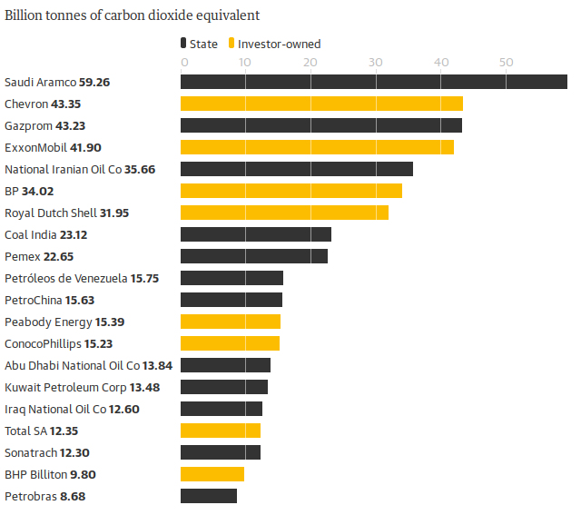

```{r setup, include=FALSE}
knitr::opts_chunk$set(echo = TRUE)
```

## Oryginalny wykres

Artykuł: <https://www.theguardian.com/environment/2019/oct/09/revealed-20-firms-third-carbon-emissions>

Wykres: 

{ width=80% }

Rozwiązując zadanie starałem się jak najdokładniej odwzorować powyższy wykres z użyciem biblioteki ggplot2.

## Rozwiązanie zadania

```{r plot, fig.height=5.5, fig.width=6}
library(ggplot2)

data <- read.csv('data.csv')
data$Owner <- factor(data$Owner, levels = rev(levels(data$Owner)))

myfunction <- function(x, y) bquote(.(x)~bold(.(y)))

make_labels <- function(value1, value2) {
  x <- as.character(value1)
  y <- as.character(value2)
  do.call(expression, mapply(myfunction, x, y))
}

ggplot(data) +
  geom_col(aes(reorder(Company, Emission), Emission, fill = Owner), width = 0.65) +
  scale_fill_manual(values=c('#333333', '#FCBC00')) +
  coord_flip() +
  scale_x_discrete(expand = c(0, 0), labels = make_labels(data$Company, data$Emission)) +
  scale_y_continuous(position = 'right', breaks = seq(0, 50, 10), minor_breaks = seq(0, 50, 10), expand = expand_scale(add = c(1, 0))) + 
  labs(fill = '', title = 'Billion tonnes of carbon dioxide equivalent') +
  theme(axis.title = element_blank(),
        axis.text.x = element_text(color = '#CDBFC5', size = 10),
        axis.text.y = element_text(hjust = 0),
        axis.ticks.x = element_line(color = '#CDBFC5'), 
        axis.ticks.y = element_blank(), 
        axis.line = element_blank(),
        panel.background = element_rect(fill = NA),
        panel.ontop = TRUE,
        panel.grid.major.x = element_line('white', 0.1),
        panel.grid.major.y = element_blank(),
        legend.position = c(0.21, 1.1),
        plot.margin = unit(c(4,1,1,1), 'lines'),
        legend.direction = 'horizontal',
        legend.key.height = unit(0.4, 'cm'),
        legend.key.width = unit(0.2, 'cm'),
        plot.title = element_text(size = 10, hjust = -1.65, vjust = 15)
        )
```