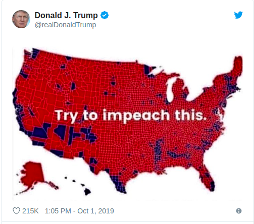

```{r setup, include=FALSE}
knitr::opts_chunk$set(echo = TRUE)
```

### On 1.10.2019 President Donald Trump tweeted:



```{r message=FALSE, warning=FALSE}
library(tidyverse)
library(urbnmapr)
library(urbnthemes)

set_urbn_defaults(style = "map")

# Data from 2016 US Presidential Elections
elections <- read.csv("https://raw.githubusercontent.com/tonmcg/US_County_Level_Election_Results_08-16/master/2016_US_County_Level_Presidential_Results.csv")

# Default map of US counties
counties_map <- get_urbn_map(map = "counties", sf = TRUE)

# County fips - Federal Information Processing Standard Publication - uniquely identifies counties and county equivalents in the United States
# Convert to integers for joining
counties_map$county_fips <- as.integer(counties_map$county_fips)

# Joining map data with elections data
elections_data <- left_join(counties_map, elections, by = c("county_fips" = "combined_fips") )

# Add variable for winning party in each county
elections_data$Winner <- ifelse(elections_data$per_gop > 0.5, "Republicans", "Democrats")

# Missing data, fill them with actual Winner / mean value
elections_data[is.na(elections_data$Winner), "county_name.x"]

# Oglala Lakota County - democrats won, source:
# https://en.wikipedia.org/wiki/2016_United_States_presidential_election_in_South_Dakota

# Kusilvak Census Area - democrats won, source:
# https://en.wikipedia.org/wiki/2016_United_States_presidential_election_in_Alaska

# Kalawao - democrats won, source:
# https://en.wikipedia.org/wiki/2016_United_States_presidential_election_in_Hawaii

# Filling missing data 
elections_data[is.na(elections_data$Winner), 'Winner'] <- 'Democrats'
elections_data[is.na(elections_data$per_gop), 'per_gop'] <- mean(elections_data$per_gop, na.rm = TRUE)
```

### Fill is descrete variable

```{r}

ggplot() +
    geom_sf(elections_data,
            # Winner is categorical data with two levels: 'Democrats' and 'Republicans'
            mapping = aes(fill = Winner),
            # Fill and size of border lines
            color = "#ffffff", size = 0.06) +
    labs(title = "2016 elections results") +
    scale_fill_manual(values = c("#060548", "#B70103")) +
    theme(
        legend.title = element_text(size = 14),
        legend.text = element_text(size = 10),
        legend.position = "right",
        plot.title = element_text(size = 16, hjust = 0.5)
    ) 

```

### Fill is continuous variable 

```{r}

ggplot() +
    geom_sf(elections_data,
            # per_gop is float between 0 and 1, representing % of votes won by Republicans
            mapping = aes(fill = per_gop),
            # Fill and size of border lines, for continous colors smaller border lines are better
            color = "#ffffff", size = 0.001) +
    labs(title = "2016 elections results", fill = "% of Republican votes") + 
    scale_fill_gradient(low="#060548", high="#B70103", breaks=c(0,0.5, 1), 
                        labels=c("0%", "50%","100%"), limits=c(0,1)) +
    theme(
        plot.title = element_text(size = 16, hjust = 0.5),
        legend.title = element_text(size = 14),
        legend.text = element_text(size = 10),
        legend.position = "right"
    ) 

```