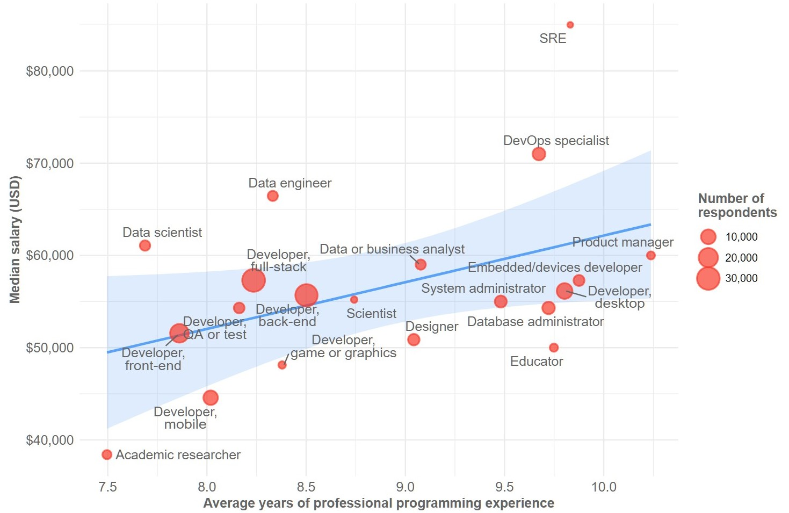

```{r setup, include=FALSE}
knitr::opts_chunk$set(echo = TRUE)
knitr::opts_chunk$set(fig.width=12, fig.height=8) 

# needed library
library(ggplot2)
library(dplyr)
library(stringi)
# to prettier text in the plot
library(ggrepel)
# to comma formatting
library(scales)
options(stringsAsFactors = FALSE)

```

## Wybrany wykres
Wykres, który wybrałem znajduje się na stronie: [Developer Survey Results](https://insights.stackoverflow.com/survey/2019). Strona ta przedstawia podsumowanie rocznych statystyk związanych z programowaniem.

### Wykres oryginalny: 
```{r,echo=FALSE}

```

Wykres przedstawia mediane wynagorodzenia w danym zawodzie w zależności od średniego doświadczenia programistów w tym zawodzie. Ponadto za pomocą wielkości kropek zaznaczono na jakiej wielkości próbki wykonano badanie.

## Wczytanie danych

Dane są publicznie dostępne. Można je pobrać ze strony: [dane](https://drive.google.com/file/d/1QOmVDpd8hcVYqqUXDXf68UMDWQZP0wQV/view).

Pierwszym krokiem jest wczytanie danych:

```{r read_data}
data <- read.csv(
  'survey_results_public.csv',
  header = TRUE,
  sep = ",")
```

## Transformacja danych

Następnie dane te musimy odpowiednio obrobić, aby były użyteczne przy tworzeniu wykresu:


```{r}
# choose needed column
limitedData <- data[c("ConvertedComp", "DevType", "YearsCodePro")]

# disabling scientific notation in R
options(scipen = 999)

# separate data from colimn "DevType" (some of the people have more than one type)
separatedData <- tidyr::separate_rows(limitedData, DevType, sep=';', convert = TRUE)

separatedData <- separatedData[!separatedData$YearsCodePro =='Less than 1 year',]
separatedData <- separatedData[!separatedData$YearsCodePro =='More than 50 years',]
separatedData$YearsCodePro <- as.integer(separatedData$YearsCodePro)


endData <- separatedData %>%
  na.omit() %>%
  group_by(DevType) %>%
  summarize(
    avgYears=mean(YearsCodePro, na.rm = FALSE),
    medianSalary=median(ConvertedComp),
    numDeveloper=n()) %>%
  ungroup()

endData <- endData[endData$avgYears>7.5 & endData$avgYears<11.0, ]

```

Gdy ktoś wybrał "Less than 1 year" albo "More than 50 years" wówczas te rekordy pominąłem. Pierwszym pomysłem była transformacja "Less than 1 year" na 0, a "More than 50 years" na 50. Uznałem jednak, że tych danych nie jest dużo w porównaniu z całością zbioru. Przez to ich ewentualny brak nie wpłynie w znaczący sposób na wynik końcowy.

## Wykres


```{r echo=FALSE}
# make a plot

myPlot <- ggplot(endData, aes(x = avgYears, y = medianSalary, label=DevType)) +
  geom_smooth(method=lm, fill=c('#b4d6ff')) +
  # add x and y name 
  labs(
    x = "Average years of professional programming experience",
    y = "Median salary (USD)") +
  # used dollar_format() to make $
  scale_y_continuous(label=dollar_format()) +
  scale_x_continuous(breaks=c(seq(7.0, 10.0, by=0.5))) +
  # add points, which are depends how many number of Developer is in that group
  geom_point(aes(size = numDeveloper, colour='red', alpha=0)) +
  geom_point(shape=1, aes(size=numDeveloper, colour="red")) +
  scale_size(range=c(0, 14)) +
  # add labs to the legend
  labs(size = "Number of \nrespondents") +
  # remove legend for color
  guides(alpha=FALSE, color=FALSE) +
  # add legend to the points
  geom_text_repel(size = 4, force = 1) +
  theme_minimal() +
  theme(text = element_text(size=14))


myPlot
```

W oryginalnym obrazku jest jeszcze skala 3000. U mnie wynika to pewnie z tego, że nie brałem pod uwagę "Less than 1 year" i "More than 50 years" i nie było wyniku, który miałby więcej niż 3000 ankietowanych (najwięcej - 29418 - ma Developer, full-stack).

