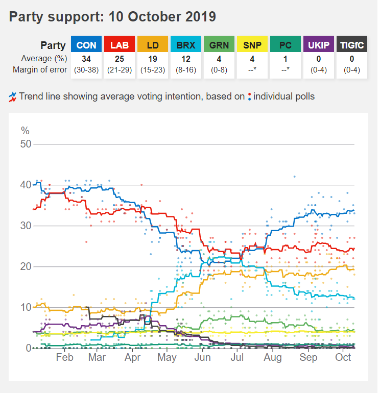

```{r setup, include=FALSE}
knitr::opts_chunk$set(echo = TRUE)
library(ggplot2)
library(dplyr)
library(reshape2)
library(Cairo)
library(zoo)
# faktyczne biblioteki sa ladowane tutaj, zeby uniknac komunikatow o warningach nizej
if (!knitr::is_latex_output()) {
  knitr::opts_chunk$set(dpi = 300, dev.args = list(type = "cairo"))
} # rozwiazanie problemow z anti-aliasingiem

```

W tym raporcie prezentuję moje wykonanie pracy domowej nr 1 z Technik Wizualizacji Danych.

## Oryginalny wykres
Oryginalny wykres został umieszczony w artykule pod adresem [https://www.bbc.com/news/uk-politics-49798197](https://www.bbc.com/news/uk-politics-49798197) w dniu 15 października 2019. Prezentuje on wyniki poszczególnych partii politycznych w sondażach wyborczych od stycznia br. do 10 października.




When you click the **Knit** button a document will be generated that includes both content as well as the output of any embedded R code chunks within the document. You can embed an R code chunk like this:

## Wykonanie mojego wykresu

Wykonanie mojego wykresu podzieliłem na dwie fazy - załadowanie potrzebnych danych (wyników sondaży w procentach), zapisanych w pliku csv. Potrzebowałem ramki danych z wynikami konkretnych sondaży (odpowiadają za kropki) oraz uśrednionych wartości z tych sondaży na przestrzeni czasu (tzw. trendlines). Następnie wykonałem sam wykres. Został on wygenerowany z pomocą pakietu Cairo z powodu problemów z renderowaniem anti-aliasingu na systemie Windows.

### Załadowanie danych
```{r dane}
library(ggplot2)
library(dplyr)
library(reshape2)
library(Cairo)
library(zoo)
options(stringsAsFactors = FALSE)
results <- read.csv("pollsovertime.csv")
# przekonwertowanie kolumny na date
results[,"Date"] <- as.Date(results[,"Date"], format="%d/%m/%y") 
d <- melt(results, id.vars = "Date", na.rm = TRUE) # ramka do wygodnego plotowaia
results_moving <- results # ramka z przesuwajaca sie srednia
results_moving[,2:10] <- rollmean(results[,2:10], 7, fill = "extend")
results_moving <- melt(results_moving, id.vars = "Date", na.rm=TRUE) 
```

### Przygotowanie wykresu

```{r przygotowanie_wykresu}
p <- ggplot(d, aes(Date, value, col = variable), fill = factor(variable)) +
  labs(color="Party: ") + # nazwa legendy
  scale_color_manual( # nadanie odpowiednich kolorow odpowiednim partiom i skrotow
    labels=c("ConservativesCON" = "CON", # do legendy
             "LabourLAB" = "LAB", 
             "Lib.DemsLD" = "LD", 
             "Brexit.PartyBRX" = "BRX", 
             "GreenGRN" = "GRN", 
             "SNPSNP" = "SNP",
             "Plaid.CymruPC"="PC", 
             "UKIPUKIP" = "UKIP", 
             "The.Independent.Group.for.ChangeTIGfC"="TIGfC"),
    values = c("ConservativesCON" = "#0575C9",
                       "LabourLAB" = "#E91D0E",
                       "Lib.DemsLD" = "#EFAC18",
                       "Brexit.PartyBRX" = "#02B6D7",
                       "GreenGRN" = "#5FB25F",
                       "SNPSNP" = "#F8ED2E",
                       "UKIPUKIP" = "#712F87",
                       "Plaid.CymruPC"="#159B78",
                       "The.Independent.Group.for.ChangeTIGfC"="#414142")) +
  geom_point(alpha=0.7, shape=16, size=1) + # wyniki poszczegolnych sondazy
  geom_line(data=results_moving, aes(Date, value), size=1) + # trend line
  scale_x_date(date_breaks = "1 month", # ustalenie skali takiej jak w oryginale
               date_labels = "%b", name = "") + 
  scale_y_continuous(name="%", expand = c(0, 0)) + # przesuniecie do 0 jak w oryginale
  ggtitle("Party support: 10 October 2019")+ 
  theme( # nadanie stylu tak jak w oryginalnym wykresie
    legend.position = "top",
    legend.direction = "horizontal",
    legend.background = element_blank(),
    panel.grid.major.x = element_blank(),
    panel.grid.minor.x = element_blank(),
    panel.grid.major.y = element_line( size=.2, color="#AEAEB5"),
    panel.grid.minor.y = element_blank(),
    axis.title.y = element_text(angle=0, vjust=1, hjust=1),
    plot.background = element_rect(fill = "#F2F2F2"),
    panel.background = element_rect(fill="white"),
    plot.title = element_text(face="bold", colour = "#3f3f42", size = "18")
  ) + coord_cartesian(ylim=c(0, 52))
```

## Wykres
Poniżej zaprezentowany jest efekt końcowy, czyli moja próba odwzorowania oryginalnego wykresu.

```{r wykres, echo=FALSE}
p
```
