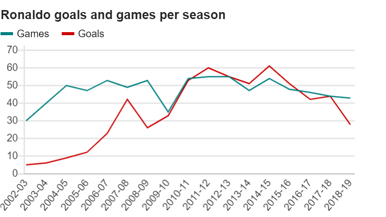

```{r setup, message=FALSE, echo=FALSE}
library("ggplot2")
```

## Link do artykułu z wykresem

https://www.bbc.com/sport/football/50049796

## Sam wykres

```{r, echo = FALSE}

```


## Wreszcie tworzenie kopii wykresu
```{r}
dt_1 <- read.csv("Cristiano_Ronaldo.csv")
colnames(dt_1) <- c("Season","Games","Goals")
# zadajemy znaczące nazwy tytuły kolumnom

ggplot(dt_1, aes(x=Season)) + 
  geom_line(aes(x = Season, y = Games, group = "Games", color = "Games"), size = 1.5) + 
  geom_line(aes(x = Season, y = Goals, group = "Goals", color = "Goals"), size = 1.5) + 
# na oś OX nanosimy kolejne sezony, natomiast na oś OY liczbę rozegranych meczów i zdobytych bramek
  
  scale_color_manual(name="", values=c("Games"="deepskyblue3",  
                                       "Goals"="red")) + 
  scale_fill_manual(name="", values=c("Games"="deepskyblue3",
                                      "Goals"="red"))+
# wybieramy odpowiednie kolory dla naszego wykresu
  
  labs(title = "Ronaldo games and goals per season", x = NULL, y = NULL) + 
# dodajemy tytuł wykresu oraz usuwamy tytuły osi
  
  scale_y_continuous(limits = c(0,70), breaks = seq(0,70,10)) +
# dodajemy odpowiednią skalę do osi OY
  
  theme(panel.background = element_blank()) + 
  theme(panel.grid.major.y = element_line(colour = "lightgrey", linetype = "solid", size = 1.2)) +
# poprawiamy ogólny wygląd wykresu
  
  theme(axis.line.y = element_line(colour = "lightgrey", linetype = "solid", size = 1.2)) +
# akcentujemy wygląd osi OY
  
  theme(plot.title = element_text(size = 22, face = "bold")) + 
# nadajemy odpowiedni wygląd tytułowi wykresu
  
  theme(legend.position = "top", legend.justification = c(0,0), legend.key = element_blank(), 
        legend.text = element_text(size = 16)) +
# poprawiamy wygląd legendy
  
  theme(axis.text.x.bottom = element_text(colour = "black",size = 16, angle = 45), axis.ticks = element_blank()) +
  theme(axis.text.y = element_text(colour = "black", size = 16), axis.ticks = element_blank())
# ustalamy wygląd elementów na osiach

```


