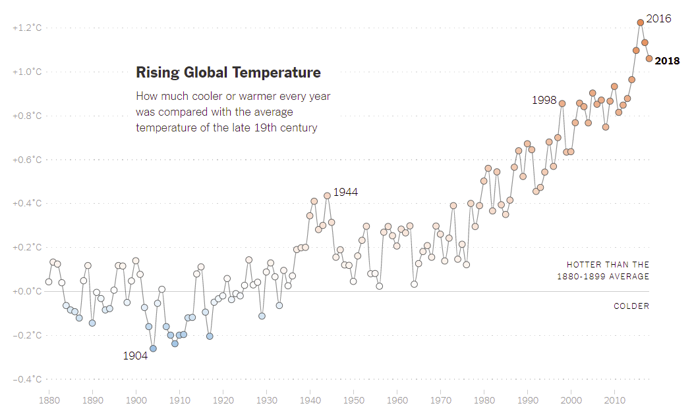
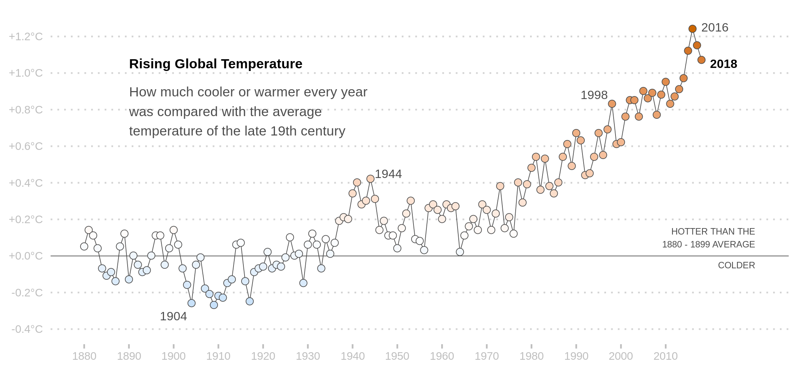

```{r setup, echo = FALSE}
knitr::opts_chunk$set(echo = TRUE)
```

## Przygotowanie
```{r, echo=FALSE, include=FALSE}
library(dplyr)
library(ggplot2)
```

Artykuł z wykresem znajduje sie pod tym adresem: 
https://www.nytimes.com/2019/10/03/learning/whats-going-on-in-this-graph-oct-9-2019.html 

dane ze strony : https://climate.nasa.gov/vital-signs/global-temperature/

```{r}
# wczytajmy dane
data <-  read.csv("ZonAnn.Ts+dSST.csv") %>% select(1:2)

# i sprawdzmy co w nich jest: 
head(data)

```
Musimy przerobić dane, aby odnosiły się do średniej z 19 wieku:
```{r}
avg <- data %>% filter(Year < 1900) %>% select(Glob) %>% summarise(Mean = mean(Glob)) %>% as.numeric()

data <- data %>% mutate("Glob_compared" = Glob-avg)
```

## Robienie wykresu

Musimy ustalić na osi Y przedziałkę z temperaturą
```{r}
tick <-c(1:9)
grid <- c(-0.4 + 0.2*0:9) %>% round(digits = 2)
for (i in 1:length(grid)){
  tick[i] = paste(format(grid[i], nsmall = 1), "°C", sep = "")
  if (grid[i] >= 0 ){ tick[i] <- paste("+" ,tick[i], sep="") }
} 
```


Robimy wykres
```{r}
NYC <- ggplot(data, aes(x = Year, y=Glob_compared))+
                
                # dodamy 2 linie, jedna biala zakrywajaca linie(kropki) pomocnicze, a druga zwykla
                geom_hline(yintercept=0 , colour = "white", size = 2) + 
                geom_hline(yintercept=0 , colour = "#4d4d4d", size = 0.2) + 
                
                # zwykły szary wykres liniowy
                geom_line(colour = "#4d4d4d" , size = 0.2 ) + 
                
                # robimy kropki, z szarą obwódką i wypełnieniem jako gradientem
                geom_point(size = 2, stroke = 0.3, shape = 21,
                           colour = "#4d4d4d",   aes(fill = Glob_compared), show.legend = FALSE) + 
                
                # gradient
                scale_fill_gradient2(low = "#01a6ee",mid = "white",  high= "#cc6600", midpoint = 0.1) + 
  
                # robimy nowy motyw
                theme(panel.grid.major = element_line(linetype = 3, colour = "lightgrey"),
                      panel.grid.minor = element_line(linetype = 3), 
                      panel.background = element_rect(fill = 'white'), 
                      panel.grid.major.x = element_blank(),
                      panel.grid.minor.x = element_blank(), 
                      aspect.ratio = 0.45, 
                      axis.title.x = element_blank(), 
                      axis.title.y = element_blank(), 
                      axis.ticks.y = element_blank(), 
                      axis.ticks.x = element_line(colour = "grey") ,
                      axis.text = element_text(colour = "grey", size = 7)) + 
                # ustawiamy przedziałkę (na osi y dajemy wcześniej wygenerowany wektor napisów)
                scale_x_continuous(breaks = c(1880 + 10*0:13) ) + 
                scale_y_continuous(breaks = c(-0.4 + 0.2*0:9),
                                   labels = tick) +
                
                
                # początek osi
                expand_limits(x = 1890, y = -0.4) +
                
                # dodajemy tekst do wykresu 
                annotate("text", x = 1900, y = -0.33, label = "1904", fontface = 6,
                                 colour = "#4d4d4d", size = 2.7)+
                annotate("text", x = 1948, y = 0.45, label = "1944", fontface = 6,
                                 colour = "#4d4d4d", size = 2.7) +
                annotate("text", x = 1994, y = 0.88, label = "1998", fontface = 6, 
                                 colour = "#4d4d4d", size = 2.7) +
                annotate("text", x = 2021, y = 1.25, label = "2016", fontface = 6, 
                                 colour = "#4d4d4d", size = 2.7) +
                annotate("text", x = 2023, y = 1.05, label = "2018", fontface = 2, 
                                 colour = "black", size = 2.7)   +
                annotate("text", x = 2030, y = 0.10, label = "HOTTER THAN THE\n1880 - 1899 AVERAGE",
                                 fontface = 6, colour = "#4d4d4d", size = 2 ,hjust = 1)    +
                annotate("text", x = 2030, y = -0.05, label = "COLDER", fontface = 6, 
                                 colour = "#4d4d4d", size = 2, hjust = 1) +
                annotate("text", x = 1890, y = 1.05, label = "Rising Global Temperature", fontface =2 , 
                                 hjust = 0 , size = 3 ) + 
                annotate("text", x = 1890, y = 0.79,
                         label = "How much cooler or warmer every year\nwas compared with the average\ntemperature of the late 19th century",
                         fontface =1, hjust = 0, color = "#4d4d4d" , size = 3)
                
                # zapisujemy w formacie jpg
                # ggsave("NYC_plot.png" , height = 6, width =7 , device = "png")
```

## Porównanie wykresów: 

1. Wykres oryginalny: 
```{r,echo=FALSE}

```


2. Mój wykres: 
```{r, echo = FALSE}

```


W folderze umieściłem screen oryginalnego wykresu oraz plik png z moim wykresem do porównania. 

---
