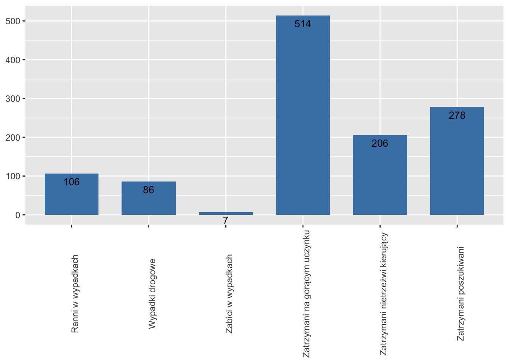

Rozwiązanie pracy domowej 2 

Wersja przed : 

```{r echo=FALSE}


```


```{r echo=TRUE, message=FALSE, warning=FALSE,fig.width=10}
##Wczytywani danych 
dane <- read.csv("Untitled 1.csv")
dane <- dane[-1,]
dane <- dane[order(dane[,2]),]
# potrzebne pakiety
library(ggplot2)
library(reshape2)
ggplot(dane,aes(x=reorder(Przypadek,Licznosc),y=Licznosc))+
  geom_bar(stat="identity",fill="steelblue",width=0.7)+coord_flip()+##Ustawienie danych i geometri
  geom_text(aes(label=Licznosc), vjust=0.5,hjust=-0.3, size=5)+
  scale_y_continuous(expand = c(0, 0),limits = c(0,600))+## dostoswanie skali i pozycij opisu
  ggtitle("Statystyki policyjne z dnia 2019-10-07")+# dodanie tytułu 
  theme(panel.background = element_blank(),# uwuwanie siatki i koloru
        panel.grid.major = element_blank(), 
        panel.grid.minor = element_blank(),
        axis.title.x = element_blank(),# usuwanie tytułów osi
        axis.title.y = element_blank(),
        axis.text.x = element_blank(),# usuwanie osi X
        axis.ticks = element_blank(),
        axis.text.y = element_text(size=13,face="bold"),# Zmiana wielkości napisów 
        plot.title = element_text(family = "Helvetica", face = "bold", size = 20,hjust = 0.15)# poprawienie wielkości i pozycij tytułu
        )


```
\n Dyskusja : \
\n 1.W poprzednim wykresie brakuje tytułu w poprawionej wersji postanowiłem go dodać aby ułatwić odzczytanie wykresu.\ 
\n 2.Obrócenie wykresu również moim zdaniem ułatwia odczytanie danych ponieważ bardziej pasują one do tego typu wykresu.\
\n Upraszcza to  znacznie odcztanie opsiów z osi X w originale a u mnie Y . \
\n 3.Usunięcie siatki i osi Y w originale u mnie X . Zarówno siatka jak i oś X były zbędne biroąc pod uwagę podpis każdego z słupków.\
\n 4.Pogrubienie opisów czyni je czytelniejszymi . \
\n 5.Posortowanie danych również ułatwia odczytanie pewnych informacij bez dokładnego przyglądania się wykresowi. \