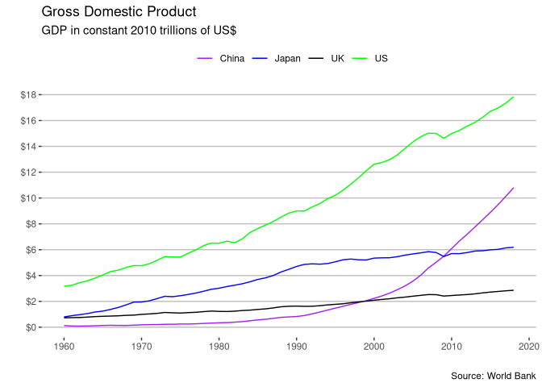

```{r setup, include=FALSE}
knitr::opts_chunk$set(echo = TRUE)
```

## Wybranie wykresu

To zdecydowanie była najtrudniejsza część zadania, ponieważ chciałem wybrać wykres, w którym mógłbym się popisać poprawiając go. Ale po kilku dniach udało mi się. Oto oryginał.
```{r include=TRUE, fig.align="center", echo=FALSE}

```
## Tworzenie wykresu 
### Użyte biblioteki
```{r libraries, message=FALSE,warning=FALSE}
library(ggplot2)
library(dplyr)
library(gganimate)
options(stringsAsFactors = FALSE)
```

## Obróbka danych otrzymanych
Korzystam z tych samych surowych danych, które pobrał twórca bazowego wykresu, jednak trochę inaczej je będę obrabiał, bo będę potrzebował mniej dodatkowych kolumn. 

```{r data}

read.csv("res/data.csv", header=FALSE)->GDPs
select(GDPs, -(2:4))%>%t()%>%as.data.frame()->GDPs
colnames(GDPs)<-c("Year", GDPs[1,-1])
GDPs[-1,]%>%
  select(Year, China, Japan, "United States", "United Kingdom")%>%
  lapply(as.double)%>%as.data.frame()->cut_GDPs

#liczby są podane w dolarach. Sprawmy, by były podane w trylionach $
cut_GDPs[,-1] / (1e+12) -> cut_GDPs[,-1]
cut_GDPs[1] <- seq(1960,2019,1)
cut_GDPs <- cut_GDPs[-60,]

### My dataset

usable_gdp <- data.frame(Year=cut_GDPs$Year,
                         Country=rep(colnames(cut_GDPs[-1]),each=59),
                         Value=c(cut_GDPs$China,cut_GDPs$Japan,cut_GDPs$United.States,cut_GDPs$United.Kingdom))

usable_gdp  %>%
  group_by(Year) %>%
  mutate(Rank = rank(-Value))->usable_gdp2


```


## Wynik końcowy 

Chciałem dodać efekty pa wejściu i wyjściu używając funkcji animate(), ale animacja generowana bez niej wyglądała lepiej i dobierała tak parametry by zawsze być płynną.


```{r plot}

ggplot(data=usable_gdp2, aes(Year,Value,color=Country,fill=Country)) +
  
  geom_line() +
  geom_col(position = "dodge")+
  labs(
    title="GDP in year {as.integer(frame_along)}",
    caption="Source: World Bank")+
  ylab("GDP in trylions of dollars\n")+
  scale_fill_manual(values = c("#e04745","#f9b2ff","#964351","#398bce"),
                    label=c("China","Japan","United Kingdom", "United States"))+
  scale_color_manual(values = c("#e04745","#f9b2ff","#964351","#398bce"),
                     label=c("China","Japan","United Kingdom", "United States"))+
  theme(
    legend.position = "bottom",
    legend.title = element_blank(),
  
    axis.title.x  = element_blank(),
    axis.text.y = element_text(size = 10),
    axis.title.y = element_text(size = 12,colour = "grey"),
    
    plot.title = element_text(size=32,face="bold",hjust = 0.5,color="lightgrey"),
    plot.caption = element_text(color="lightgrey"),
    
    panel.grid.minor = element_blank(),
    panel.grid.major.x = element_blank(),
    panel.grid.minor.y = element_blank(),
  )+
  transition_reveal(Year)+
  view_follow(fixed_x = c(1960,NA),fixed_y = c(0,NA))+
  ease_aes("cubic-in-out")


```