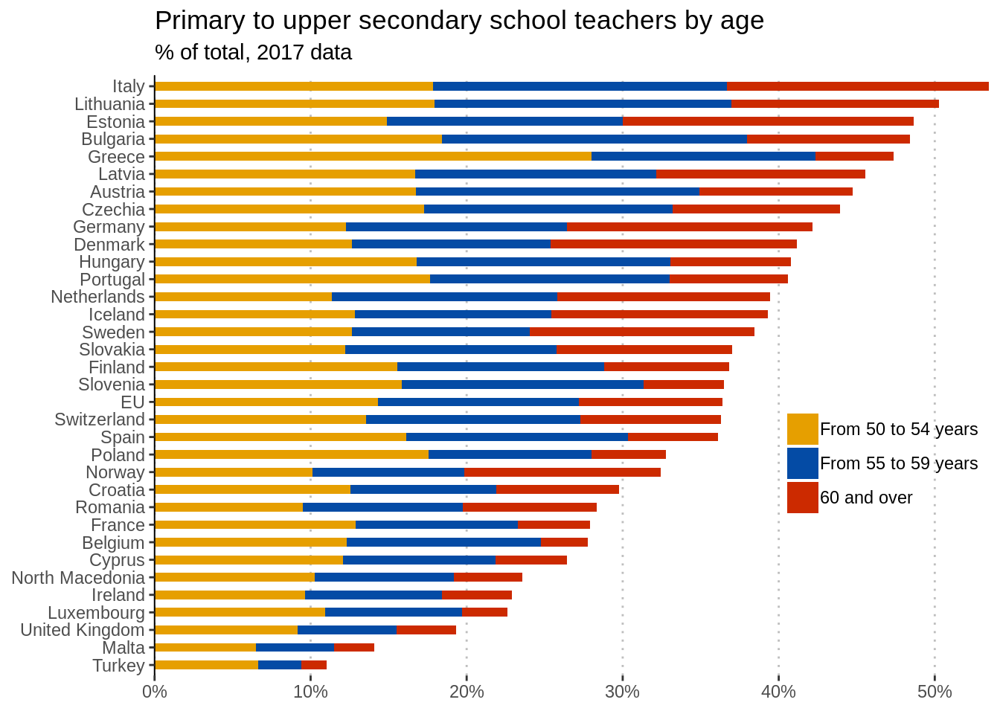

```{r setup, include = FALSE}
knitr::opts_chunk$set(echo = T)
```

## Wykres źródłowy


Teoretycznie ten wykres pozwala nam odczytać procent nauczycieli w poszczególnych przedziałach wieku dla różnych państw. W praktyce jednak dane które realnie jesteśmy w stanie porównać, to procent nauczycieli 50-54, 50-59, 50+. Porównanie procent nauczycieli 55+ lub 55-59 jest bardzo trudne, ponieważ zaczynają i kończą się w różnych pozycjach na osi x.
Jeśli zastanowimy się co jest najbardziej interesującę, to jest to pokazanie jak w krajach Europy różni są procent starszych nauczycieli. Dlatego musimy pokazać przedziały 50+, 55+,60+, 65+. W obecnym wykresie tylko przedział 50+ jest dobrze widoczny.
Poza tym bardzo trudno jest sobie wyobrazić tak sporą liczbę państw po ich nazwach. Znacznie łatwiej gdy widzimy je na mapie.

## Przetwarzamy dane

```{r, message=FALSE}
# Załadowanie bibliotek i ramek danych
library(dplyr)
library(stringi)
library(maps)
library(ggplot2)
library(ggrepel)
library(scales)
raw_data <- read.csv('./educ_uoe_perp01_1_Data.csv')

raw_data %>%
  # Filtrujemy wiersze, bez ilości nauczycieli NA, dla obu płci, z 2017 roku, z wyjątkiem
  # gimnazjum w danii, gdzie najaktualniejsze dane są z 2014 roku
  filter(SEX == 'Total', Value != ':', TIME == 2017 |
         (TIME == 2014 & GEO == 'Denmark' & ISCED11 == 'Lower secondary education')) %>%
  # Usuwamy przecinek z liczby nauczycieli (liczba jest w formacie 1,000.0)
  mutate(Value = as.numeric(stri_replace_all_fixed(Value, ',',''))) %>%
  # Zamieniamy nazwy państw, by pasowały do funkcji map_data
  mutate(GEO = stri_replace_first_fixed(GEO, 'Germany (until 1990 former territory of the FRG)', 'Germany')) %>%
  mutate(GEO = stri_replace_first_fixed(GEO, 'Czechia', 'Czech Republic')) %>%
  mutate(GEO = stri_replace_first_fixed(GEO, 'United Kingdom', 'UK')) %>%
  mutate(GEO = stri_replace_first_fixed(GEO, 'North Macedonia', 'Macedonia')) %>%
  # Wybieramy tylko wiek nauczycieli, państwo i ilość takich nauczycieli
  select(AGE, GEO, Value) -> data

data %>%
  # Zliczamy liczbę nauczycieli w każdym kraju i dodajemy to do głównej ramki jako kolumnę Total
  filter(AGE == 'Total') %>%
  group_by(GEO) %>%
  summarise(Total = sum(Value)) %>%
  inner_join(data %>%
             filter(AGE != 'Total')) %>% # Usuwamy łączne liczby nauczycieli
  # Dodajemy kolumny logiczne, czy nauczyciel jest nie młodszy, niż {50, 55, 60, 65} lat
  mutate(Over50 = AGE == '65 years or over' | AGE == 'From 50 to 54 years' |
         AGE == 'From 55 to 59 years' | AGE == 'From 60 to 64 years') %>%
  mutate(Over55 = AGE == '65 years or over' | AGE == 'From 55 to 59 years' |
         AGE == 'From 60 to 64 years') %>%
  mutate(Over60 = AGE == '65 years or over' | AGE == 'From 60 to 64 years') %>%
  mutate(Over65 = AGE == '65 years or over') %>%
  mutate(ratio = Value/Total * 100) %>% # Dodajemy kolumnę ratio = procent takich nauczycieli w kraju
  select(GEO, Over50, Over55, Over60, Over65, ratio) -> ages

# Dla każdej kolumny "czy nauczyciel jest nie młodszy niż {50, 55, 60, 65}" w każdym kraju sumujemy
# procent takich nauczycieli i doklejamy  to jako kolumny odpowiednio ratio{50, 55, 60, 65}
ages %>%
  group_by(GEO) %>%
  filter(Over50) %>%
  summarise(ratio50 = sum(ratio)) %>%
  inner_join(
    ages %>%
      group_by(GEO) %>%
      filter(Over55) %>%
      summarise(ratio55 = sum(ratio))
  ) %>%
  inner_join(
    ages %>%
      group_by(GEO) %>%
      filter(Over60) %>%
      summarise(ratio60 = sum(ratio))
  ) %>%
  inner_join(
    ages %>%
      group_by(GEO) %>%
      filter(Over65) %>%
      summarise(ratio65 = sum(ratio))
  ) -> ratios

# Funkcja map_data daje nam geometrię każdego państwa, łączymy to z kolumnami ratio do jednej ramki
map_data("world", region = ratios$GEO) %>%
  rename(GEO = region) %>%
  inner_join(ratios) -> maps

# Dla każdego państwa wyliczamy też centroidy i podobnie łączymy
maps %>%
  select(GEO, lat, long) %>%
  group_by(GEO) %>%
  summarise(lat = mean(lat), long = mean(long)) %>%
  inner_join(ratios) -> maps_centroids

# Centroidy dzielimy na te po lewej i po prawej, dla ułatwienia wyświetlania adnotacji
maps_centroids_left <- maps_centroids %>% filter(long <= 14)
maps_centroids_right <- maps_centroids %>% filter(long > 14)
```

## Funkcja do rysowania map
```{r}
make_plot <- function(title, ratio_column) {
  # Tworzymy dodatkowe "kopie" ramek z centroidami, aby kolumna ratio{50,55,60,65} zawsze się nazywała ratio
  centroids_left <- maps_centroids_left %>% select(GEO, lat, long, ratio=ratio_column)
  centroids_right <- maps_centroids_right %>% select(GEO, lat, long, ratio=ratio_column)
  ggplot(maps, aes(x = long, y = lat)) +
    # Rysujemy państwa, z wypełnieniem zależnym od kolumny ratio
    geom_polygon(aes_string(group = 'group', fill = ratio_column), color = "grey50", size = 0.1) +
    # Skala wypełnienia od białego=0% do czerwonego=60%, z przerwami co 15%
    scale_fill_gradient(low = "white", high = "red", limits = c(0,60), name = "", breaks = (0:4)*15,
                        labels = c('0', '15', '30\n%', '45', '60')) +
    # Dodajemy oznaczenia państw i wartość kolumny ratio jako label'e, po lewej i prawej stronie mapy
    geom_label_repel(aes(label = paste0(GEO, ': ', round(ratio),'%')), centroids_right, size = 3,
                     segment.color = "black", segment.alpha = 0.3, nudge_x = 100, xlim = c(39,45), hjust = 0) +
    geom_label_repel(aes(label = paste0(GEO, ': ', round(ratio),'%')), centroids_left, size = 3,
                     segment.color = "black",  segment.alpha = 0.3, nudge_x = -100, xlim = c(-23,-20),
                     ylim = c(35, 60), hjust = 1) +  
    theme_void() +
    ggtitle(title) +
    theme(
          panel.background = element_rect(fill = "lightgrey"),
          plot.background = element_rect(fill = "lightgrey"),
          plot.title = element_text(color = "white", size = 24, face = "bold", hjust = 0.1, vjust = 0.1),
          legend.direction = "horizontal",
          legend.key.size = unit(0.8, 'cm'),
          legend.position = c(0.1, 0.06),
          legend.text = element_text(color = "white", size = 13, face = "bold"),
          ) +
    # Ustawiamy granicę mapy, wycinając mały fragment Norwegii, tzn. bardzo oddalone wyspy
    # które są niepotrzbne do przedstawienia wyniku
    scale_x_continuous(limits = c(-25, 45)) +
    scale_y_continuous(limits = c(35,71))
}
```

## Wyniki

```{r, warning = FALSE, fig.width = 10, fig.height = 8}
make_plot('Procent nauczycieli w wieku co najmniej 50 lat', 'ratio50')
```
```{r, warning = FALSE, fig.width = 10, fig.height = 8}
make_plot('Procent nauczycieli w wieku co najmniej 55 lat', 'ratio55')
```
```{r, warning = FALSE, fig.width = 10, fig.height = 8}
make_plot('Procent nauczycieli w wieku co najmniej 60 lat', 'ratio60')
```
```{r, warning = FALSE, fig.width = 10, fig.height = 8}
make_plot('Procent nauczycieli w wieku co najmniej 65 lat', 'ratio65')
```
