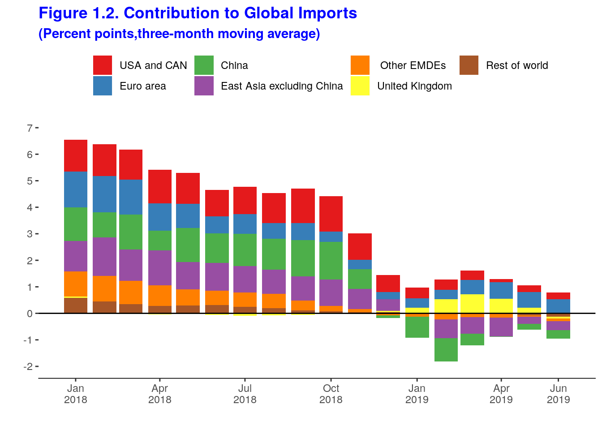
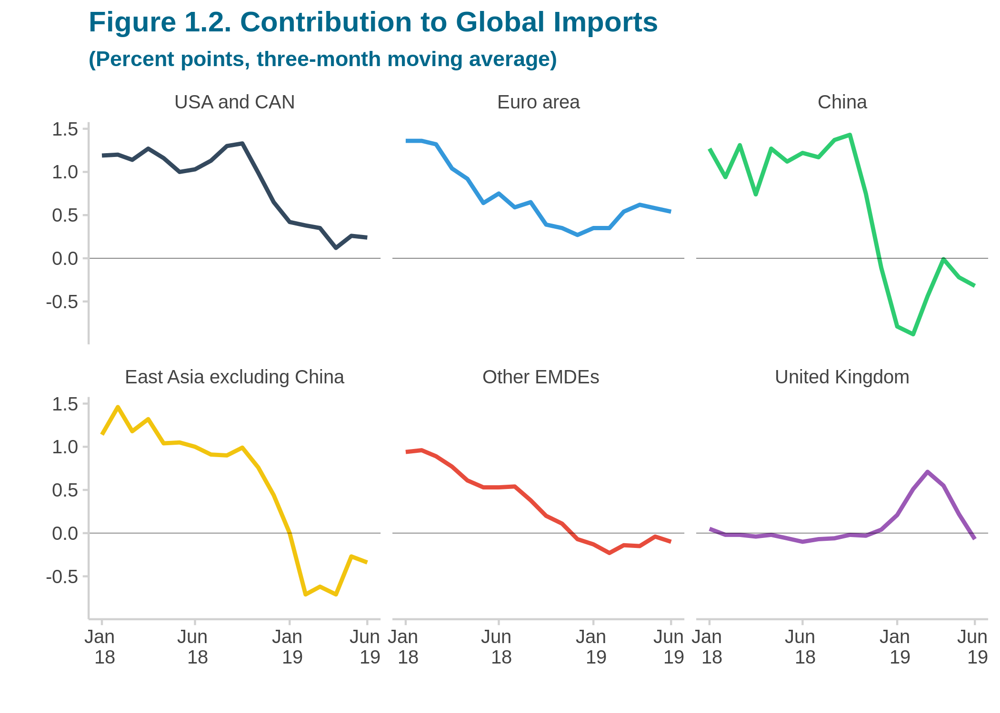

```{r setup, include=FALSE}
knitr::opts_chunk$set(echo = TRUE, warning = FALSE, message = FALSE)

library(reshape2)
library(zoo)
library(tidyverse)
library(ggthemr)
```


```{r plot, fig.show='hide'}

# Change plot theme
ggthemr('pale')

data <- read.csv("dane.csv")

# Custom column names
colnames(data) <- c('Date', "USA and CAN", "Euro area", "China",
                    "East Asia excluding China"," Other EMDEs",
                    "United Kingdom","Rest of world")

# Removing Rest of world as it does not contribute any significant information to the plot
data <- data %>% select(-'Rest of world')

# Melting and extracting date
data <- melt(data)
data$Date <- paste(substr(data$Date, 1, 4), (substr(data$Date, 6, 7)), sep = "/")
data$Date <- as.Date(as.yearmon(data$Date, format="%Y/%m"))

# Custom date breaks, corresponding labels and colors
breaks <- as.Date(c("2018-01-01", "2018-07-01", "2019-01-01", "2019-06-01"))
colors = c("#34495e", "#3498db", "#2ecc71",  "#f1c40f",  "#e74c3c", "#9b59b6")
labels <- c('Jan \n 18', 'Jun \n 18', 'Jan \n 19', 'Jun \n 19')

ggplot(data, aes(x = Date, y = value, fill = variable)) + 
    geom_line(aes(color = variable), size = 1) + 
    geom_hline(yintercept = 0, color = 'black', size = 0.1) + 
    facet_wrap(~ variable) + 
    scale_x_date(breaks = breaks,
                 labels = labels, 
                 name="") +
    scale_y_continuous(name = "") + 
    scale_color_manual(values = colors) + 
    labs(title = "Figure 1.2. Contribution to Global Imports", 
         subtitle="(Percent points, three-month moving average)") +
    theme(legend.position = "", 
          legend.title = element_blank(),
          panel.grid.major = element_blank(),
          plot.title = element_text(lineheight=.8, face="bold",color = "deepskyblue4"),
          plot.subtitle = element_text(lineheight=.8, face="bold",color = "deepskyblue4"))

ggsave("improved_plot.png")
```

## Original plot
 

## Improved plot


## Why I think plot after improvements is better:
* Trends and absolute values in each group are more readable and comparable with each other
* Information if and when each group value dropped down below zero is available
* Rest of World group removed as it didn't contribute any significant information to the plot
* Clean structure of plot, in contrast with information overwhelm in original plot
* Nicer colours