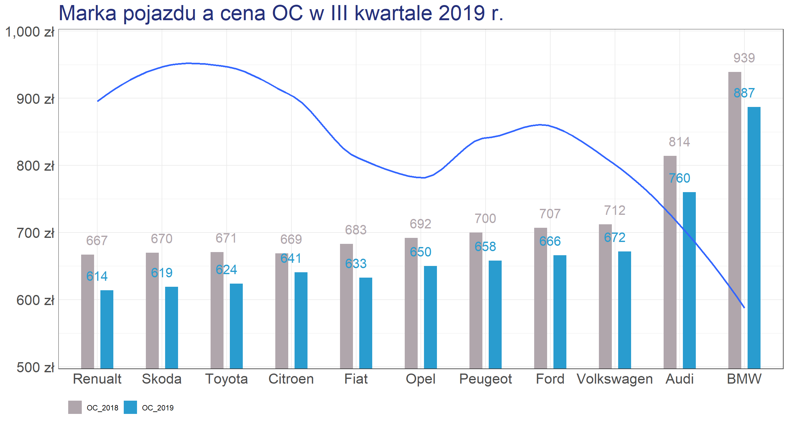

```{r include=FALSE}
knitr::opts_chunk$set(echo = TRUE)
knitr::opts_chunk$set(fig.width=12, fig.height=8) 
# needed library
library(ggplot2)
#install.packages("ggalt")
library(ggalt)
library(dplyr)
options(stringsAsFactors = FALSE)
```

### Wybrany wykres

Wykres, który wybrałem do poprawienia jest autorstwa Pana Macieja Paczóskiego.

```{r echo=FALSE}

```

### Mój wykres

```{r include=FALSE}
data <- read.csv('data.csv', fileEncoding="UTF-8-BOM")
data$marka <- factor(data$marka, levels=as.character(data$marka))  # for right ordering of the dumbells
data$diff <- sprintf("-%d", as.integer((data$OC_2018-data$OC_2019)))
```

```{r echo=FALSE}

extrafont::loadfonts(device="win")
windowsFonts(Calibri=windowsFont("Calibri"))

colorLeft <- "#1B9E77" #"#9fb059"
colorRight <- "#D95F02" #"#edae52"

# make a plot
myPlot <- ggplot(data, aes(x=OC_2018, xend=OC_2019, y=marka, group=marka)) +
  theme_bw(base_family="Calibri") +
  theme(panel.border=element_blank()) +
  theme(plot.title=element_text(face="bold")) +
  theme(plot.caption=element_text(size=10, margin=margin(t=12), color="#7a7d7e")) +
  geom_segment(data=data, aes(y=marka, yend=marka, x=600, xend=1000), color="#b2b2b2", size=0.15) +
  labs(x="", y=NULL, title="Cena [PLN] OC a marka ubezpieczonego pojazdu",
       subtitle="Mediana cen OC na podstawie danych z I kw. 2018 r. i I kw. 2019 r.",
       caption="źródło: rankomat.pl") +
  theme(plot.title = element_text(color="black", size = 20, face = "bold", hjust=0.5)) +
  theme(plot.subtitle=element_text(face="italic", size=9, margin=margin(b=12), hjust=0.5)) +
  theme(axis.text.y=element_text(face = "bold", size = 14)) +
  geom_dumbbell(color="#b2b2b2", 
                  size = 3,
                  size_x = 6, 
                  size_xend = 6,
                  colour_x = colorLeft,
                  colour_xend =colorRight) + 
  geom_text(data=dplyr::filter(data, marka =="BMW"),
                       aes(x=OC_2018, y=marka, label="2018"),
                       color=colorLeft, size=4, vjust=-1.5, fontface="bold", family="Calibri") +
  geom_text(data=dplyr::filter(data, marka =="BMW"),
                   aes(x=OC_2019, y=marka, label="2019"),
                   color=colorRight, size=4, vjust=-1.5, fontface="bold", family="Calibri") +
  geom_text(data=data, aes(x=OC_2018, y=marka, label=OC_2018),
                     color=colorLeft, size=3.5, vjust=2.5, fontface="bold", family="Calibri") +
  geom_text(data=data, aes(x=OC_2019, y=marka, label=OC_2019),
                   color=colorRight, size=3.5, vjust=2.5, fontface="bold", family="Calibri") +
  geom_rect(data=data, aes(xmin=1000, xmax=1020, ymin=-Inf, ymax=Inf), fill="#efefe3") +
  geom_text(data=data, aes(label=diff, y=marka, x=1010), fontface="bold", size=4, family="Calibri") +
  geom_text(data=filter(data, marka=="BMW"), aes(x=1010, y=marka, label="zmiana"),
            size=4, vjust=-2, fontface="bold", family="Calibri") +
  theme(axis.text.x=element_blank())

myPlot

```


### Dlaczego?
Postaram się uzasadnić co dane zmiany wnoszą do poprawy jakości wykresu:  
1. zmiana położenia tytułu: tytuł na środku zdecydowanie bardziej przykuwa uwagę odbiorcy i w mojej opini wygląda estetyczniej  
2. zmiana tytułu: tytuł nie oddawał w pełni danych na wykresie   
3. dodanie podtytułu: informacje te były zawarte w wykresie oryginalnym  
4. zrezygnowanie z danych na osi X (cen OC): na podstawie zasady **check** (wykład 3 prof. Biecka: *avoid truncated axes*)  
5. zrezygnowanie z legendy poza wykresem: poprzednia legenda wg mnie burzy harmonię wykresu; dodałem subtelną legendą nad marką samochodu na samej górze  
6. dodanie kolumny z różnicą ceny OC: dodakowa informacja na wykresie nie wprowadzająca zaburzenia **simplify**  
7. zamiana zł -> PLN: dbanie o spójność wykresu wg zasady **unify** (wykład 3 prof. Biecka: *unify numbers, units and dates*)  
8. dodanie źródła: informacja skąd dane są zawarte wg mnie istotna  
9. usunięcie linii symbolizującej zależność pomiędzy liczbą szkód jakie zgłoszali kierowcy danych marek: wykres ten dotyczył innej zależności; wg mnie nie powinno być linii ciągłej do danych dyskretnych  
10. odwrócenie osi: w mojej opini czystsza struktura  
11. zmiana kolorów: bardziej ciepłe -> bardziej chce się oglądać  


