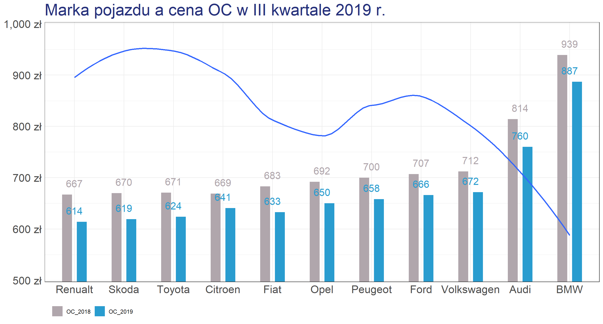

```{r echo=FALSE, warning=FALSE, message=FALSE}
library(ggplot2)
library(dplyr)
```

## Wykres przed:

```{r przed, echo=FALSE, out.width='100%'}

```

## Wczytanie danych
Dane przekopiowałam od kolegi, ale podmieniłam szkody na procenty, gdyż nie wiedziałam, co dokładnie przedstawia obecna wartość.

```{r read_data}
data <- read.csv('dane.csv')
```

## Nowy pomysł

Mam kilka zarzutów do wykresu stworzonego przez kolegę, które postaram się poprawić:

* marki samochodów są wartościami dyskretnymi, więc szkody nie powinny być linią ciągłą
* liczba zgłoszonych szkód jest w innych jednostkach niż kwota, więc powinna mieć osobną oś
* kwoty nachodzą na sąsiednie słupki
* OC nie jest opisane
* skala nie zaczyna się od 0

W tym celu przede wszystkim podzielę powyższy wykres na dwa. Dodatkowo postaram się poprawić nieco etykiety

### Porównanie kwot OC w latach 2018-2019

```{r plot, warning=FALSE, fig.width = 13, fig.height = 6}
ggplot(
    data,
    aes(x = reorder(marka, OC), weight = OC, fill = rok)) +
  theme_minimal() +
  ggtitle("Marka pojazdu a kwota OC [zł]") +
  scale_fill_manual(
    values = c('#B0A6AC', '#299CCF'),
    labels = c("OC w III kwartale 2018 r", "OC w III kwartale 2019 r")) +
  geom_bar(
    position = position_dodge(width = 0.8),
    width = 0.6) +
  coord_cartesian(
    ylim = c(530, 980)) +
  geom_text(
    aes(label = OC, x = marka, y = OC),
    vjust=-1,
    color=rep(c('#299CCF', '#B0A6AC'), times=11),
    size=5.5,
    position = position_dodge(width = 0.8))+
  theme(
    axis.text = element_text(size = 16),
    plot.title = element_text(
      size = 24,
      hjust = 0.5,
      margin = margin(t = 0, r = 0, l = 0, b = 20)),
    legend.position = "bottom",
    legend.box = "horizontal",
    legend.justification = "center",
    legend.text = element_text(size=12),
    axis.text.y = element_blank()) +
  labs(x = "", y = "", fill = "")
```

Powyższy wykres ma poprawione etykiety słupków i legendę. Dodatkowo tytuł i legenda zostały wyśrodkowane. Linia szkód została usunięta, więc nie zaburza obrazu. Poprawiłam też nieco szerokość słupków, żeby całość wyglądała bardziej estetycznie.


### Kwota OC a procent kierowców deklarujących szkody

```{r plot2, warning=FALSE, fig.width = 13, fig.height = 6}
data <- data %>%
  filter(rok == "OC_2019")

ggplot(
    data,
    aes(x = OC, y = szkody)) +
  theme_minimal() +
  ggtitle("Kwota OC a procent kierowców deklarujących szkody") +
  labs(x = "Kwota OC", y = "Kierowcy deklarujący szkody") + 
  geom_point(size = 4, color = "#299CCF") +
  coord_cartesian(
    ylim = c(16,22),
    xlim = c(600, 900)) +
  theme(
    axis.text = element_text(size = 16),
    axis.title.y = element_text(
      size = 20,
      margin = margin(t = 0, r = 20, b = 0, l = 0)),
    axis.title.x = element_text(
      size = 20,
      margin = margin(t = 20, r = 0, b = 0, l = 0)),
    plot.title = element_text(
      size = 24,
      hjust = 0.5,
      margin = margin(t = 0, r = 0, l = 0, b = 20))) +
  scale_y_continuous(
    label = scales::dollar_format(prefix = "", suffix = "%")) +
  scale_x_continuous(
    label = scales::dollar_format(prefix = "", suffix = " zł")) +
  geom_line(
    stat="smooth",
    method = "loess",
    formula = y ~ x,
    linetype ="dotted",
    size = 1.5,
    alpha = 0.8,
    color = "#B0A6AC")
```

Drugi wykres zachowuje kolorystykę poprzedniego. Marki samochodów zostały naniesione jako punkty, ale dodatkowo jest linia trendu narysowana metodą LOESS, więc można zauważyć pewne zachowanie danych. Rozdzielenie wykresów na dwa zdecydowanie poprawiło ich czytelność i w obecnej formie wiadomo, czym jest linia dotycząca szkód.
