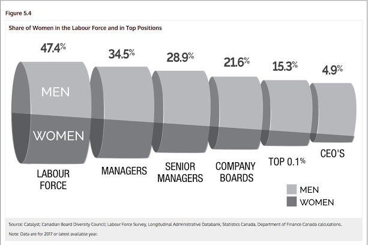

Praca domowa 3\
Jan Borowiski\
Wykres bazowy
```{r pressure, echo=FALSE, out.width = '100%'}

```

Kod wykresu:
```{r fig.width=18, message=FALSE, warning=FALSE, ,echo=TRUE,fig.height=9}
# wczytywanie danych
dane <- read.csv("dane.csv")
# 
dane <- dane[,2:4]
colnames(dane) <- c("V1","V2","V3")


library(ggplot2)

# imiciowanie wykresu
ggplot(dane,aes(x=V1,y=V2,fill=V3,label=paste0(V2,"%")))+
   # wybór geometrij
  geom_bar(stat="identity", position=position_dodge())+theme_minimal()+
  # właściwe ustawienie osi X (wiem że można inaczej)
  scale_x_discrete(limits=c("Labour Force","Managers","Senior Managers","Company Boards","TOP 0.1%","CEO'S"))+
  # poprawienie osi Y
  scale_y_continuous(breaks=c(0,25,50,75,100),labels = paste0(c(0,25,50,75,100),"%"),limits = c(0,100))+
  # dodanie podpisów 
  geom_text(vjust=-1.1,hjust =0.45,position = position_dodge(0.9),size=6)+
  # dodanie tytułu 
    labs(title = "Shere of Women in the Labour Force and in Top Positions")+
  # ustawienie nazw osi 
  theme(axis.title.x = element_blank(),
        axis.title.y = element_blank(),
        axis.text.y = element_text(size=20),
        axis.text.x = element_text(size=20),
        plot.title = element_text(size = 20),
        legend.text = element_text(size=20),
        legend.title = element_text(size=20)
  )+
# poprawienie legendy 
scale_fill_discrete(name = "Gender", labels = c("MEN", "WOMEN"))

  

```


Uważam ,że moja wersja lepiej przedstawia opisane dane dzięki wyraźnemu podziałowi na grupy nie utrzymane  w kolorach szarości. 
Nie wprowadza ona również w bład przeststawiając opisy przy niewłaściwej grupie jak ma to miejsce w oryginale. Uproszczona forma również ułatwia odbiór danych.