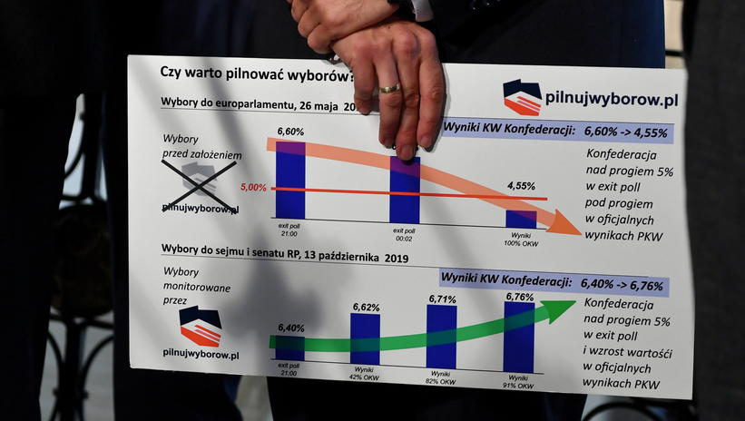

```{r setup, include=FALSE}
knitr::opts_chunk$set(echo = TRUE, save = TRUE, message = FALSE, warning = FALSE)
```

## Orginal
{width=600px}

### Zrodlo:
https://www.pap.pl/aktualnosci/news%2C528239%2Ckonfederacja-chce-uniewaznienia-wyborow.html


## Co jest bledne?
Baner przedstawiony na rysunku wprowadza odbiorce w blad na kilka sposobow.\
$1$. Wykresy slupkowe nie zaczynaja sie od zera. Po poprawce rysowane w oryginale strzalki po czesci traca sens, a juz na pewno skale i waznosc.\
$2$. Na graficje wazne jest porownanie wyzszego z nizszym wykresem, co rowniez zostalo utrudnione odbiorcy - najmniejszy slupek na gornym wykresie i na dolnym sa zupelnie inne mimo, ze najwieksze sa podobnej wartosci.\
$3$. Na dolnym wykresie srodkowe $2$ slupki nie wnosza zadnej informacji, gdyz to w jakiej kolejnosci `Okregowe Komisje Wyborcze` przysylaly wyniki jest kompletnie niezalezne od dzialania `pilnujwyborow.pl`.\
$4$. Jeszcze jedna metoda manipulacji danymi jaka widzimy na oryginalnym obrazku to wybieranie danych pod historie. Prawda jest taka, ze konfederacja miala lepsze wyniki w wiekszych miastach, z ktorych wyniki `OKW` przysylaly pozniej, wiec sila rzeczy wynik konfederacji rosnol w czasie, co zostalo pokazane na dolnym wykresie. Jednakze takiej korelacji nie widac na gornym, gdyz pokazane na nim dane sa innej natury: wszystkie $3$ to sondarze dla calej polski.
$5$. Infografika sugeruje, ze ostateczny wynik `KW Konfederacji`, dzieki dzialaniu `pilnujwyborow.pl`, zwiekszyl sie w porownaniu z wynikiem sondarzu, gdy tak naprawde ta organizacja miala na celu "ustabilizowac" te wartosc, co rownierz sie udalo, ale niejest to pokazane.\


## Moja propozycja poprawki
```{r dane}
library(ggplot2)
library(dplyr)
library(ggimage)

dane <- data_frame(
                    Wynik_z = c("Exit poll", "PKW", "Exit poll", "PKW"),
                    wybory = c("europarlament", "europarlament", "sejm i senat", "sejm i senat"),
                    wyniki = c(6.60, 4.55, 6.40, 6.81),
                    nazwa = c("6.60%", "4.55%", "6.40%", "6.81%"),
                    opis = c("Niedokladnosc przed:\n2.05 punktu procentowego", "",
                             "Niedokladnosc po:\n0.41 punktu procentowego", "")
                  )
Encoding(dane$opis) <- "UTF-8"
```

```{r poprawka}
ggplot(dane, aes(x=wybory, fill=Wynik_z)) +
  geom_bar(stat="identity", aes(y=wyniki), position=position_dodge(), colour=NA) +
  scale_fill_manual(values=c("#999999", "#FFFF00"), name = "Wynik z", labels = c("Exit poll", "PKW")) + 
  scale_y_continuous(expand = c(0,0), limits = c(0, 7)) +
  geom_text(aes(label = nazwa, colour=rodzaj, y=wyniki-0.2, fontface="bold"),
            position=position_dodge(width=0.9), colour = "#000000", size=3.5) +
  geom_text(aes(label = opis,
                colour=Wynik_z, y=0.65, fontface="bold"), colour = "#000000", size=3.5) +
  geom_image(aes(y = 2.50, image = c("przed.png", "przed.png", "po.png", "po.png")), size = 0.4) +
  labs(title = "Roznica miedzy exit poll'em, a wynikami PKW dla KW Konfederacji",
       subtitle = "przed i po zalozeniu organizacji pilnujwyborow.pl") +
  theme_bw() +
  theme(panel.grid.major = element_blank(), axis.ticks.x.bottom = element_blank())
```


