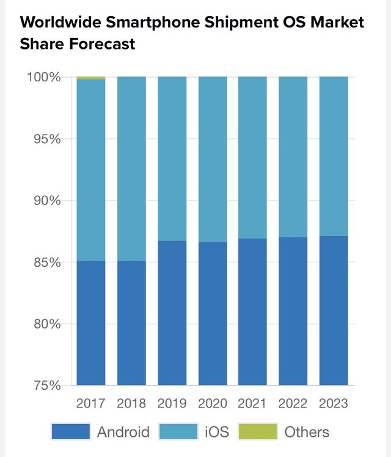

Wykres do poprawy

Wykres który udało mi się znaleźć do poprawy pochodzi ze strony https://www.idc.com/promo/smartphone-market-share/os,
i przedstawia on udział na rynku poszczególnych mobilnych systemów opreacyjnych w latach 2017-2023. Główną wadą tego wykresu jest kompletnie nieintuicyjnie zaczynająca sie skala od 75% oraz przedstawienie wartości Others w taki sposób, że jest ona kompletnie niewidoczna.

Wersja przed



Wersja po
```{r echo=FALSE, fig.height=6, fig.width=12, message=FALSE, warning=FALSE}
library(tidyverse)
library(reshape2)

data <- data.frame(year=as.character(seq(2017,2023)),Android=as.numeric(c("85.1","85.1", "87.0",	"87.0","87.2","87.3",	"87.4")),
                   Apple = as.numeric(c("14.7","14.9","13.0","13.0",	"12.8",	"12.7","12.6")),
                   Others=as.numeric(c("0.2","0","0","0","0","0","0")))

data <- melt(data,id.vars=c("year"))

ggplot(data=data,aes(x=year,y=value,fill=variable))+
  geom_bar(stat = "identity", position = position_dodge(width = 0.75), width = 0.8)+
  theme_minimal()+
  ggtitle("Worldwide Smartphone Shipment OS Market Share Forecast")+
  xlab("")+ ylab("")+
  theme(legend.title = element_blank(),
        plot.title = element_text(hjust = 0.5,size=18))+
  annotate(geom="label",x=seq(1,7)+0.25,y=3,label= data[15:21,3],size=3)+
  annotate(geom="label",x=seq(1,7)+0.01,y=3,label= data[8:14,3],size=3)+
  annotate(geom="label",x=seq(1,7)-0.25,y=3,label= data[1:7,3],size=3)+
  scale_fill_brewer(labels = data[1], type = "qual", palette = 7)
  
```