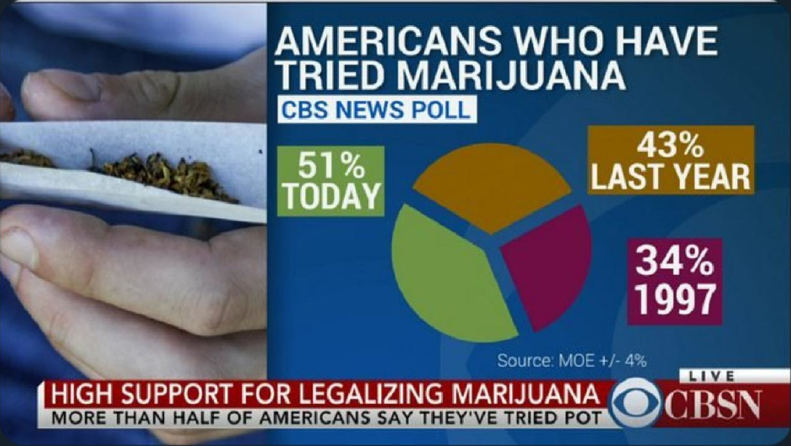

```{r setup, include=FALSE}
knitr::opts_chunk$set(echo = TRUE,cache=TRUE)
options(stringsAsFactors = FALSE)
```

## Co będę poprawiał?
Natrafiłem w internecie na tą wspaniałą kreację, o wyborze tego a nie innego wykresu zadecydowała ilość, ale przede wszystkim unikatowość jego błędów.


Wymieńmy wszystkie, rzeczy którymi trzeba się zająć:

* Jest to wykres kołowy
* Procenty nie sumują się do 100
* Jest on nieczytelny, 51% to mniej niż połowa wykresu
* Bez znajomosci daty publikacji, wykres jest bezużyteczny
* Używa kolorów, które mogłyby być trude do odróżnienie dla daltonistów
* Jako źródło jest podany błąd pomiaru <3

## Biblioteki

```{r librarys, warning=FALSE, message=FALSE}
library(ggplot2)
library(dplyr)
library(showtext)
font_add_google("Roboto", "Roboto") 
```

## Tworzenie danych
Do odtworzenia tego wykresu będziemy musieli stworzyć własną ramke danych.
Na szczęście danych nie ma dużo, więc jest to łatwe. Dodałem 2 puste lata, bo użyję ich przy tworzeniu wykresu.

```{r}

data <- data.frame(
    Year=c("2019","2018","2017","2016","1997"),
    Value=c(51,43,0,0,34)
)

```


## Wykres


```{r plot,warning=FALSE, fig.height=8,fig.width=6, fig.align='center'}

ggplot(data, aes(x=Year,y=Value))+
    
    geom_col(fill="#2e8b57")+
    geom_text(aes(label=paste0(Value,"%")),data = data[c(1,2,5),],nudge_y=1.6,size=6)+
    geom_segment(aes(x=0.6, xend=1.4, y=43, yend=43),color="darkgrey",size=0.75) + 
    geom_segment(aes(x=0.6, xend=1.4, y=47, yend=47),color="darkgrey",size=0.75) + 
    annotate("text",x="1997",y=45,label="MOE* 4%",color="darkgrey",size=4) +
    
    scale_y_continuous(position = "right",
                       labels=c("0"="","10"="10%","20"="20%","30"="30%","40"="40%","50"="50%"))+
    scale_x_discrete(
                        labels = c("1997","2016"="               . . .","2017"="","2018","2019"))+
    labs(title="\nAMERICA AND MARIJUANA",
         caption = "* Margin of Error +/- 4%\nSource: CBS NEWS poll",
         subtitle ="Percentage of Americans who smoked pot")+
    theme(
        text = element_text(family="Roboto"),
        
        panel.background = element_blank(),
        panel.grid.major.y = element_line(colour = "lightgrey"),
        
        axis.ticks = element_blank(),
        axis.title.y = element_blank(),
        axis.title.x = element_blank(),
        axis.text.x = element_text(size=20,face="bold"),
        axis.text.y = element_text(size=10,color="grey"),
        
        plot.title = element_text(size=30,face="bold"),
        plot.subtitle=element_text(size=18,color="darkgrey"),
        plot.caption  = element_text(size=10,color="darkgrey")
    )


```

## Przed 


## Zmiany  

* Pozbycie się nieczytelnego wykresu kołowego i zastąpnienie go wykresem słupkowym
* Oczyszczenie tła i otoczenia wykresu tak by dane były lepiej widoczne
* Zmiana pól "TODAY" i "LAST YEAR", na odpowiednie lata, dzięki czemu wykrs przeztaje być bezużyteczny bez daty publikacji
* Oddalenie danych z 1997 roku i dodanie w puste miejsce trzech kropek, tak by łatwiej rzucał się w oczy spory odstęp czasowy 
* Dodanie tutyłu, który skutecznie informuje o tamatyce wykresu oraz podtytułu, który wyjaśnia dane znajdujące sie na wykresie. Zdecydowałem sie go umieścić tutaj, zamiast na osi y, ze względu na jego czytelność, która jest niezbędna, by prawidłowo odczytać wykres
* Naniesienie na wykres zakresu błędu pomiaru, dzięki czemu lepiej jest widoczna niepewność danych
* Przeniesienie pola CBS NEWS POLL z tytułu do źródła danych wykresu
* Unijikacja kolorów, dzięki czemu wykres jest lepiej czytelny dla osób z wszelkimi zaburzeniami widzenia kolorów

 


