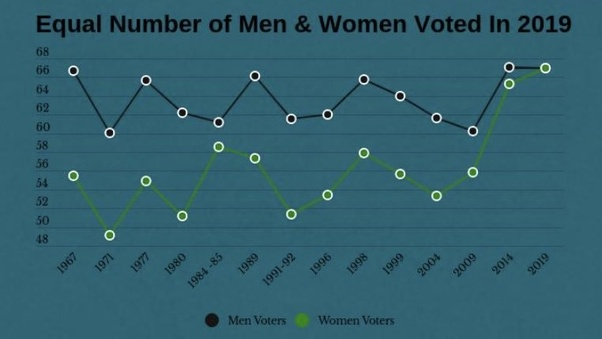

<style type="text/css">
.main-container {
  max-width: 1300px;
  margin-left: auto;
  margin-right: auto;
}
</style>

```{r setup, include=FALSE}
knitr::opts_chunk$set(echo = TRUE)
```

## Oryginalny wykres

Źródło: <https://www.quora.com/What-are-some-amazing-facts-related-to-the-recently-concluded-2019-Lok-Sabha-Elections-in-India>

Wykres:



## Wprowadzone zmiany

+ użyłem słupków zamiast łamanej ze względu na dyskretne wartości
+ słupki podpisałem odpowiadającymi im wartościami
+ zmieniłem błędny tytuł (w 2019 nie zagłosowała równa liczba mężczyzn i kobiet, tylko frekwencje w tych grupach były sobie bliskie)
+ podpisałem oś x numerami kolejnych elekcji, dzięki czemu zniwelowałem problem równych odległości między nierównymi odstępami czasu (daty elekcji zawarłem w nawiasach)
+ zawarłem wszystkie elekcje do Lok Sabha, zaznaczaczyłem braki danych
+ oś y zaczyna się od 0 oraz kończy na 100, z racji tego, że jest to oś procentowa
+ podpisałem osie odpowiednimi tytułami
+ zastosowałem lepsze "ticki" na osi y, teraz widać, których wartości dotyczą poszczególne linie pomocnicze
+ użyłem znacznie czytelniejszego schematu kolorystycznego (kolory odnoszą się do flagi Indii)
+ precyzyjniej opisałem legendę, zmieniłem jej położenie
+ dodałem podpis informujący o źródle danych

## Rozwiązanie zadania

```{r plot, message=FALSE, warning=FALSE, fig.width=12, fig.height=9, dpi=300}
#wczytanie bibliotek
library(ggplot2)
library(reshape2)

#manipulacja danymi
data <- read.csv("data.csv")
data$lok_sabha <- factor(x = data$lok_sabha, levels = data$lok_sabha)
data <- melt(data, id.vars = c("lok_sabha", "year"))

#przygotowanie wykresu
ggplot(data, aes(x = lok_sabha)) +
  geom_col(aes(y = value, fill = variable), position = "dodge") +
  geom_text(aes(y = value - 1, label = paste0(value, "%")), position = position_dodge2(width = 0.9, ), size = 2.5) +
  annotate("text", x = 1, y = 2, label = "No data") +
  annotate("text", x = 2, y = 2, label = "No data") +
  scale_y_continuous(limits = c(0, 100), breaks = seq(0, 100, 10), expand = c(0, 0)) +
  scale_x_discrete(labels = paste0(data$lok_sabha, "\n", "(", data$year, ")")) +
  scale_fill_manual(values = c("#FF9933", "#138808"), labels = c("men turnout", "women turnout")) +
  labs(title = "Lok Sabha general elections turnout by sex", subtitle = "", caption = "Source: India Press Information Bureau", fill = "Legend:") +
  ylab("Turnout (in %)") +
  xlab("Lok Sabha general election") +
  theme_bw() +
  theme(
    axis.text.x = element_text(angle = 45, vjust = 0.5),
    plot.caption = element_text(hjust = 1, size = 8),
    axis.title.x = element_text(vjust = -3),
    axis.ticks.x = element_blank(),
    legend.position = "top"
  )
```