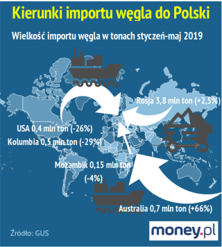

## Wykres przed:



## Wykres po:

```{r, echo=TRUE}
library(ggplot2)
library(tidyverse)

Kierunek <- c("USA", "Kolumbia", "Mozambik", "Australia", "Rosja")
Import19 <- c(0.4, 0.5, 0.15, 0.7, 3.8)
Zmiana <- c(-0.26, -0.29, -0.04, 0.66, 0.025)
Import18 <- Import19 + Import19*(-Zmiana)
Wzrost <- Import19 - Import18
Zmiana <- as.character(paste(Zmiana*100, "%"))

IW19 <- data.frame(Kierunek = Kierunek, Import = Import19, Rok = "2019")
IW18 <- data.frame(Kierunek = Kierunek, Import = Import18, Rok = "2018")
IW <- rbind(IW18, IW19)
diff_iw <- data.frame(Kierunek, Import18, Import19, Wzrost, Zmiana)

diff_iw <- diff_iw %>%
  mutate(Maximport = ifelse(Import18 > Import19, Import18, Import19), Wzrost = Wzrost < 0) %>%
  select(Kierunek, Maximport, Wzrost, Zmiana)

ggplot(IW, aes(Kierunek, Import)) +
  geom_bar(aes(y = Maximport + 0.1), data = diff_iw %>% filter(Wzrost == TRUE), stat = "identity", fill = NA, width = 0.4, colour = "red") +
  geom_bar(aes(y = Maximport + 0.1), data = diff_iw %>% filter(Wzrost == FALSE), stat = "identity", fill = NA, width = 0.4, colour = "green") +
  geom_text(aes(label = Zmiana, y = Maximport), vjust=-1.5, data = diff_iw %>% filter(Wzrost == TRUE), colour = "red") +
  geom_text(aes(label = Zmiana, y = Maximport), vjust=-1.5, data = diff_iw %>% filter(Wzrost == FALSE), colour = "green") +
  geom_bar(aes(fill = Rok), position = "dodge", stat="identity", width=0.8, colour = "grey20") +
  geom_text(aes(label=Import, group=Rok), position=position_dodge(width=0.8), vjust=1.3) +
  scale_fill_manual("", values = c("2018" = "cadetblue3", "2019" = "cornflowerblue")) +
  ylab("Wielkość importu węgla (tony)") + xlab("Kraj pochodzenia") +
  ggtitle("Import węgla do Polski (styczeń - maj)")

```

# Komentarz:

Ewidentnie wykres ze strony money.pl wprowadza duże zamieszanie. Strzałki były po pierwsze różne, po drugie ich wielkość nie była adekwatna ani do wielkości importu, ani do przyrostu. Strzałki nie zostały poprowadzone z każdego kraju. Dodatkowe grafiki są całkowicie zbędne. W moim prywatnym odczuciu najpierw rzuca się w oczy przyrost lub spadek, dopiero później rzeczywista wartość.

Stwierdziłem, że są to na tyle proste informacje, że zwykły wykres słupkowy zdecydowanie wystarczy, aby przejrzyście je przedstawić. Po odpowiednich obliczeniach stworzyłem więc zestawienie wielkości importu z 2018 i 2019 z poszczególnych krajów. Dodatkowo za głównym wykresem umieściłem słupki, przedstawiające przyrost lub spadek procentowy.

Zarówno w artykule jak i na samym wykresie nie jest jasno powiedziane, czego tyczy się zmiana procentowa. Skoro są to dane z GUSu, cicho założyłem, że jest to zmiana w stosunku do analogicznego okresu z zeszłego roku (tzn. styczeń-maj 2018)