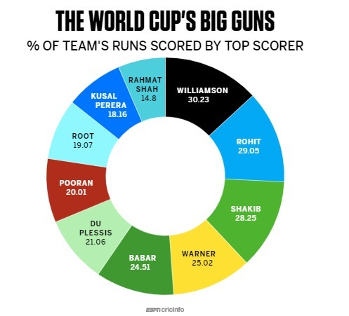

```{r setup, include=FALSE}
knitr::opts_chunk$set(cache = TRUE)
library(ggplot2)
```

## Stary wykres

Wykres dotyczy mistrzostw świata w krykiecie mężczyzn, a konkretniej zawodników zdobywających najwięcej procent punktów dla swojej reprezentacji na mistrzostwach rozegranych w latach 2015-2019.

```{r dane, echo=FALSE}

```

([źródło](https://www.espncricinfo.com/story/_/id/27143430/kane-williamson-hand-steadies-new-zealand-ship))

### Co jest nie tak?

Oczywiście to, że jest to **wykres kołowy**. Co więcej jednak, dane przedstawione na nim **nie sumują się do 100%**, nie wykluczając się nawzajem ani nie wyczerpując wszystkich danych, wbrew pierwotnemu założeniu schematu kołowego. To jeszcze bardziej zaburza interpretację wykresu - punkty zdobyte przez wymienionych zawodników nie tworzą przecież jednej całości.

## Nowy wykres

W nowym wykresie korzystam ze sprawdzonego, prostego schematu wykresu słupkowego, który pozwoli łatwiej porównać dane między sobą. Dodatkowo zapisałem całe nazwiska graczy i ich reprezentacje ([dostępne tutaj](http://stats.espncricinfo.com/ci/engine/stats/index.html?class=2;spanmin1=30+Mar+2015;spanval1=span;template=results;type=batting)), które mogłyby przydać się czytelnikowi niezaznajomionemu z tematyką wykresu. Osobne kolory wycofałem z wykresu jako zbędne.

```{r wykres, echo=TRUE}
# dane do ramki
gracz <- c("Kane Williamson\n(Nowa Zelandia)", "Rohit Sharma\n(Indie)",
           "Shakib Al Hasan\n(Bangladesz)", "David Warner\n(Australia)",
           "Babar Azam\n(Pakistan)", "Faf Du Plessis\n(RPA)",
           "Nicholas Pooran\n(kraje Karaibskie)", "Joe Root\n(Anglia)",
           "Kusal Perera\n(Sri Lanka)", "Rahmat Shah\n(Afganistan)")
procent <- c(30.23, 29.05, 28.25, 25.02, 24.51, 21.06, 20.01, 19.07, 18.16, 14.8)
dataf <- as.data.frame(cbind(as.character(gracz), as.double(procent)))

# wykres
ggplot(data=dataf, aes(x=reorder(gracz, procent), y=procent, label=paste(procent, "%", sep=""))) +
  geom_col(fill="#004080", width=5/6) + # kolumny
  geom_text(color="#e0e0e0", size=4, hjust=1) + # procenty na słupkach
  coord_flip() + # zmiana współrzędnych - wymagana dla prawidłowego przeczytania danych zawodników
  labs(x="gracz (i reprezentacja)", y="procent punktów zdobytych dla drużyny",
       title="Najlepsi z najlepszych...", subtitle="...graczy krykieta w swoich reprezentacjach") # tytuł i nazwy osi
```
