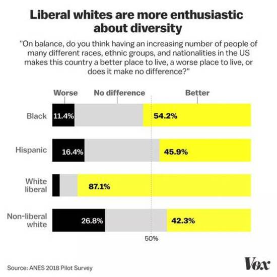
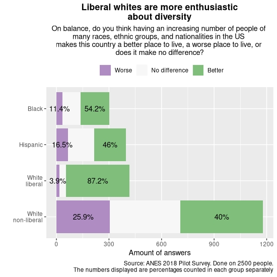

```{r setup, include=FALSE, eval = FALSE}
read.csv("anes_pilot_2018.csv") -> df
library(dplyr)
library(ggplot2)
library(tidyr)
```

### Oryginalny wykres i wersja poprawiona

Wersja przed               |  Wersja po
:-------------------------:|:-------------------------:
  |  

### Komentarz

Zacznijmy od tego, że wniosek przedstawiony w tytule wykresu jest poprawny. Centralna wiadomość, jaką niesie ze sobą wykres, jest prawdą. Niestety, wykres podświadomie przekazuje inne treści, które od prawdy odbiegają. (Nie mam pojęcia, skąd się biorą różnice w procentach na obu wykresach, ale nie wpływają one na problematykę zadania).

Problemem wykresu są nieidentyczne skale na paskach korespondujących z określonymi grupami. Każdej grupie przyporządkowano pasek tej samej długości, podczas gdy frakcje poszczególnych grup w społeczeństwie USA nie są identyczne. Prowadzi to do nagięcia samych wyników odpowiedzi na pytanie :

* Na oryginalnym wykresie kolor żółty (odpowiedzi pozytywne) zajmuje około **57%** powierzchni. W rzeczywistości odpowiedzi pozytywnych było **52%**. 

* W podobny sposób kolor czarny (odpowiedzi negatywne) zajmuje około **14.5%** powierzchni, podczas gdy w rzeczywistości odpowiedzi pozytywnych było **18%**. 

* Wreszcie, kolor szary zajmuje **28.5%** powierzchni, podczas gdy odpowiedzi z nim korespondujących było **30%**.

Sam dobór grup jest również nie jest dość oczywisty - czemu wśród białych wyróżniono liberałów i nie-liberałów, a wśród pozostałych już nie? Czemu nie wzięto pod uwagę innych ras? Na potrzeby tej pracy przyjmijmy, że zredukowano ilość grup, by uprościć przekaz (nawiasem mówiąc, wśród nie-białych liberałów rozkład odpowiedzi jest podobny, co u białych liberałów).

Zauważmy, że poprawiona wersja nie zakłóca pierwotnego przekazu - widz zainteresowany rozkładem odpowiedzi w poszczególnych grupach znajdzie to, czego szuka. Przy tym ta wersja trafniej pokazuje rzeczywistość - na przykład fakt, że (co do liczby bezwzględnej) wśród białych odpowiadających na pytanie pozytywnie jest prawie tyle samo liberałów, co nie-liberałów. Oryginał by wskazywał, że liberałów jest 2 razy więcej. 

### Kod R

```{r, eval = FALSE}
# lcself - własne poglądy
# ideo5 - poglądy:
# 1-2 -> liberal; 3-7 -> non-liberal 
# diversity - odpowiedzi na rzeczone pytanie:
# 1-3 -> better; 4 -> no difference; 5-7 -> worse
# race - rasa:
# 1 - white
# 2 - black
# 3 - hispanic

ideologies <- c(rep("liberal",2), rep("non-liberal",5))
diversities <- c(rep("Better",3), "No difference", rep("Worse",3))
make_groups <- function(race, views){
  race <- as.character(race)
  race[race == "White"] <- paste("White", views[race == "White"], sep = "\n")
  race
}

my_data <- select(df, weight, ideo5, race, diversity) %>%
  filter(race %in% 1:3, ideo5 != -7) %>%
  mutate(race = factor(race, labels = c("White", "Black", "Hispanic")), 
         ideo = ideologies[ideo5],
         diversity = diversities[diversity],
         vox_groups = factor(make_groups(race, ideo),
                             levels = c("White\nnon-liberal",
                                        "White\nliberal",
                                        "Hispanic",
                                        "Black"))) %>% 

  group_by(vox_groups, diversity) %>%
  summarise(totalWeight = sum(weight)) %>%
  group_by(vox_groups) %>% 
  arrange(desc(diversity)) %>%
  mutate(cumWeight = cumsum(totalWeight) - (totalWeight / 2),
         labels = round(totalWeight / sum(totalWeight) * 100, digits = 1) %>% paste0("%"))

my_data[my_data[["diversity"]]=="No difference","labels"] <- ""

# Zdecydowałem się na osi Y przedstawić wyniki bezwzględne, a nie procentowe, by się nie myliły z procentami
# na samym wykresie.

ggplot(my_data,
       aes(x = vox_groups, y = totalWeight, fill = diversity, label = labels, group = diversity)) +
  geom_col() +
  scale_fill_brewer(palette = "PRGn", direction = -1) +
  geom_text(aes(y = cumWeight)) +
  coord_flip() +
  theme(legend.title = element_blank(),
        legend.position = "top",
        plot.title = element_text(hjust = 0.5, face = "bold"), 
        plot.subtitle = element_text(hjust = 0.5)
        ) +
  labs(title = "Liberal whites are more enthusiastic\nabout diversity",
       subtitle = "On balance, do you think having an increasing number of people of 
many races, ethnic groups, and nationalities in the US 
makes this country a better place to live, a worse place to live, or 
does it make no difference?",
       caption = "Source: ANES 2018 Pilot Survey. Done on 2500 people.
       The numbers displayed are percentages counted in each group separately") +
  scale_x_discrete(name = "") +
  scale_y_continuous(name = "Amount of answers")

```

### Źródła

[Oryginalny artykuł](https://www.vox.com/2019/3/22/18259865/great-awokening-white-liberals-race-polling-trump-2020)

[Dane](https://electionstudies.org/data-center/2018-pilot-study/)
