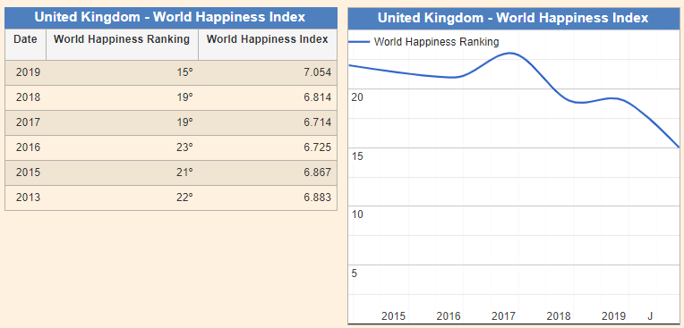

```{r setup, include=FALSE}
knitr::opts_chunk$set(echo = TRUE)
library(ggplot2)
library(patchwork)
```

## Żródło
Dane i sam wykres pobrane zostały ze strony https://countryeconomy.com/demography/world-happiness-index/uk .



Wykres przedstawia światowy ranking szczęścia UK na przestrzeni lat. Jednak jest to pokazane w sposób tragiczny, bo nic nie widać na pierwszy rzut oka: wydaje się, że UK opada w rankingach a jest właśnie odwrotnie. Do tego wykres podpisany jest "UK - World Happiness Index" a przedstawione są rankingi. Sam indeks szczęścia pokazany jest tylko w tabelce obok, która jest dużo czytelniejsza niż sam wykres.


```{r dane, include=FALSE}
data <- data.frame( c( "2013", "2015", "2016", "2017", "2018", "2019"),
              c( 22, 21, 23, 19, 19, 15),
              c( 6.883, 6.8867, 6.725, 6.714, 6.814, 7.054),
              c( 2013, 2015, 2016, 2017, 2018, 2019))
colnames(data) <- c("Date", "World.Happiness.Ranking", "World.Happiness.Index", "Date2")
```


## Poprawianie wykresu
```{r wykresy}
p <- ggplot(data=data, aes(x = Date,                       # BARPLOT RANKINGU
                           y=World.Happiness.Ranking)) + 
  
  geom_col( aes(fill=World.Happiness.Ranking),     # barplot
            width = 0.9) + 
  
  geom_text(aes(label=World.Happiness.Ranking),        # napisy
            position = position_stack(vjust = 0.5), 
            size = 4.2, color = "white") +
  
  scale_fill_gradient(low = "#41b6c4", high = "#225ea8", guide=FALSE) + # kolorki
  
  scale_x_discrete(position = "top") +               # skala x
  
  expand_limits(y = c(0, 25)) +                   # skala y
  scale_y_reverse(expand = c(0.01, 0.02)) +
  
  labs(title = "World Happiness Ranking: United Kingdom",      # labelsy
       x = "Year",
       y = "World Happiness Rank") +
  
  theme(
    title = element_text(size = 13, face="italic", vjust=10),
    
    axis.title.x = element_text(size = 10, face="plain"),
    axis.text.x = element_text(size = 12,),
    axis.ticks.x = element_blank(),
    
    axis.title.y = element_text(size = 10, face="plain"),
    axis.ticks.y = element_blank(),
    axis.text.y = element_blank(),
    
    panel.background = element_blank(),   # biale tlo
    )


p2 <- ggplot(data=data, aes(x = Date2,                 # LINEPLOT INDEKSU
                           y=World.Happiness.Index)) + 
  
  geom_line( color="#e81e10", size=1.2) +         # lineplot i kropki
  geom_point(color="#e81e10", size=2) +
  
  scale_x_continuous(position = "top",              # skala x
                     breaks = seq(2013,2019,1)) +
  
  scale_y_continuous(breaks = seq(6.675,7.1,0.025)) +         # skala y
  expand_limits(y = c(6.68, 7.1)) +                   
   
  labs(x = "Year",
       y = "World Happiness Index") +   # labelsy
    
  theme(
    axis.line = element_line(color = "black", size = 0.3, linetype = "solid"),
    
    panel.grid.major.x = element_line(color = "#303030", size = 0.2, linetype = "dotted"),
    panel.grid.minor.x = element_blank(),
    
    panel.grid.major.y = element_line(color = "#242424", size = 0.2, linetype = "dashed"),
    panel.grid.minor.y = element_blank(),
    
    axis.title.x = element_text(size = 10, face="plain"),
    axis.title.y = element_text(size = 10, face="plain"),
    
    panel.background = element_blank(),   #biale tlo
    )
```

## Końcowy wykres
```{r fin, warning=FALSE}
p+p2
```