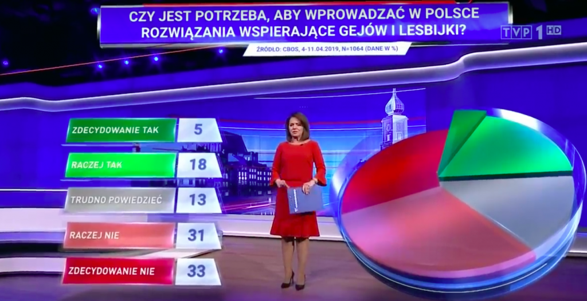

```{r setup, include=FALSE}
knitr::opts_chunk$set(echo=T)
```

## Wykres źródłowy


### Problemy z nim
* Zastosowanie wykresu kołowego - trudniej porównywać wartości
* Wykres jest w 3D, perspektywa dodatkowo utrudnia
* Poszczególne części koła się rozchodzą w osi Z, co jeszcze bardziej to utrudnia, a jeszcze to niby szkło
* Wartości znajdują się na legendzie, a nie na wykresie, trudno patrzeć na jedno i drugie jednocześnie

## Wykres wykonany przeze mnie
```{r, warning=FALSE, fig.width=10, fig.height=8}
library(dplyr)
library(ggplot2)

data <- data.frame(response=c("ZDECYDOWANIE TAK", "RACZEJ TAK", "TRUDNO POWIEDZIEĆ", "RACZEJ NIE", "ZDECYDOWANIE NIE"),
                   value=c(5,18,13,31,33))
data$label <- paste0(data$value, "%")
data$response = factor(data$response, levels=data$response) # Wymuszamy kolejność

ggplot(data, aes(x=response, y=value, label=label)) +
  ggtitle("CZY JEST POTRZEBA, ABY WPROWADZAĆ W POLSCE \nROZWIĄZANIA WSPIERAJĄCE GEJÓW I LESBIJKI?") +
  labs(caption="CBOS, 4-11.04.2019, N=1064") +
  geom_col(fill=rev(c("red", "orange", "yellow", "green", "dark green"))) +
  theme_minimal() + 
  expand_limits(y=c(0,40)) +
  theme(legend.position="none", 
        axis.title.x=element_blank(),
        axis.title.y=element_blank(),
        plot.title=element_text(size=14, face="bold", colour = "black"),
        axis.text.x=element_text(size=10, face="bold", color = "black")) +
  geom_label(size=6) 
```

Wykres jest prosty, ale znacznie bardziej czytelny i przejrzysty.
