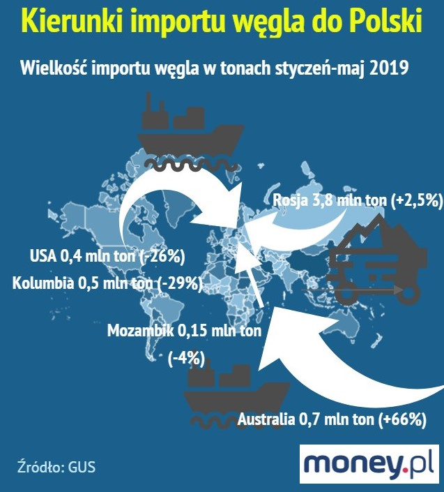

```{r include=FALSE}
knitr::opts_chunk$set(echo = TRUE)
knitr::opts_chunk$set(fig.width=12, fig.height=8) 
# needed library
library(ggplot2)
library(dplyr)
options(stringsAsFactors = FALSE)

Sys.setlocale(category = "LC_ALL", locale = "Polish")
```

## Wstęp

Tematem pracy domowej było wybranie wykresu, który źle przedstawia dane (manipuluje, wprowadza w błąd). Wykres ten miał pochodzić z 2019 roku. 

W związku z tym, iż wykresy te nie są przeważnie ambitne (aby coś zmanipulować nie stosuje się dużej liczby danych) przedstawię dwie najlepsze *manipulacje*, *błędy* jakie znalazłem.


## Wykres nr 1

### Źródło

Pierwszy wykres pochodzi ze strony [apostel.pl](http://apostel.pl/home/). Na stronie tej znajdują się podobne wykresy, które mają ten sam cel - zmanipulować odbiorcę. Wykresy przedstawione na stronie powstały w roku 2019. 

### Kod

```{r}
data <- read.csv('data/plot2.csv')
order <- c("Formacja", "RGT Kilimanjaro", "Patras", "APOSTEL")


extrafont::loadfonts(device="win")
windowsFonts(Calibri=windowsFont("Calibri"))

plot1 <- ggplot(data, aes(x=name, y=value)) +
  labs(x="", 
       y="% wzorca",
       title = "Plon ziarna na tle wzorca pszenicy jakościowej",
       caption="źródło: COBAR") +
  coord_cartesian(ylim = c(5, 110)) +
  scale_y_continuous(breaks = seq(0, 110, by=10)) +
  scale_x_discrete(limits = order) +
  theme_bw(base_family="Calibri") +
  theme(plot.caption=element_text(size=10, margin=margin(t=12), color="#7a7d7e")) +
  geom_bar(stat="identity", width = 0.4) +
  geom_text(aes(label = value), position = position_stack(vjust = 0.5), size = 6, color = "white") +
  theme_minimal() +
  theme(plot.title = element_text(color="black", size = 15, hjust=0.5)) +
  theme(axis.text.x =element_text(face = "bold", size=10)) +
  theme(axis.text.y=element_text(face = "bold"))

  
```


### Wersja pierwotna

 

### Dlaczego wykres jest zły?

Firma **APOSTEL** celowo manipuluje danymi, aby pokazać się z lepszej strony na tle konkurencji. W tym celu:  
* występuję ucięta oś - dane są pokazane od wartości 96 a nie od 0: 
  powoduje to efekt, iż różnice w wysokościach sugerują dużą różnicę pomiędzy firmami a w rzeczywistości różnica ta nie jest
  tak olbrzymia  
* pole kolumny - "kolumny" rosną nie tylko w wysokości, ale też w szerokości: 
  przez wzrost nie tylko w kolumnie, ale również w szerokości mamy wrażenie, iż różnica ta jest jeszcze większa  
* wyróżnienie - jedna firma jest szczególnie wyróżniona: 
  powoduje to, iż odbiorca głównie przykuwa uwagę na tym elemencie  


### Wersja poprawiona

```{r echo=FALSE} 
  plot1
```


### Co jeszcze poprawiłem?

* tytuł wykresu: znajduję się on teraz w środku - łatwiej go czytać  
* źródło: w pierwotnym wykresie stanowiło ważny element wykresu; w moim wypadku odgrywa raczej rolę drugorzędną (co jest wg mnie słuszne)  
* wyróżniona kolumna: wszystkie kolumny w moim wykresie mają ten sam kolor (nie manipuluje odbiorcą)  
* w środku danej kolumny są wartości, ile dokładnie dana wartość wynosi - łatwe ogląDanie wykresu  


## Wykres nr 2


### Źródło

Drugi wykres pochodzi ze strony [money.pl](https://www.money.pl/gospodarka/wegiel-z-mozambiku-to-gwozdz-do-trumny-kopalnie-nie-daja-rady-6423400036157569a.html). Artykuł wraz wykresem został opublikowany 11 września 2019 r.

### Kod

```{r}
data <- read.csv('data/plot1.csv', encoding="UTF-8")


order <- c("Niemcy", "RPA","Czechy", "Mozambik", "Kazachstan",
           "USA", "Kolumbia", "Austalia", "Rosja")


extrafont::loadfonts(device="win")
windowsFonts(Calibri=windowsFont("Calibri"))

plot2 <- ggplot(data, aes(x=country, y=value)) +
  geom_bar(stat="identity", fill="#f68060", alpha=.6, width=.4) +
  scale_x_discrete(limits = order) +
  scale_y_continuous(breaks = seq(0, 5000, by=500)) +
  labs(x="", 
       y="",
       title = "Import węgla do Polski w okresie styczeń-maj 2019 r. (w tys. ton)",
       caption="źródło: GUS") +
  geom_text(aes(label = value), size = 3, vjust = -1, color = "#444444") +
  theme_minimal() +
  theme(plot.title = element_text(color="black", size = 15, hjust=0.5)) +
  theme(axis.text.x =element_text(face = "bold", size=10)) +
  theme(axis.text.y=element_text(face = "bold"))


  
```


### Wersja pierwotna

 

### Dlaczego wykres jest zły?

* wielkość strzałek jest nie adekwatna do żadnej zmiennej  
* na wykresie znajduję się wiele różnych grafik i danych przez to wykres jest nieczytelny  
* jedna ze strzałek (która zapewne w oczach autora miała wychodzić z Australii) nie odpowiada żadnemu krajowi (wychodzi ona z ocenu)  
* Kolumbia nie ma żadnej strzałki  
* dane na w nawiasach są nie wyjaśnione przez to są one zbędne i nie wnoszą żadnej informacji dla obriorcy wykresu (jednynie zaciemniają właściwe odczytanie)  
* dane na wykresie nie odpowiadają danym GUS-u  


### Wersja poprawiona

```{r echo=FALSE} 
  plot2
```


### Co jeszcze poprawiłem?

* dodałem wykres kolumnowy  
* dodałem więcej państw - odpowiada to sytuacji rzeczywistej  
* tytuł został wypośrodkowany (lepsza cztelność i schludniejsza forma)  
* nad daną kolumną są wartość określające dokładną wartość ile wynosi import z danego kraju  
* źródło: w pierwotnym wykresie stanowiło ważny element wykresu; w moim wypadku odgrywa raczej rolę drugorzędną (co jest wg mnie słuszne)  


