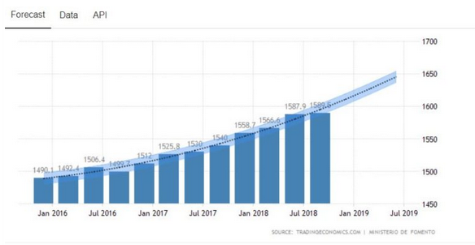

```{r echo=FALSE, warning=FALSE, message=FALSE}
library(ggplot2)
library(dplyr)
library('latex2exp')
```

## Wykres przed:

```{r przed, echo=FALSE, out.width='100%'}

```
[Źródło wykresu](https://globly.eu/ceny-nieruchomosci-w-hiszpanii/)

Główne moje zarzuty to słupki niezaczynające się od 0 i słabe etykiety na osi x - nie wiadomo, czy są to dane kwartalne czy miesięczne, dopiero opis na stronie [źródła](https://tradingeconomics.com/spain/housing-index) to wyjaśnia. 

```{r plot, warning=FALSE}
label <- c("Q1 2016", "Q2 2016", "Q3 2016", "Q4 2016", "Q1 2017", "Q2 2017", "Q3 2017", "Q4 2017",
           "Q1 2018", "Q2 2018", "Q3 2018", "Q4 2018", "Q1 2019", "Q2 2019", "Q3 2019", "Q4 2019")
val <- c(1490.1, 1492.4, 1506.4, 1499.7, 1512, 1525.8, 1530, 1540, 1558.7, 1566.6, 1587.9, 1589.5, NA, NA, NA, NA)
x <- 1:16

data <- data.frame(label, val, x)

ggplot(data, aes(x = factor(x), y = val)) +
  theme_minimal()+
  coord_cartesian(ylim = c(0, 1700))  +
  geom_bar(stat="identity", width = 0.8, fill = "steelblue") +
  geom_line(
    stat = "smooth",
    aes(x = x, y = val),
    method = "lm",
    alpha = 0.2,
    color = "dodgerblue4",
    size = 5,
    na.rm = TRUE,
    fullrange = TRUE) +
  geom_smooth(
      method = "lm",
      na.rm = TRUE,
      aes(x = x, y = val),
      linetype = "dotted",
      color = "dodgerblue4",
      fullrange = TRUE,
      se = FALSE) +
  scale_x_discrete(breaks = 1:16, labels = label) +
  ylab(parse(text = TeX('Cena mieszkania w €/$m^2$'))) +
  labs(x = "", title = "Średnie ceny mieszkań w Hiszpanii od 2016 r.") +
  theme(
    axis.text.x = element_text(angle = 45, hjust = 1, color = "#444444"),
    plot.title = element_text(color="#444444", size=16, hjust = 0.5),
    axis.text.y = element_text(color = "#444444")) +
  geom_text(aes(label = round(val)), size = 3, vjust = -1, color = "#444444")

```
  


