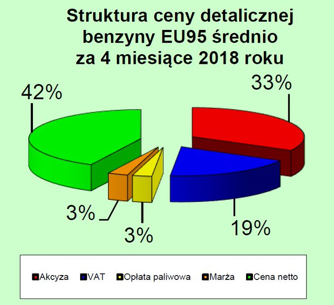

[Wykres](https://businessinsider.com.pl/finanse/makroekonomia/mateusz-morawiecki-o-benzynie-odpowiedz-for/90xky5j) pochodzi z artykułu z portalu Business Insider Poland, z załączonego tweeta Rafała Trzeciakowskiego.



```{r setup, include=FALSE}
library(ggplot2)
data <- data.frame("Rodzaj" = c("Cena Netto", "Akcyza", "VAT", "Opłata Paliwowa", "Marża"), "Ilosc" = c(0.42, 0.33, 0.19, 0.03, 0.03))
data$Rodzaj <- factor(data$Rodzaj, levels = c("Cena Netto", "Akcyza", "VAT", "Opłata Paliwowa", "Marża"))
```

## Including Plots

```{r plot}
ggplot(data = data, aes(x = Rodzaj, y = Ilosc)) +
    geom_bar(stat = "identity", width = 0.9, fill = "#362A66") +
    geom_text(aes(label = scales::percent(Ilosc, accuracy = 1)), position = position_stack(vjust = 0.5), size = 6, color = "white") +
    scale_y_continuous(limits = c(0, 0.42), expand = c(0, 0)) +
    theme(axis.text.y = element_blank(),
          axis.line.y = element_blank(),
          axis.ticks.y = element_blank(), 
          axis.title = element_blank(),
          axis.text.x = element_text(size = 10, face = "bold"),
          axis.line.x = element_line(),
          panel.grid.major = element_blank(),
          panel.grid.minor = element_blank(),
          panel.border = element_blank(),
          panel.background = element_blank()) +
    coord_fixed(10) +
    labs(title = "Struktura ceny detalicznej benzyny EU95 średnio za 4 miesiące 2018 roku", fill = element_blank())
```