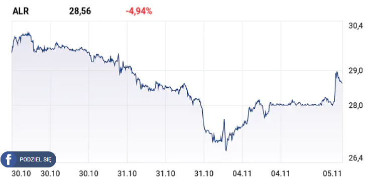

```{r setup, include=FALSE}
knitr::opts_chunk$set(echo = FALSE)
library("ggplot2")
library("dplyr")
library("knitr")
```

### Oryginalny wykres

Oryginalny wykres pochodzi z artykułu pt. "Alior odbija od dna. Wyniki najlepsze w tym roku. Firmy dały zarobić", który można znaleźć poniżej:
(https://www.money.pl/gielda/alior-odbija-od-dna-wyniki-najlepsze-w-tym-roku-firmy-daly-zarobic-6442778158815361a.html).

Sam wykres natomiast zamieszczam poniżej:

```{r}

```

Głównym zarzutem, który wnoszę do powyższego obrazu jest ucięcie osi OY bardzo blisko minimalnej wartości osiągniętej przez cenę akcji Alior Banku, co ma sugerować, że istotnie "odbiła się ona od dna". Ponadto przedstawiony został bardzo krótki okres, więc ciężko nawet stwierdzić w jak długim okresie czasu cena akcji Alior Banku malała. Obie te nieścisłości naprawia mój pierwszy wykres: 

## Pierwszy wykres


```{r, fig.width = 12, fig.height = 8,echo=FALSE}
aliorbank <- read.csv("C:/Users/welkierk/Downloads/Alior Bank SA (ALR).csv")
colnames(aliorbank) <- c("Data","Otwarcie","Zamknięcie","Maks","Min","Obrót (mln zł)","Zmiana")

aliorbank[130:258,]<-aliorbank[1:129,]
aliorbank[1:129,8] <- aliorbank[1:129,4]
aliorbank[130:258,8] <- aliorbank[130:258,5]
aliorbank[1:129,9] <- "Maksymalna wartość akcji w kolejnych dniach"
aliorbank[130:258,9] <- "Minimalna wartość akcji w kolejnych dniach"
aliorbank <- aliorbank[,c(1,8,9)]


theme_set(theme_minimal()) 
ggplot(aliorbank, aes(x=Data, y=V8, group = V9, color = V9))  + geom_line(stat = "identity", size = 2) + scale_color_manual(values=c("green", "red")) + 
  coord_cartesian(ylim=c(0,60)) + 
  labs(title = "Wartość akcji Alior Banku na przestrzeni ostatnich dwóch kwartałów") +
  xlab ("16 maja 2019 ------- 6 listopada 2019") + ylab("Wartość akcji (w PLN)") + 
  theme(axis.title.x = element_text(size=18, color = "steelblue") , axis.title.y = element_text(size = 18, color = "steelblue"),axis.text.x = element_blank(), 
        axis.ticks.x = element_blank(), axis.ticks.y = element_blank(),axis.text.y = element_text(size=12),
        plot.title = element_text(size = 22, hjust = 0.5, face = "bold", color="deepskyblue2"))+ 
    theme(panel.background = element_rect(fill = "#BFD5E3")) +  theme(legend.position = "top", legend.title = element_blank(),legend.justification = c(0,0), legend.key = element_blank(), 
                                                                     legend.text = element_text(size = 14))
```

Uważam, że mój pierwszy wykres pokazuje znacznie szersze spektrum interesującego nas zagadnienia i robi to w sposób znacząco bardziej obiektywny. Jednkże jeszcze większą obiektywność zyskamy jeśli porównamy, w tym samym okresie czasu, ceny akcji Alior Banku z cenami akcji WIG-BANKI, czyli indeksu giełdowego, do którego akcje Alior Banku należą. Oczywiście ceny akcji każdego banku mogą należeć liczbowo do bardzo różnych przedziałów, więc pozwoliłem sobie uśrednić otrzymane pomiary (dane, z których korzystamy dotyczą każdego banku należącego do WIG-BANKI z osobna, a nie całego indeksu giełdowego na raz).


## Drugi wykres

```{r, fig.width = 14, fig.height = 8,echo=FALSE}
all_banks = as.data.frame(matrix(0,nrow=129,ncol=26))
nazwy_banków = c("Alior Bank SA (ALR).csv","MBank SA (MBK).csv","Banco Santander SA (SAN).csv","Bank Handlowy SA (BHW).csv","Bank Millennium SA (MIL).csv","Bank Pekao SA (PEO).csv",
                 "BNP Paribas Bank Polska SA (BNP).csv","BOŚ SA (BOS).csv", "Getin Holding SA (GTN).csv", "Idea Bank SA (IDA).csv", "ING BSK SA (ING).csv",
                 "PKO BP SA (PKO).csv", "Santander Bank Polska SA (SPL).csv")
 
for (i in 1:length(nazwy_banków)){
  
  dataset <- combine_words(c("C:/Users/welkierk/Desktop/Data Science/TWD/PD_4", nazwy_banków[i]), and = "/")
  dataset <- read.csv(dataset)

  colnames(dataset) <- c("Data","Otwarcie","Zamknięcie","Maks","Min","Obrót (mln zł)","Zmiana")
  mean_of_dataset <- sum(dataset[,3])/length(dataset[,3])
  dataset[,2] <- dataset[,3] / mean_of_dataset
  all_banks[,1+2*(i-1)] <- dataset[,1]
  all_banks[,2+2*(i-1)] <- dataset[,2]
}
wig_banks <- all_banks[,c(1,seq(2,26,2))]
wig_banks[,2] <- (wig_banks[,2] + wig_banks[,3] + wig_banks[,4] + wig_banks[,5] + wig_banks[,6] + wig_banks[,7] + wig_banks[,8] + wig_banks[,9] + wig_banks[,10] + 
  wig_banks[,11] + wig_banks[,12] + wig_banks[,13] + wig_banks[,14])/(length(wig_banks)-1)
wig_banks <- wig_banks[,c(1,2)]
aliorbank_2 <- all_banks[,c(1,2)]
final <- aliorbank_2[,c(1,2)]
final[,3] <- wig_banks[,2]
final[130:258,]<-final[1:129,]
final[130:258,2] <- final[130:258,3]
final[1:129,3] <- "Wartości akcji Alior Banku w kolejnych dniach"
final[130:258,3] <- "Notowania indeksu WIG-banki w kolejnych dniach"

theme_set(theme_minimal()) 
ggplot(final, aes(x=V1,y=V2, group=V3,color=V3)) + geom_line(stat = "identity", size = 2) + scale_color_manual(values=c("deepskyblue3", "limegreen")) + 
  coord_cartesian(ylim=c(0,2)) + labs(title = "Porównanie wartości akcji Alior Banku oraz wartości indeksu WIG-BANKI na przestrzeni ostatnich 2 kwartałów") +
  xlab ("16 maja 2019 ------- 6 listopada 2019") + ylab("Uśredniona wartość akcji") + 
  theme(axis.title.x = element_text(size=16, color = "steelblue") , axis.title.y = element_text(size = 16, color = "steelblue"),axis.text.x = element_blank(), 
        axis.ticks.x = element_blank(), axis.ticks.y = element_blank(),axis.text.y = element_text(size=12),
        plot.title = element_text(size = 18, hjust = 0.5, face = "bold", color="deepskyblue2"))+ 
  theme(panel.background = element_rect(fill = "#BFD5E3")) +  theme(legend.position = "top", legend.title = element_blank(),legend.justification = c(0,0), legend.key = element_blank(), 
                                                                    legend.text = element_text(size = 14))
```

Podsumowując dopiero drugi wykres pokazuje, że w rzeczywistości "dno" osiągnięte przez Alior Bank nie jest aż tak głębokie jak sugeruje zaprezentowany artykuł.
