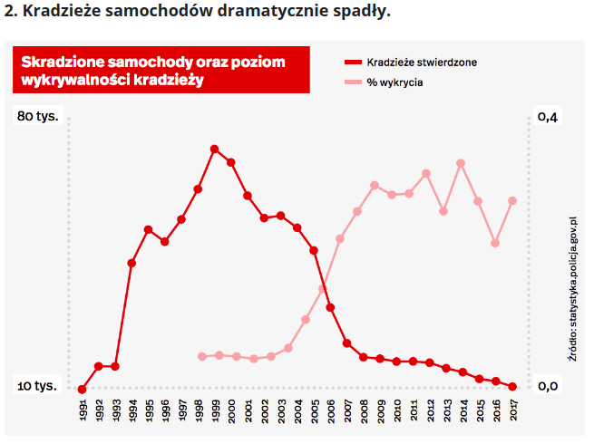

## Wykres

Wykres znaleziony na:
http://300gospodarka.pl/wykres-dnia/2019/06/04/21-wykresow-pokazujacych-jak-bardzo-zmienila-sie-polska-przez-ostatnie-30-lat/

```{r, echo=FALSE}

```

Wykres pokazuje wzrost i spadek kradzieży samochodów w Polsce na przestrzeni lat, oraz wykrywalność tych kradzieży. Może on jednak wprowadzić nieuważnego czytelnika w błąd. Główne grzechy:

1. Skala nie zaczyna się od zera. W roku 91 i 2017 wciąż jest 10 tysięcy kradzieży samochodów w Polsce. Kradzież samochodów spada do wartości 10 000 w 2017 roku, ale wykres liniowy kończy się niebezpiecznie początku drugiej osi przy wartości 0.0 . 

2. Ciężko wyczytać ile dokłanie samochodów jest kradzionych w danych latach.

3. Z legendy wynika, że wartości wykrycia są podawane w procentach, czyli wahają się między 0.0% a 0.4%. Po spojrzeniu na statystyki policji wnioskuję, że autorowi chodziło raczej o skalę między 0% a 40%.

4. Wykres wykrycia na 2 planie ma skalę dziwnie dopasowaną do tego na 1. 30% wykrycia skradzionych samochodów z jakiegoś powodu jest tak samo wysoko jak kradzież 50-60 tysięcy tychże pojazdów.


```{r, echo= FALSE, include=FALSE}

library(dplyr)
library(ggplot2)

# dane z statystyk policji sa gromadzone w okropny sposob, raporty z roznych lat maja kompletnie inna formę, w niektórych jest wykrywalność,
# w innych nie ma(np. tych sprzed 2009 roku). Nie wiem również w jaki sposób oryginalny wykres odnosi się do odwołanych kradzieży,
# które widnieją w raportach. Nie mogłem dojść do wyników tych danych, więc postarałem się je przepisać z wykresu "na oko".

# Mój wykres nie przedstawia więc prawdziwych danych, jedynie odtworza te z oryginalnego wykresu.
 
# Tu patrzyłem sprawdzając dane, których koniec końców nie użyłem:
# http://www.statystyka.policja.pl/st/wybrane-statystyki/kradzieze-samochodow 

lata <- seq(1991,2017,1)
lab_lata <- as.character(lata)
lata1 <- lata
lata1[7] = 1997.99
kradziezeStwierdzone <- c(10,15,14,40,47,45,49,57,73,69,56,49,50,47,30,20,19.5,18,18.1,16.4,15.5,14.5,14,13,12,11,10)
wykrycia <-             c(0, 0, 0, 0, 0, 0, 0,5, 5, 5.1,5,4.9,5,6,10,14,23,26,30,28,28.5,31,26,33,27,22,27)

# robimy tysiace
kradziezeStwierdzone <- kradziezeStwierdzone * 1000

# robimy procenty
wykrycia <- wykrycia /100

data <- bind_cols("lata" = lata, 'lata1' = lata1 ,"kradziezeStwierdzone" = kradziezeStwierdzone, 'wykrycia' = wykrycia )


```

## Poprawa wykresu
```{r, echo = TRUE}

breaks_y <- c(0,1,2,3,4,5,6,7,8 ) * 10000
labels_y <- c("0 tys.", "10 tys.", "20 tys.", "30 tys.", "40 tys.", "50 tys.", "60 tys.", "70 tys.","80 tys")

ggplot(data, aes(lata,  kradziezeStwierdzone)) +
  
            geom_area(stat = "identity", aes(fill = "#e6550d"), color = "black",alpha = .85) + 
            
            geom_area(aes(x = lata1, y = wykrycia*kradziezeStwierdzone, fill = "#fdae6b"),
                          stat = 'identity', color = "black") + 
            
            # adjust braks, axis start and it's limits
            scale_x_continuous(breaks  = lata, expand = c(0,0), limits = c(1991,2017.1), labels = lab_lata) +
            scale_y_continuous(breaks =breaks_y, labels = labels_y , expand = c(0,0), limits = c(0,81000) ) + 
            
            
            theme(# tekst pochylony
                  axis.text.x = element_text(angle = 90),
                  # bez przedziałki
                  axis.ticks = element_blank() , 
                  # bez tytułów
                  axis.title = element_blank(),
                  
                  # inny panel, bardziej przystępny
                  panel.grid.major = element_line(linetype = 1, colour = "lightgrey"),
                  panel.grid.minor = element_line(linetype = 1), 
                  panel.background = element_rect(fill = '#f7f7f7'),
                  plot.background = element_rect(fill = '#f7f7f7'),
                  panel.grid.major.x = element_blank(),
                  panel.grid.minor.x = element_blank(), 
                  
                  # legenda na polu wykresu, o tym samym tle
                  legend.position = c(0.75,0.8), 
                  legend.background = element_rect(fill = '#f7f7f7'),
                  
                  # inna czcionka
                  title = element_text(family = "Palatino"), 
                  plot.title = element_text(face = "bold")
                  
                  
                  
                  ) + 
            # kolory wybrane color brewerem
            scale_fill_manual(name = "Kradzieże", labels = c("zgłoszone","wykryte"), values = c("#f1a340", "#998ec3")) + 
            ggtitle("Skradzione samochody oraz \npoziom wykrywalności kradzieży")


```

