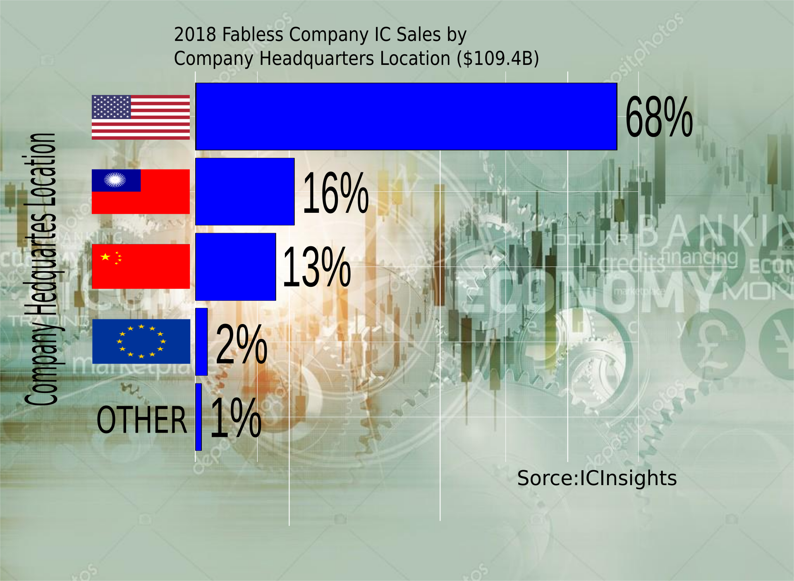

\includesvg{wykres_po.svg}

Wykres przed : \
```{r echo=FALSE, message=FALSE, warning=FALSE}
library(ggplot2)
#stworzenie data frame
#nie biore pod uwage japoni (zbyt maly procent)
udzialRynku <- data.frame( firmy = c("U.S." ,"Taiwanese", "Chinese", "European", "Other"),
                   procentUdzialuWRynku = c(0.68,0.16,0.13,0.02,0.01))
#Zamiast beznadziejnego wykresu klowego zrobie wykres kolumnowy, dla latwiejszego porownywania firm
#uznaje ze glownym celem jest przedstawienie aktualnej sytuacji, dlaetgo nie zamiezczam informacji na rok 2010
#Kolory sa zbedne wiec ich tez nie bedzie
#Posortownie firm da latwiejszy poglad ktora firma jest lepsza na rynku, bedzie to od razu widoczne
#jedynie "pozostale" beda na koncu
n <-length(udzialRynku[,1])
porzadek <- c(order(udzialRynku[1:(n-1),2], decreasing = TRUE),n)
#trzeba zmnienic factor by ggplot narysowal je w odpowiednim porzadku
udzialRynku$firmy <- factor( udzialRynku$firmy, levels = udzialRynku$firmy[porzadek])
ggplot(udzialRynku, aes(firmy,procentUdzialuWRynku))+
  geom_col()+
  #oznaczenia osi x jest zbedne (jest samo tlumaczace sie)
  labs(title = "2018 Fabless Company IC Sales by \nCompany Headquarters Location ($109.4B)",
       #uznaje * za zbedne
       caption="Sorce: ICInsights")+
  xlab("Companies")+ ylab(NULL)+
  #dodanie na gorze kolumn ich wartosci ulatwi odczytywanie wykresu
  geom_text(aes(label=procentUdzialuWRynku), vjust=-0.06)

```

Wykres w wersij po : \ 

```{r pressure, echo=FALSE, out.width = '80%'}

```


Uważam ,że wprowadzone zmiany wpłyneły pozytywnie na czytelność wykresu poza zmianami takimi jak poprawione opisy czy zmiana położenia. Dodałem 
także flagi państw co dużo wygodniej jest zrobić w inkscapie. Pozwala to na pierwszy rzut oka zobaczyć przedstawione dane. W inscapie dodałem tło które poprawia ogólne wrażenie wizualne. 