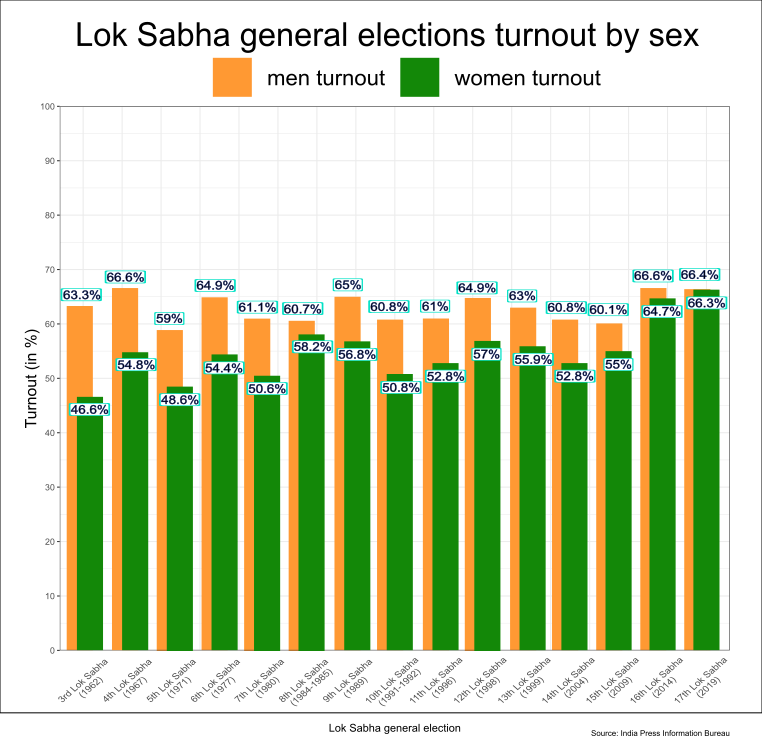

<style type="text/css">
.main-container {
  max-width: 1300px;
  margin-left: auto;
  margin-right: auto;
}
</style>

```{r setup, include=FALSE}
knitr::opts_chunk$set(echo = FALSE)
```


## Oryginalny wykres
Poprawiam wykres autorstwa Mateusza Grzyba

```{r plot, message=FALSE, warning=FALSE, fig.width=12, fig.height=9, dpi=300}
#wczytanie bibliotek
library(ggplot2)
library(reshape2)

#manipulacja danymi
data <- read.csv("data.csv")
data$lok_sabha <- factor(x = data$lok_sabha, levels = data$lok_sabha)
data <- melt(data, id.vars = c("lok_sabha", "year"))

#przygotowanie wykresu
ggplot(data, aes(x = lok_sabha)) +
  geom_col(aes(y = value, fill = variable), position = "dodge") +
  geom_text(aes(y = value - 1, label = paste0(value, "%")), position = position_dodge2(width = 0.9, ), size = 2.5) +
  annotate("text", x = 1, y = 2, label = "No data") +
  annotate("text", x = 2, y = 2, label = "No data") +
  scale_y_continuous(limits = c(0, 100), breaks = seq(0, 100, 10), expand = c(0, 0)) +
  scale_x_discrete(labels = paste0(data$lok_sabha, "\n", "(", data$year, ")")) +
  scale_fill_manual(values = c("#FF9933", "#138808"), labels = c("men turnout", "women turnout")) +
  labs(title = "Lok Sabha general elections turnout by sex", subtitle = "", caption = "Source: India Press Information Bureau", fill = "Legend:") +
  ylab("Turnout (in %)") +
  xlab("Lok Sabha general election") +
  theme_bw() +
  theme(
    axis.text.x = element_text(angle = 45, vjust = 0.5),
    plot.caption = element_text(hjust = 1, size = 8),
    axis.title.x = element_text(vjust = -3),
    axis.ticks.x = element_blank(),
    legend.position = "top"
  )
```

## Co poprawię?
$1$) Informacja o brakach danych jest jałowa i mogłoby po prostu brakować słupków i wszystko jest jasne, a robimy więcej miejsca na faktyczne dane i wykresy.\
$2$) Powiększenie słupków.\
$3$) Dla ułatwienia porównania informacji o mężczyznach i kobietach, nałożę zielone słupki "na" słupki żółte. Mogę tak zrobić, bo każdy ze słupków żółtych jest wyższy od zielonych. Dzięki takiej operacji porównanie różnic między słupkami jest łatwiejsza, a to właśnie miało być pokazane-że różnica między mężczyznami, a kobietami spadała z czasem.\
$4$) Aby można było liczbę procent, po nałożeniu pasków na siebie, przesunąłem je wyżej i niżej w zalezności od koloru, oraz dodałem do nich obramówkę.\


# Poprawiony obrazek




