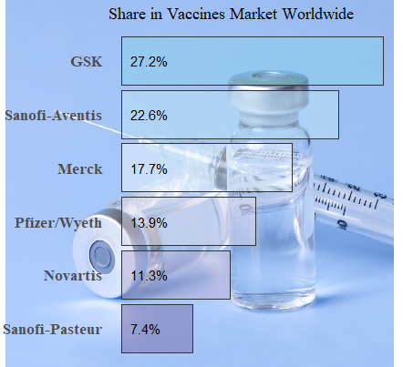

## Wstęp
Przy tworzeniu swojego wykresu korzystałem jedynie z wykresu kolegi (który weksportowałem do svg) oraz programu Inkscape, dlatego nie umieszczę tu żadnego kodu.

## Porównanie 

### Przed

### Po

## Zmiany 
Wszystkie zmiany oznaczone " * " są w mojej opini trudne bądź nie do zrobienia w samym pakiecie ggplot

* Zmiana tytułu na widoczny i pokazanie go na zielonym tle *
* Ogólna zmiana kolorystyczna i stylistyczna, wykres jest bardziej czytelny, uważam że silniej zapadnie komuś w pamięć, przez połaczonenie stylu i jego tematyki
* Dwa labele na osi y. Nazwa firmy i procentowy udział w rynku  (Jeżeli miałyby one poza wykresem to *)
* Wykorzystanie ikony strzykawki przy rysowaniu wykresu *
* Dodanie osi x dla łatwiejszego odczytania wartości 
* Pozbycie się rozpraszającego obrazu tła

