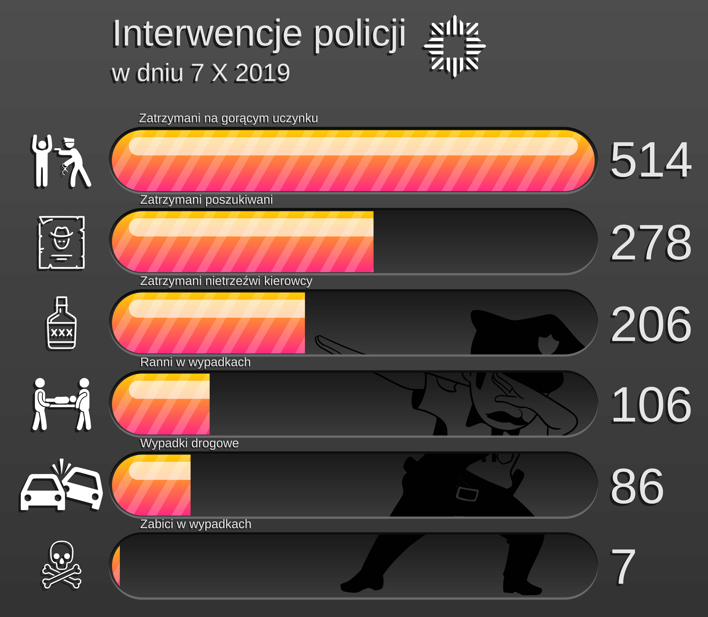

```{r setup, include=FALSE}
knitr::opts_chunk$set(echo = TRUE)
```

## Oryginalny wykres

Autor: Marceli Korbin

```{r plot}
library(ggplot2)

# dane przed wczytaniem wpisano ręcznie do osobnego pliku
dane <- read.csv("dane.csv")

ggplot(dane, aes(x=reorder(nazwa, liczba), y=liczba)) +
    # kolumny
  geom_col(width=0.8, fill="#c0c0c0") +
    # zamiana współrzędnych
  coord_flip() +
    # nazwy wydarzeń i liczby przy kolumnach
  geom_text(aes(label=paste(nazwa, liczba, sep="\n")), hjust="inward", size=3, color="black") +
    # nazwy osi i tytuł
  labs(x="wydarzenie", y="liczba interwencji", title="Interwencje policji", subtitle="w dniu 7 X 2019") +
    # bez ostatniej linijki nazwy wydarzeń byłyby w dwóch miejscach każda
  theme(axis.text.y = element_blank())
```

## Wykres po modyfikacji w Inkscape



## Komentarz

Głównym założeniem rozwiązania była zupełna metamorfoza oryginalnego wykresu, idąca daleko poza możliwości oferowane przez bibliotekę ggplot2 (dlaczego, myślę, nie muszę tłumaczyć). Pomimo licznych zmian wizualnych, uatrakcyjniających pierwowzór, uważam, że nie stracił on szczególnie na czytelności, a nawet niejednokrotnie zyskał w tej kwestii. Duże podpisy i liczby są łatwe do odczytania, a odpowiednio zachowane proporcje wymuszają wygodną kolejność poznawania danych. Skrupulatnie dobrane ikony sprawiają, że znaczenie słupków jest jasne dla odbiorcy niemalże natychmiast. Ponadto, rozwiązanie nie zawiera żadnych grafik rastrowych, dzięki czemu jest w pełni skalowalne. Jak wiadomo, diabeł tkwi w szczegółach, dlatego niemalże jedną czwartą powierzchni wykresu zajmuje dabująca podobizna stereotypowego zjadacza pączków z dziurką.