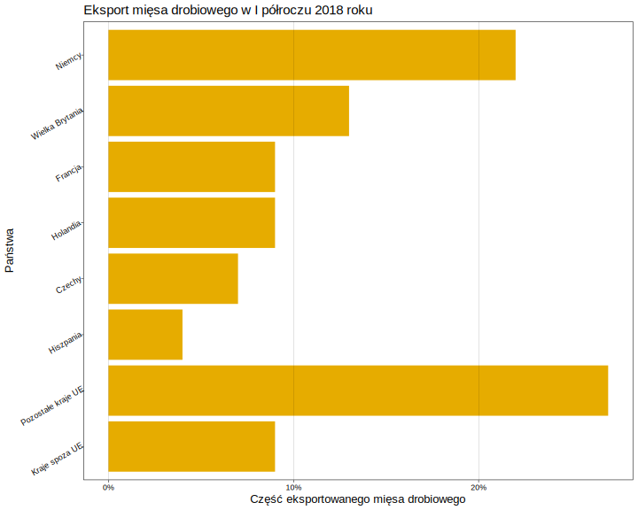
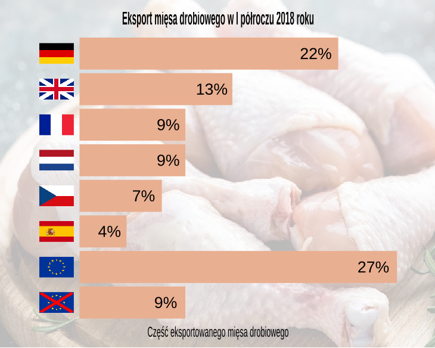

  ```{r setup, include=FALSE, message=FALSE}
knitr::opts_chunk$set(echo = TRUE)
```

## Wstęp

Wykres, który wybrałem jest autorstwa Dawida Przybylińskiego. Przedstawia państwa, do których Polska eksportowała najwięcej mięsa drobiowego w pierwszym półroczu 2018 roku.


## Wykresy

#### Wykres autorstwa Dawida 



#### Wykres po mojej obróbce w Inkscape




## Zmiany 

* Zastąpienie nazw państw ich flagami i usunięcie podpisu osi "Państwa" - informacja, którego kraju dotyczy dany słupek jest wyraźniejsza, szybsza do odczytania. Flagi wszystkich krajów zawartych na wykresie są powszechnie znane - obiorcy nie powinni mieć problemu z rozpoznaniem ich. Przed dzisiejszymi zajęciami nie wiedziałbym jak to zrobić w R, w Inkscape mogę sobie poza tym łatwo manipulować rozmiarem tych flag.
* Dodanie tła - od razu widać, jaką tematykę porusza wykres. W R znacznie trudniej dodać obrazek jako tło wykresu.  
* Zmiana kolorów słupków - bardziej pasują kolorystycznie do tła i tematyki wykresu. Kolor miał się trochę kojarzyć z kolorem mięsa z kurczaka. 
* Zmiana czcionki, rozmiaru czcionki - W Inkscape ta zmiana jest bardzo prosta, napisy wcześniej były mało widoczne, bo w R nie jest zachowywany stały stosunek rozmiaru napisów do rozmiaru obrazka.
* Dodanie etykiet na szczytach słapków - dzięki temu szybciej można odczytać dokładne wartości dla poszczególnych państw. Tutaj znowu wygodniej w Inkscape dopasować ich rozmiar do rozmiaru obrazka.
* Usunięcie skali osi x i pionowych linii siatki - Po dodaniu etykiet na szczytach słupków nie są one już potrzebne.
