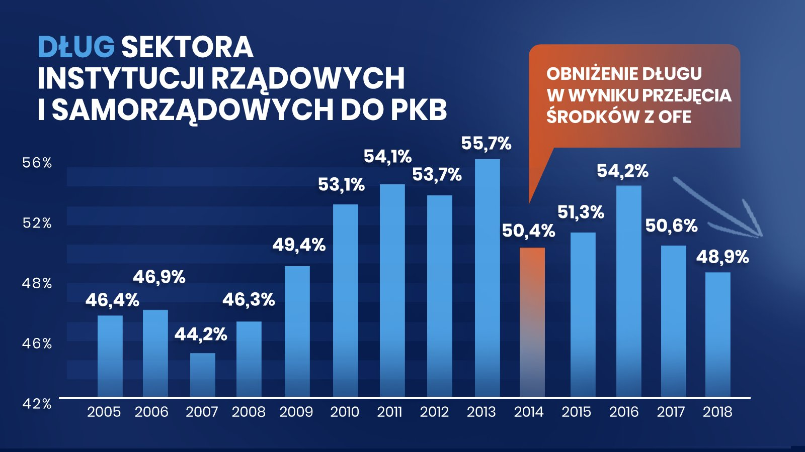
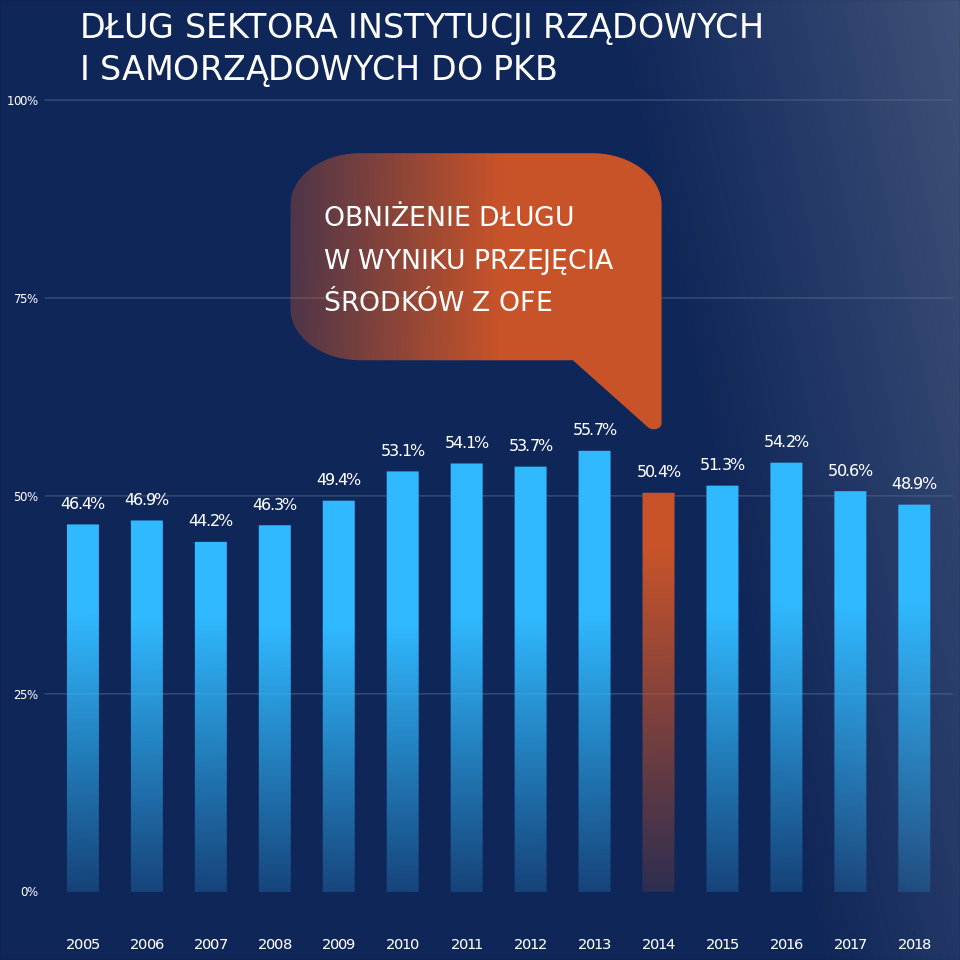

```{r setup, include=FALSE}
knitr::opts_chunk$set(echo = TRUE)
```

## Wykres oryginalny


Oryginalna wersja wykresu pochodzi z oficjalnego profilu Kancelarii Premiera RP na Twitterze, gdzie został umieszczony 22 października br. Wyszukała go oraz umieściła w swojej pracy Ania z grupy G6. Oprócz standardowych zarzutów dotyczących nieproporcjonalnych długości słupków do faktycznych wartości, chciałbym zwrócić uwagę na jeszcze jeden, prawdopodobnie niezauważony niuans: Dlaczego etykiety pionowej skali są oznaczone najczęściej co 2 punkty procentowe, a dwie najmniejsze wartości to `42%` i `46%`?



## Pierwsza poprawa wykresu

Dla ścisłości, umieszczam również poprawioną przez Anię wersję wykresu:


## Poprawiona przez mnie wersja wykresu


Za pomocą narzędzia do grafiki wektorowej Inkscape dokonałem kilku zmian kompozycji. Dokonane przeze mnie zmiany były inspirowane oryginalną wersją wizualizacji: pomarańczowa barwa podkreśla 2014r., co było celem autorów. Dodatkowo dodałem podobną chmurkę z informacją o przejęciu środków OFE. Kolejnymi efektami są gradienty: słupków, tła, a także chmurki z adnotacją. Program Inkscape umożliwia również łatwe manipulowanie tekstem: czcionką, wyglądem, interliniami oraz dodatkowymi efektami. Edytor graficzny jest doskonałem narzędziem do urozmaicenia wykresu obrazami, jednak w tym przykładzie nie odczułem potrzeby (ani możliwości) umieszczenia dodatkowej grafiki




## Uwagi końcowe

W moim własnym, subiektywnym odczuciu, prezentacja tych danych za pomocą kolumn jest nietrafionym pomysłem. Jednocześnie, wizualizacja Kancelarii Premiera manipuluje odczuciami odbiorców dotyczącymi proporcji wartości, zdrugiej jednak strony, zmiany jakie miały na przestrzeni lat są w tym przypadku znaczące, pomimo niezbyt różniących się wysokości słupków prezentowanych w skali 0-100%. Moją propozycją byłoby zastosowanie estetycznego wykresu liniowego, który dobrze by prezentował zmiany na przestrzeni lat oraz mógłby być wyrysowany na odcinku skali procentowej. 
