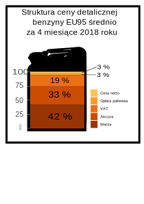

## Oryginalny wykres i wersja poprawiona

Wersja przed               |  Wersja po
:-------------------------:|:-------------------------:
 |  

### Komentarz

Uważam, że wersja "po" jest ładniejsza i przekazuje informację o tematyce wykresu szybciej. Nie tracimy na czytenlności - jest to właściwie ładnie opakowany stacked barplot. Słabe ułożenie podpisów osi na lewo od kanistra jest, moim zdaniem, bardziej winą RMarkdowna niż rysunku (w Inkscape z tym problemu nie ma).

Tym niemniej, wytworzenie tego efektu w R byłoby nieco czasochłonne. Tło można zmienić z pomocą funkcji `ggbackground()`, ale dopasowanie wykresu do tła jest trudniejsze i wymaga ręcznych zmian na limitach oś. Kolejnym problemem są podpisy nielicznych grup, które trudno się robi w pakiecie `ggplot`. W Inkscapie wprowadzenie powyższych modyfikacji nie sprawia większych trudności.

## Kod R generujący oryginalny wykres
```{r setup, include=FALSE}
library(ggplot2)
library(dplyr)
data <- data.frame("Rodzaj" = c("Cena Netto", "Akcyza", "VAT", "Opłata Paliwowa", "Marża"), "Ilosc" = c(0.42, 0.33, 0.19, 0.03, 0.03))
data$Rodzaj <- factor(data$Rodzaj, levels = c("Cena Netto", "Akcyza", "VAT", "Opłata Paliwowa", "Marża"))
```
```{r original, eval = FALSE}
ggplot(data = data, aes(x = Rodzaj, y = Ilosc)) +
    geom_bar(stat = "identity", width = 0.9, fill = "#362A66") +
    geom_text(aes(label = scales::percent(Ilosc, accuracy = 1)), position = position_stack(vjust = 0.5), size = 6, color = "white") +
    scale_y_continuous(limits = c(0, 0.42), expand = c(0, 0)) +
    theme(axis.text.y = element_blank(),
          axis.line.y = element_blank(),
          axis.ticks.y = element_blank(), 
          axis.title = element_blank(),
          axis.text.x = element_text(size = 10, face = "bold"),
          axis.line.x = element_line(),
          panel.grid.major = element_blank(),
          panel.grid.minor = element_blank(),
          panel.border = element_blank(),
          panel.background = element_blank()) +
    coord_fixed(10) +
    labs(title = "Struktura ceny detalicznej benzyny EU95 średnio za 4 miesiące 2018 roku", fill = element_blank())
```

## Wykres przekazany do obróbek w Inkscape

Zdecydowałem się nieco zmienić geometrię wykresu przed eksportem do pliku .svg .

```{r mods}
data <- data.frame("Percentage" = c(42, 33, 3, 3, 19),
                   "Name" = c("Marza", "Akcyza", "Cena_netto", "Oplata_paliwowa", "VAT"))
data <- arrange(data, Percentage) %>%
  mutate(Name = factor(Name, levels = Name, ordered = TRUE)) %>%
  arrange(desc(Percentage)) %>%
  mutate(LabsPos = cumsum(Percentage) - Percentage / 2)
theme_set(theme_bw())

ggplot(data, aes(x = 1, y = Percentage, fill = Name, label = paste0(Percentage, " %"))) +
  geom_col() +
  scale_fill_manual(values = c("#fec44f",
                               "#fe9929",
                               "#ec7014",
                               "#cc4c02",
                               "#993404")) +
  geom_text(aes(y = LabsPos)) +
  theme(aspect.ratio = 5/4,
        panel.background = element_blank(),
        panel.grid.major.x = element_blank(),
        panel.grid.minor.x = element_blank(),
        panel.grid.minor.y = element_blank(),
        axis.ticks = element_blank(),
        axis.text.x = element_blank(),
        panel.border = element_blank(),
        axis.title = element_blank(),
        legend.title = element_blank()) +
  labs(title = "Struktura ceny detalicznej benzyny EU95 średnio za 4 miesiące 2018 roku")

```