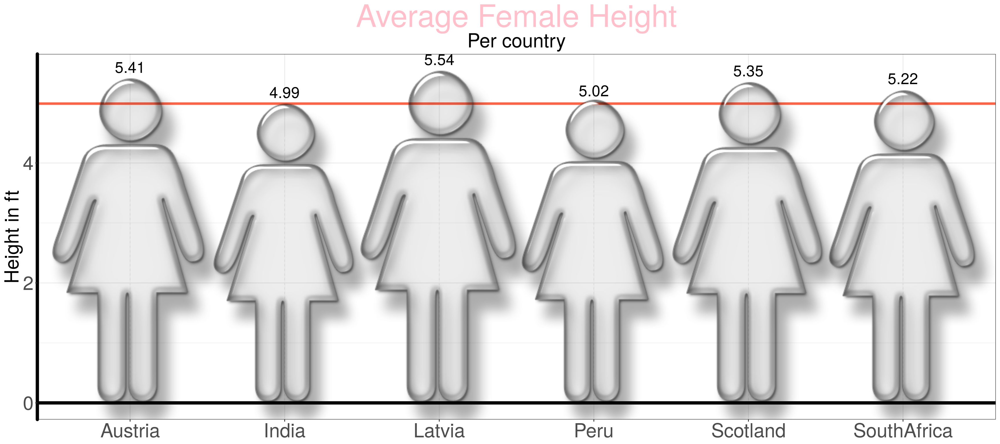
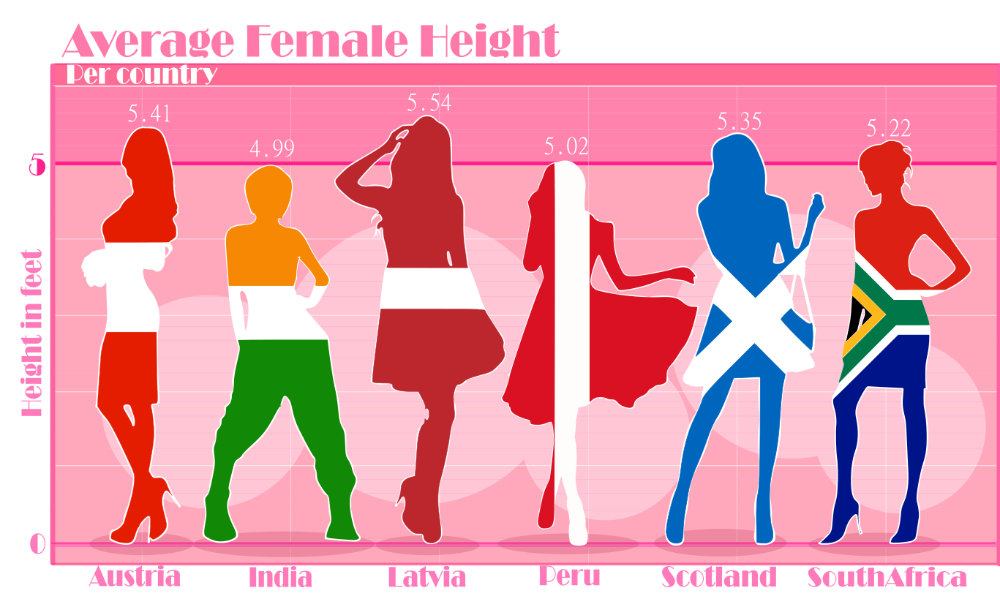

```{r lib, include=FALSE}
library(dplyr)
library(ggplot2)
library(png)
library(grid)
library(gridExtra)
```

## Oryginalny wykres  
```{r graph, message=FALSE, warning=FALSE}

data <- read.csv("data2.csv")
data[7,] <- NA
img <- readPNG("symbol.png")
g <-  rasterGrob(img, interpolate=TRUE)

p <- ggplot(data, aes(x=country, y=average_female_height_ft)) + 
        theme_bw() + 
        geom_point(col="white", size=4)

p <- p +
  geom_segment(aes(x = country,
                   xend = country,
                   y=0, 
                   yend=4.45), 
               linetype="dashed", 
               size=0.3,
               color = "white") +
  geom_hline(yintercept = 4.99, color = "tomato", size = 1.5) +
  geom_hline(yintercept = 0, color = "black", size = 2) + 
  annotation_custom(grob=g, xmin= -0.79, xmax=2.75, ymin = -0.51, ymax= 5.94) + 
  annotation_custom(grob=g, xmin= 0.47, xmax=3.5, ymin = -0.46, ymax= 5.48) +
  annotation_custom(grob=g, xmin= 0.47, xmax=5.5, ymin = -0.52, ymax= 6.08) +
  annotation_custom(grob=g, xmin= 0.47, xmax=7.5, ymin = -0.47, ymax= 5.55) + 
  annotation_custom(grob=g, xmin= 0.47, xmax=9.5, ymin = -0.49, ymax= 5.87) + 
  annotation_custom(grob=g, xmin= 0.47, xmax=11.5, ymin = -0.47, ymax= 5.72) + 
  theme(axis.title.x = element_blank(),
        axis.title.y = element_text(size = 25),
        axis.line.y = element_line(size = 2),
        axis.text = element_text(size = 25),
        plot.title = element_text(hjust = 0.5, size = 40, colour = "pink"),
        plot.subtitle = element_text(hjust = 0.5, size = 25)) +
  labs(title = "Average Female Height",
       subtitle = "Per country",
       y = "Height in ft") + 
  geom_text(aes(label = average_female_height_ft), vjust = -0.5, size = 7)

```



## Nowy wykres


## 

Jak widać zmieniona została głównie grafika wykresu. Zamiast domyślnych znaczków kobiet umieszczone zostały różne sylwetki kobiece z kolorami flag państw do których się odnoszą. Dzięki temu dużo lepiej patrzy się na wykres a także można lepiej porównać średnie wysokości, bo nowe sylwetki są wyższe a cieńsze. Na pewno dużo łatwiej było wybrać i zamienić odpowiednie czcionki i tło na wykresie, a do tego stworzenie sylwetek z kolorami flag w Inkscapie było zdecydowanie prostsze niż szukanie i wstawianie odpowiednich obrazków kolumn w R. 


