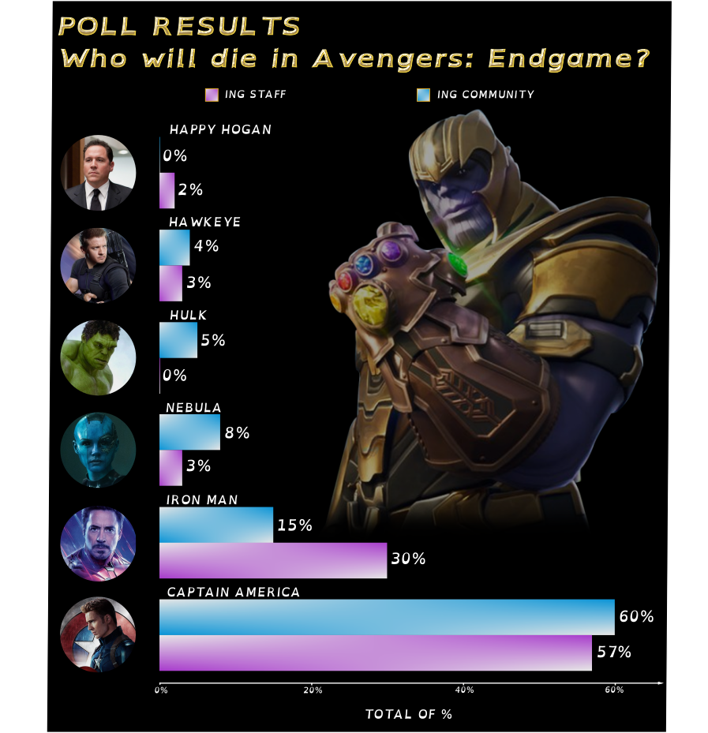

```{r setup, include=FALSE}
knitr::opts_chunk$set(echo = TRUE)

library(data.table)
library(dplyr)
library(ggplot2)
library(utils)

```

## WYKRES PRZED

```{r przed, message = FALSE, cache=TRUE}
### DANE

wyniki <- read.csv(file.path(getwd(),'IGN_wyniki.csv'))

# reorganizacja danych
staff <- wyniki %>% select(HERO, IGN_STAFF) %>% mutate(TYPE = "IGN STAFF") %>% rename(VALUE = IGN_STAFF)
comm <- wyniki %>% select(HERO, IGN_COMMUNITY) %>% mutate(TYPE = "IGN COMMUNITY") %>% rename(VALUE = IGN_COMMUNITY)
data <- staff %>% bind_rows(comm)
# dla poprawnej kolejnosci zmiennych w legendzie
data$HERO <- factor(data$HERO, levels = c("Captain America", "Iron Man", "Nebula", "Hulk", "Hawkeye", "Happy Hogan"))

### WYKRES

ggplot(data, aes(fill= TYPE, y=VALUE, x=HERO)) + 
  # geom_bar dodge
  geom_bar(position=position_dodge(), stat="identity") +
  
  # zmiana palety kolorow
  scale_fill_manual(values = c("#b941e1", "#09a3ed")) +
  
  theme_classic() +
  
  # dodanie tekstu z liczbami i procentami
  geom_text(aes(label = sprintf("        %s%%", VALUE)), 
            position = position_dodge(width = 1), size = 3.4) +
  
  # zmiana pozycji legendy
  theme(legend.position = "top") +
  
  # odwrocenie wykresu
  coord_flip() +
  
  # pozbywam sie niepotrzebnych danych na osiach
  theme(axis.line.y = element_blank(), axis.ticks.y = element_blank(), 
      legend.title = element_blank(), axis.title = element_blank(), plot.title = element_text(face = "bold"),
      axis.text.y = element_text(face = "bold"), legend.text = element_text(face = "bold")) +
  
  # dodanie tytulu
  labs(title = "POLL RESULTS \nWHO WILL DIE IN AVENGERS: ENDGAME?")
```

## WYKRES PO



\
Wykres został dość mocno zmieniony (są też małe nawiązania do wykresu orginalego, na którym wzorował się kolega - jest on w pracy domowej z poprzedniego tygodnia Aleksandra Podsiad). Na poprzednim wykresie były zawarte informacje, jednak od strony wizualnej był ubogi. Poprawiona wersja miała zachować jasność przekazu, ale też sprawić aby był przyjemniejszy dla oka odbiorcy.

Co zmieniono?

- słupki z danymi - największą ekscytacją była możliwość rozsunięcia od siebie słupków bez zmiany ich szerokości - jeśli w R jest to możliwe to nie udało mi się dowiedzieć jak to zrobić. Teraz można było umieścić tekst o tych danych nad nimi. Wielkość tesktu i szerokość słupków mogła być dowolnie wybrana przeze mnie. 

- czcionka - w poprzednich pracach domowych starałam się zmieniać czcionki tekstów, jednak wymaga to dodatkowej biblioteki i sprawdzania jak wyglądają czcionki po nazwach albo próbowanie dodawania własnych czcionek. Jest to możliwe do zrobienia, jednak Inksacape pozwala zrobić to łatwiej i szybciej. Dodatkowo można tekst szybko obrobić i zmienić jego wygląd z róznymi udziwnieniami - jak np. wypukłość, gradienty.

- legenda - rozsunięcie od siebie elemetów legendy i umieszczenie jej w wybranym miejscu. Manipulacja elementami legendy była tutaj prostsza.

- oś - została zmieniona, usunięto wartości przed zerem i dodano strzałkę na końcu oraz tytuł. Nie jest to w R trudniejdsze jeśli wie się jak dodać na końcu osi strzałkę, zrobić ją od zera czy dodać tytuł - co powinien wiedzieć chyba teraz każdy z nas ucząc się dogłębnie ggplot2, jednak zostało to poprawione, aby wykres lepiej wyglądał.

- grafiki -  robiło mi się przyjemniej niż w R dodanie grafiki jako tła. 7 zdjęć z internetu, wczytano, zmieniono kształty, przyciemniono i umieszczono w wybranym miejscu. Ikony postaci, których dotyczą wyniki, są bardziej zauważalne niż podpisy na osiw  pierwszym momencie patrzenia na wykres - jak ktoś jest w temacie Avengers to wystarczy mu rzucenie okiem na grafiki i znalezienie postaci, której chce poznać wyniki. A jak ktoś chce się dowiedzieć jak się nazywa dana postać to podpis jest tuż obok. Nie jest też tak, że podpisy do wyników są niezauważalne. Grafiki są po prostu dodatkiem, który przyciąga wzrok i pokazuje jaka to dokładnie postać jest oceniana. 

- dodałam też mały paseczek dla wartości 0, nie jest to konieczne, nie wprowadza w błąd gdy obok jest podpis "0%". Wydaje mi się że mogłoby wprowadzać w błąd niektórych, jakby nie było podpisu (chociaż słupek 2% jest dużo wyższy i nie powinno tak być), jednak nie zdecydowałabym się pewnie na to, gdyby nie podpisy dokładnych wartości. Strałam się sprawić, aby jego wysokość była na zerze. Dodanie tego było własną zachcianką, założyłam sobie, że moje słupki wszystkie miały pasek równy 0 i wartości przy określaniu oceny wzrastały do odpowiednich procentów, a tam gdzie nie to został ten paseczek.

Porównując wykresy, uważam że poprawiony wykres jest lepszy.