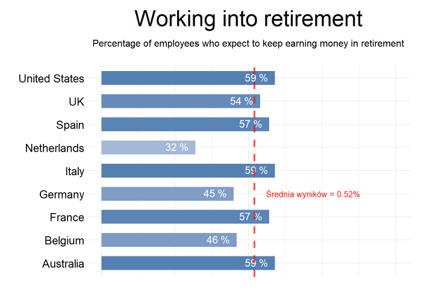
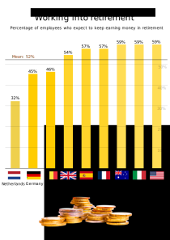

```{r setup, include=FALSE}
knitr::opts_chunk$set(echo = TRUE)
```

## Wykres przed: 



## Wykres po:



## Wprowadzone zmiany:

- ułożenie barów w kolejności, co zwiększyło przejrzystość wykresu,
- dodanie flag do nazw państw, ułatwiających szybkie odczytanie wykresu, co w R byłoby problematyczne,
- dodanie obrazka pod wykresem, związanego z tematem, który daje odbiorcy jasny przekaz odnośnie tematyki wykresu.

