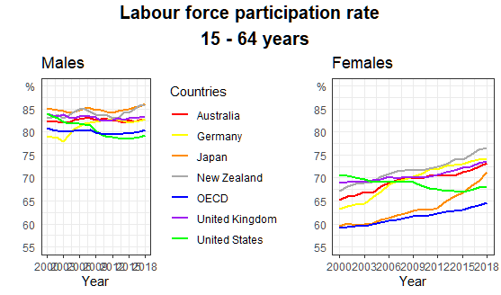
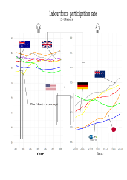

```{r setup, include=FALSE, message=FALSE}
knitr::opts_chunk$set(echo = TRUE)
```

### Wstęp

Wykres, który wybrałem jest autorstwa Agaty Makarewicz. Wykres ten jest dobrze wykonany, lecz widzę w nim potencjał do zmian w programie *Inkscape*.

### Dlaczego akurat takie zmiany? 


* zmiana legendy:  

  * **jak:** zamiast wyrazów przyporządkowanych do kolorów jest do każdej lini przyporządkowana flaga kraju za pomocą strzałki  
  * **dlaczego:** łatwiej się patrzy na zdjęcia niż czyta (nasz mózg to łatwiej odbiera)  
  * **gdzie łatwiej:** zdecydowanie strzałki łatwiej dodać w *Inkscape* - w *R* byłoby to bardzo trudne wykonalne; ponadto dodanie samych flag krajów w dane miejsca byłoby bardzo trudne - w *Inkscape* po prostu dane flagi przesuwamy  
  * **wygrywa:** *Inkscape*
  
* dodanie strzałki wskazującej:

  * **jak:** w roku 2004 w Niemczech widać pewną zmianę (dość duży wzorst); po odszukaniu w literaturze wyczytałem, że wynikało to z **The Hartz concept**  
  * **dlaczego:** sztuka objaśnienia pewnych danych na samym wykresie; odbiorca dostaje gotową odpowiedź  
  * **gdzie łatwiej:** podobnie jak w przypadku legendy zdecydowanie jest to prostsze w programie *Inkscape* (dodanie słów w danym miejscu oraz strzałki w *R* byłoby bardzo trudne)  
  * **wygrywa:** *Inkscape*  
  

* dodanie kształów:  

  * **jak:** dodanie kształtów poszczególnych płci zamiast napisów: *men*, *women*   
  * **dlaczego:** łatwiej się patrzy na zdjęcia niż czyta (nasz mózg to łatwiej odbiera)   
  * **gdzie łatwiej:** dodanie takich kształów w *R* wymagałoby nie lada zachodu       
  * **wygrywa:** *Inkscape* (zdecydowanie)    

* dodanie czcionki, którą chcemy:  

  * **jak:** wszystkie czcionki na wykresie zostały zmienione na *Calibri* 
  * **dlaczego:** wg mnie jest to estetyczniejsza czcionka niż *Arial*  
  * **gdzie łatwiej:** dodanie czcionki w *R* też nie jest trudne, ale wymaga więcej operacji i instalacji dodatkowych pakietów    
  * **wygrywa:** *Inkscape* (ale nieznacznie)  

* zmiana rozmiaru tekstu:  

  * **jak:** dane teksty w tekście zostały zmienione  
  * **dlaczego:** cziconka jest bardziej czytelna i widoczna (szczególnie tytuł)  
  * **gdzie łatwiej:** zmiana rozmiaru czcionki w *R* też nie jest trudne, ale nie widzimy *zmian na bieżąco*      
  * **wygrywa:** *Inkscape* (ale bardzo nieznacznie)  
  
* zmiana koloru lini:  

  * **jak:** dane kolory lini zmienione  
  * **dlaczego:** wg mnie były bardziej odpowiednie   
  * **gdzie łatwiej:** zmiana koloru linii na dowolny kolor w *R* też nie jest trudna, ale nie widzimy *zmian na bieżąco*      
  * **wygrywa:** *Inkscape* (ale bardzo nieznacznie)  

* dodanie wyszczególnienia punktów:  

  * **jak:** dane punkty w przypadku Niemiec zostały wyszczególnione   
  * **dlaczego:** zwrócenie uwagi odbiorcy na zanotowany niesamowity wzrost   
  * **gdzie łatwiej:** wg mnie podobnie (w *R* może nawet trochę szybciej i lepiej)     
  * **wygrywa:** remis     
  


### Wykresy

#### Wykres przed



#### Wykres po obróbce w programie **inkscape**

```{r pressure, echo=FALSE}

```


### Co mogłem jeszcze zrobić?  
  

W tle dodać jakieś zdjęcie. W *R* byłoby to trudne (szczególnie skala w jakim procencie jasności dane zdjęcie ma być wyświetlane). Nie dodałem jednak, bo temat miał mało skorelowanych z nim zdjęć.  


