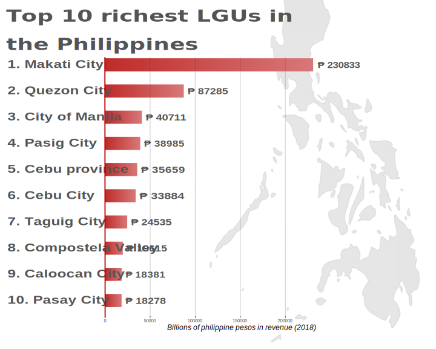

```{r setup, include=FALSE}
knitr::opts_chunk$set(echo = TRUE)
library(ggplot2)
#install.packages("png") # if not installed
library(png)
library(jpeg)
library(grid)
```

## Oryginalny wykres

Tutaj znajduje się oryginalny wykres, który poprawiam:

```{r starywykres}
library(ggplot2)
#install.packages("png") # if not installed
library(png)
library(jpeg)
library(grid)
# loading the data
data <- data.frame(names = rev(c("1. Makati City", "2. Quezon City",
                                 "3. City of Manila", "4. Pasig City", "5. Cebu province", "6. Cebu City",
                                 "7. Taguig City", "8. Compostela Valley", "9. Caloocan City", "10. Pasay City")),
                   values = rev(c(230833, 87285, 40711, 38985, 35659, 33884, 24535, 19615, 18381, 18278)))
data$names <- factor(data$names, levels = data$names)

# loading the background picture
background <- readJPEG('philippinesMap.jpg') # from file
g <- rasterGrob(background, width = unit(1, "npc"), height = unit(1, "npc"))

options(scipen = 10000) # for "pretty"" x axis numbers

# the plot code
p <- ggplot (data, aes(x = names, y = values, width = .5)) + # width - between the bars
  annotation_custom(g, -Inf, Inf, -Inf, Inf) + # loading the background
  ggtitle("Top 10 richest LGUs in the Philippines") + # title
  geom_col(fill = "brown3") + # columns
  
  scale_y_continuous(limits = c(0, 300000),
                     breaks = seq(0, 300000, 50000),
                     position = "left") + # x comparments
  ylab("Billions of philippine pesos in revenue (2018)") + # ... and its name
  geom_text(aes(label = data$values), # numbers next to bars
            position = position_nudge(y = 5),
            hjust = -0.15,
            size = 6,
            color = "#545454") +
  coord_flip(clip = "off") + # let's knock over the columns!
  
  theme(plot.title = element_text(size = 28, # some visual extras
                                  face = "bold",
                                  color = "#545454"),
        axis.text.y = element_text(hjust = 0,
                                   color = "#545454",
                                   face = "bold",
                                   size = 14),
        axis.title.y = element_blank(),
        axis.title.x = element_text(size = 14, face = "italic"),
        axis.ticks.y = element_blank())
```

## Nowy wykres

Tutaj zaś znajduje się moja poprawiona wersja:



## Uzasadnienie

Uważam, że następujące zmiany, które wprowadziłem były pomocne, byłoby też je trudniej wprowadzić kodem R-owym, niż programem inkscape:

* dodanie gradientów do kolumn, wybranie kolorów w tym programie graficznym i uzupełnianie tego na żywo pozwala na znacznie łatwiejszy dobór odpowiednich kolorów (ewentualnie jak w moim przypadku wybranie dokładnie takich kolorów jak w wykresie, na podstawie którego został zrobiony pierwszy wykres w tym dokumencie)
* dodanie czerwonej kreski na poziomie 0, żeby "zaczepić" słupki
* dodanie symbolu peso filipińskiego do pól z walutą, co w oryginale wymagałoby podpisania kolumn ręcznie
* dodanie półprzeźroczystych linii pomocniczych, które pozwalają lepiej określić wysokość (a raczej długość) słupków
* osiągnięcie kompromisu między oryginalnym-oryginalnym wykresem (mapa Filipin w tle, nachodząca na słupki i napisy), a tym poprawianym przeze mnie (mapa Filipin obok, nieprzezroczysta, która nie nachodzi), czyli ustalenie odpowiedniego alpha na obrazku w tle, zmiana go na wektorowy (dzięki czemu nie będzie problemu przy powiększaniu go i luźnych pikseli) oraz przesunięcie go w taki sposób, żeby nie nachodził na tekst, a górny słupek nie kończył się na nim
