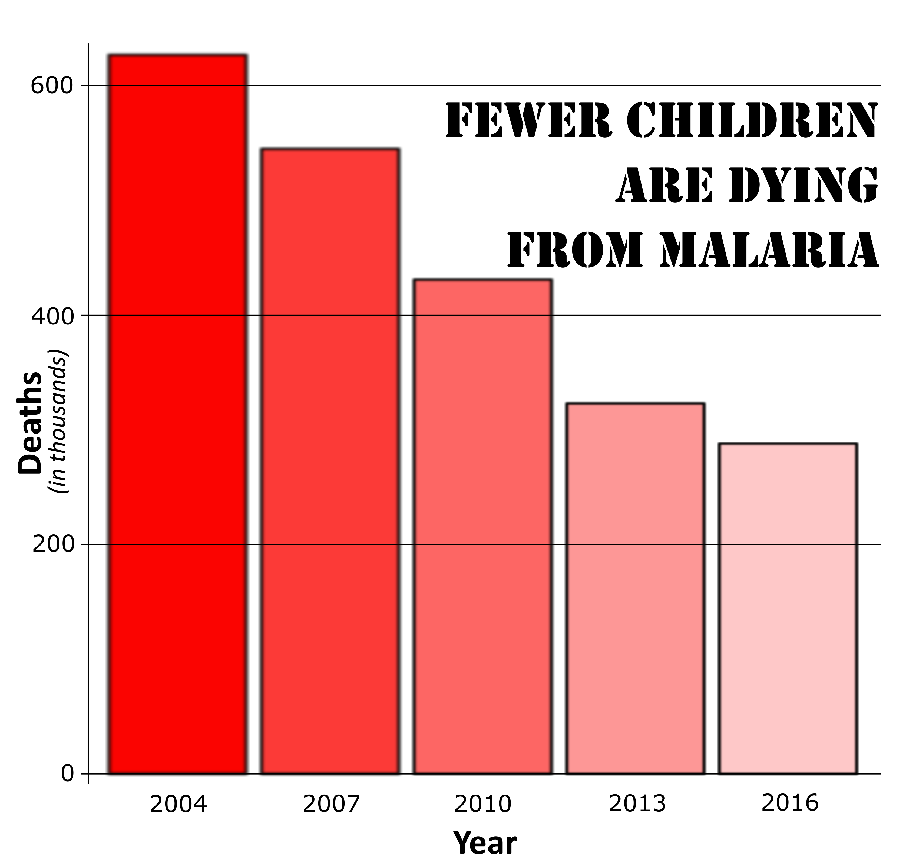

## Wykres przed zmianami

Na poczÄ…tku spĂłjrzmy na wykres oryginalny:

```{r setup, echo=FALSE, message=FALSE}
library("ggplot2")
year<-c("2004","2007","2010","2013","2016")
dead<-c(627,545,431,323,288)
malaria<-data.frame(dead,year)
ggplot(data=malaria)+
  geom_col(aes(y = dead,x=year),fill = c("#33334d", "#006633","#00cc66","green","#77ff33")) +
  theme(
    panel.grid.major = element_blank(),
    panel.grid.minor = element_blank(),
    panel.background = element_blank()) +
  labs(title = "Fewer Children Are Dying From Malaria",subtitle = "Thousands of deaths per year") +
  scale_y_continuous(name = "Deaths")+
  scale_x_discrete(name = "Year")
```


Wykres ten przekazuje treść, którą miał za zadanie prezentować, jednak ma też pewne niedociągnięcia, które poprawiłem wykorzystując narzędzie graficzne Inkscape.


## Wykres po zmianach


```{r, echo=FALSE, message=FALSE}

```


UwaĹĽam, ĹĽe nowy wykres jest lepszy, poniewaĹĽ:

- słupki przedstawiające liczbę dzieci umierających na malarię nie powinny być w kolorze zielonym, bo sugeruje to pozytywny trend, lecz w coraz jaśniejszych odcieniach czerwieni, bo wskazuje to na poprawiającą się sytuację, ale nie sugeruje, że problem ten przestał już istnieć,

- dodane poziome linie znacznie ułatwiają odczytywanie wartości liczbowych,

- powiększenie wszystkich napisów bardzo pozytywnie wpływa na łatwość odbioru wykresu,

- usunięcie podtytułu dostarcza więcej miejsca na tytuł, a informacje zawarte w podtytule, i tak, pokrywają się z poprawionymi tytułami osi,

- zmiana czcionki na mniej ogĂłlnÄ… rĂłwnieĹĽ poprawia wykres,

- dodane obramowanie słupków ułatwia odczytywanie wartości.
