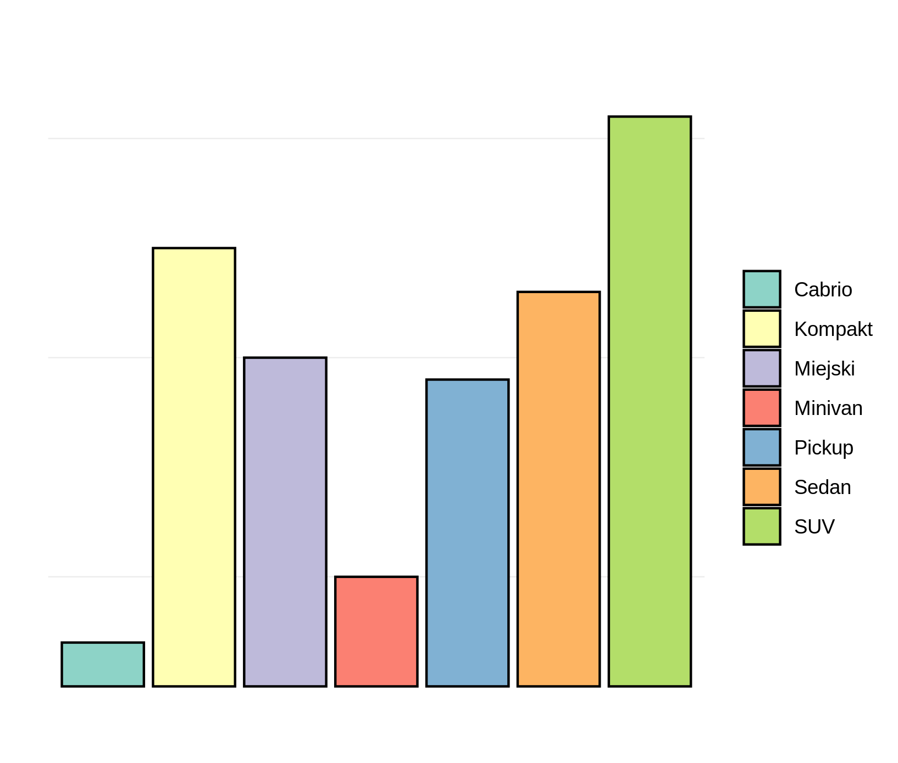
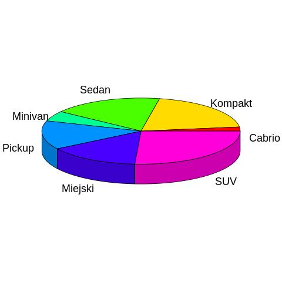
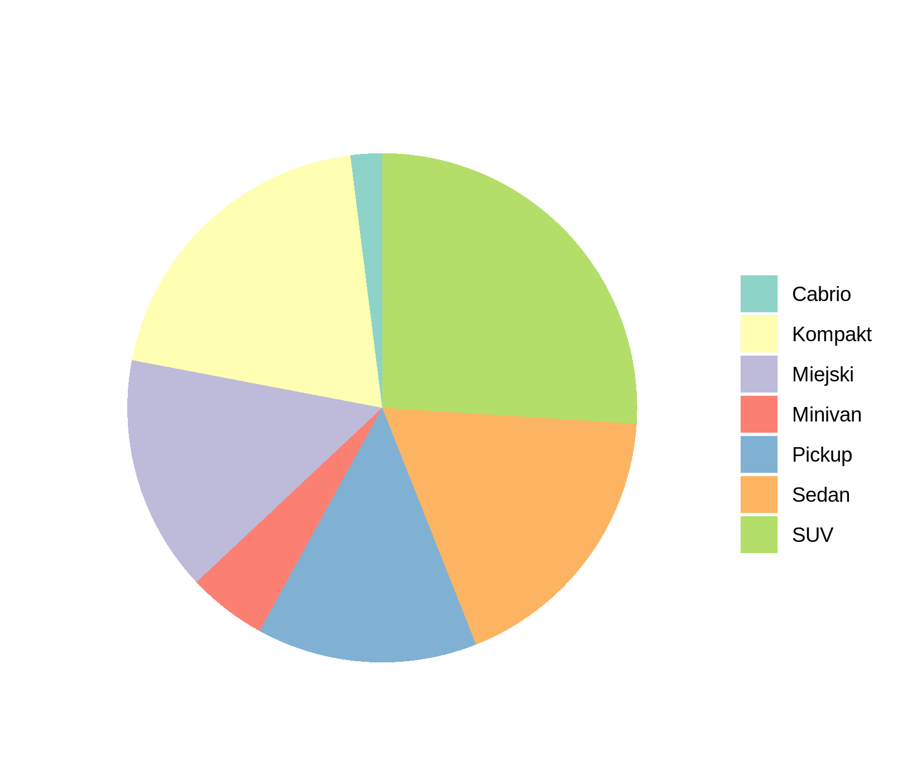
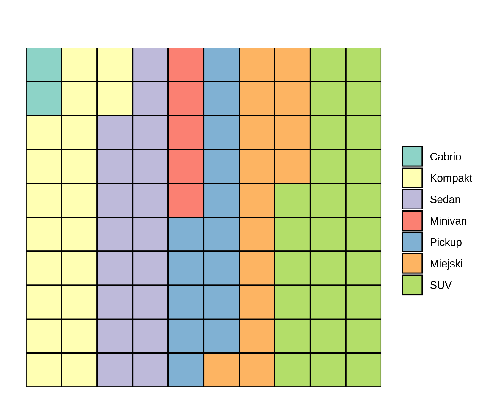

## 1.Wstęp
Zadanie respondentów było udzielenie odpowiedzi na temat odczytania danych z 4 wykresów przedstawiających te same dane pochodzące z jednego z datasetów dostępnego domyślnie w R. Zamieściłem dwa wykresy kołowe, jeden typu bubble i jeden słupkowy.
Link do ankiety: https://docs.google.com/forms/d/e/1FAIpQLSdvfFNagujypuqGRcR73cWh_fuC6DnP7FMlr4CwUxu0RdHJow/viewform

## 2.Wykresy

## 3.Wnioski

Większośc respondentów stanowili ludzie w wieku 18-25 studiujący róznego rodzaju kierunki. Z wyników które zebrałem można dość zaskakująco wywnioskować, iż nawet paskudny wykres kołowy ma mniej więcej taki sam procent dobrych odpowiedzi jak dość estetyczny i czytelny wykres kołowy. Jednakże zdecydowanie najlepszym procentem dobrych wyników może się poszczycić wykres typu bubble. Respondentom zdecydowanie najłatwiej było odczytać odpowiedzi na wszystkie pytania, dla tego wykresu występuje również zdecydowanie najmniejszy rozstrzał odpowiedzi. Żaden z innych wykresów nie zbliżył się do niego zarówno pod względem rozstrzału odpowiedzi jak i ich dokładności.
