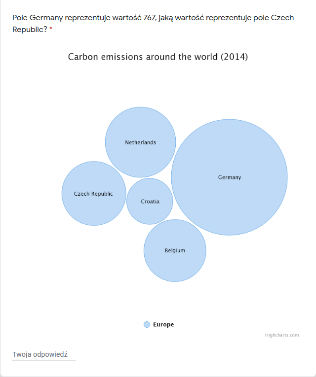
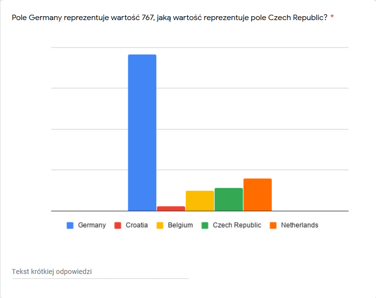
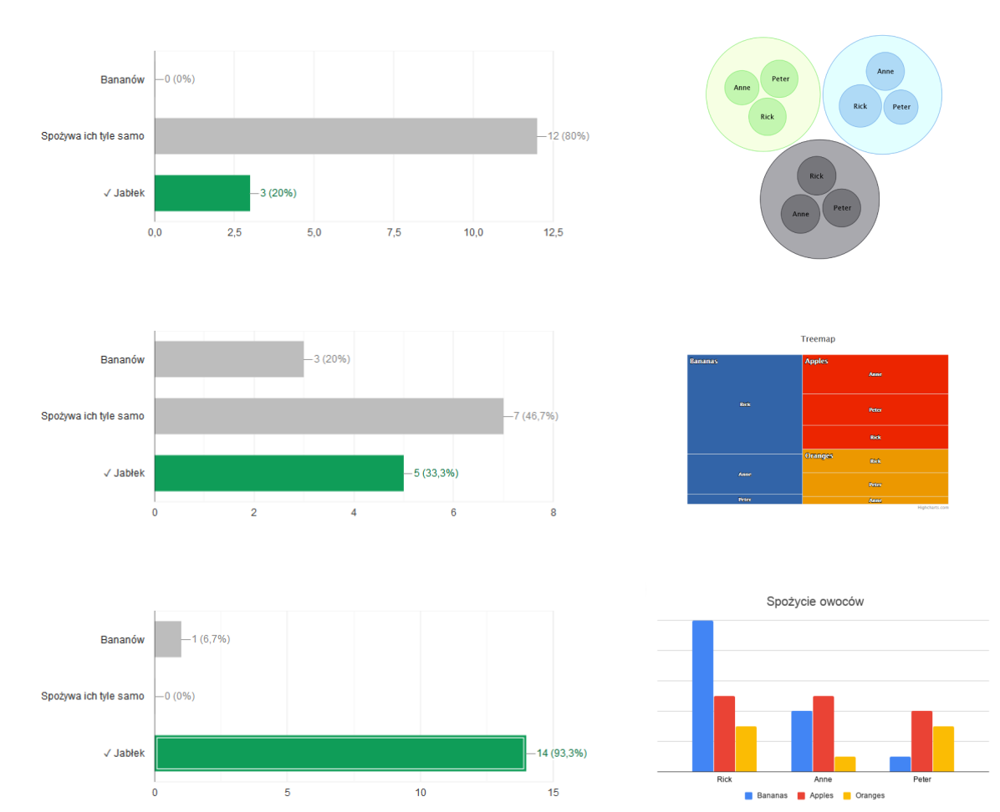

# Opis 
Celem przeprowadzonych badań było sprawdzenie w jak dużym stopniu geometria wykresu wpływa na poprawne odczytanie wartości znajdujących się na nim. Badanym zostały przedstawione 3 grupy wykresów, w każdej z grup mieli oni odpowiedzieć na to same pytanie, ale za każdym razem te same informacje były przedstawiane przy użyciu innej geometrii. Celem takiej struktury badań była obserwacja różnic w odpowiedziach, oraz sprawdzenie z jakiej geometrii wartości odczytywane są najbardziej trafnie, czyli najbliżej prawdy. Warty podkreślenia jest fakt, że wykres słupkowy pojawia się w kwestionariuszu trzykrotnie, jest to spowodowane tym, że został on przez mnie  wybrany jako "norma" tzn. do niego będę porównywał skuteczność odczytania danych z pozostałych wykresów. Zachęcam do własnego zapoznania sie z ankietą. Znajduję się ona pod linkiem: 

https://forms.gle/rr8Kmpm11inMPfvg9

# Użyte geometrie
Chciałem sprawdzić jak skuteczne są dosyć popularne sposoby prezentacji danych, oraz jakie konsekwencje niesie ze sobą użycie, tych mniej popularnych geometrii i technik. Oto spis użytych geometrii: 

* Wykres kołowy 3d 
* Wykres kołowy 
* Wykres słupkowy 
* Wykres bąbelkowy 
* "Funnel3D chart" 
* Wykres bąbelkowy z podziałem na grupy 
* Mapa drzewa  
* Wykres słupkowy z podziałem na grupy 

# Przykładowe pytanie 

W 2 grupie pytań badani mieli oszacować jaką wartość reprezentuje pole "Czech Republic" więdząc jedynie, że największemu polu "Germany" odpowiada wartości 767. Dla tej grupy pytań jesteśmy w stanie zaobserwować znaczącą różnice w udzielonych odpowiedziach, mimo że każda z gemetrii przedstawia wizualnie różnice proporcjonalne do wartościach pól. Przyjżyjmy się jednak dwóm różnym geometriom i odpowiadającym im wynikom. 

### Pytanie nr 4 w ankiecie 

Wśród przebadanych średnia wartość udzielonych odpowiedzi na to pytanie wyniosła aż 282 (poprawną odpowiedzią było 111). To o ponad 250% więcej niż wartość rzeczywista. Sytuacja wygląda jednak dużo lepiej gdy przedstawiona została inna geometria, nasza "norma", czyli wykres słupkowy. Średnia wartość odpowiedzi wyniosła w tym przypadku 119, czyli jedynie 7% procent ponad wartość rzeczywistą. Jest to satysfakcjonujący wynik.  

### Pytanie nr 6 w ankiecie 

# Podsumowanie wyników badań

### Przedmowa
W tym momencie chce stanowczo podkreślić, że grupa badanych była zdecydowanie za mała by wyciągnąć statystycznie poprawne wnioski, a także ankieta nie bada wystarczająco dokładnie tematu by dałoby się jednoznacznie określić przyczyny takich, a nie innych wyników. Jednak niech ta praca służy za wzór lub inspirację dla prawdziej pracy badawczej. 

Poniżej zamieszczam wyniki moich badań, które jak jeszcze raz podkreślę, **NIE SĄ POPRAWNNE STATYSTYCZNIE**, głównie przez wielkośc grupy badawczej.
Tych bardziej zainteresowanych odsyłam także do pliku .csv zawierającego otyginalne odpowiedzi do ankiety.

### Wyniki
Z obrazu poniżej widać, że nasza "norma" rzeczywiście uzyskała wyniki najbliższe rzeczywistym. Co ciekawe wykresy kołowe nie poradziły sobie z zadaniem dużo gorzej, chociaż dla tych w 3 wymiarach widoczne jest już odchylenie mediany od wartości rzeczywistych. Takiego wyniku się spodziewaliśmy, bo 3d zniekształca kąty wykresu kołowego, tak że niektóre wydają sie większe, a inne mniejsze niż jest to w rzeczywistości. 
Widać także, że bardziej niestandardowe formy wizualizacji danych, czyli wykresy bąbelkowe oraz funnel3d znacznie utrudiają prawidłowe odczytanie wartości. Przyjżyjmy się jeszcze grupom danych. 

### Porównanie elementów w różnych grupach 

Poniżej umieszczam wykresy odpowiedzi udzielonych w pytaniach dotyczących danych w grupach. Wyraźnie widać, że bąbelkowy wykres grupowy nie nadaje się do ilościowej reprezentacji danych, oraz tak jak w poprzednim przypadku najlepsze wyniki uzyskuje wykres słupkowy.

