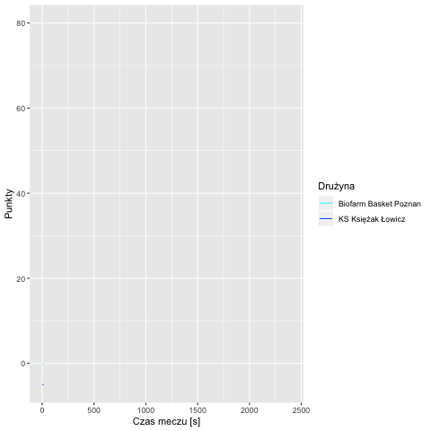
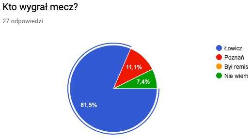
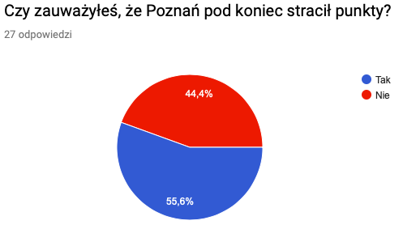
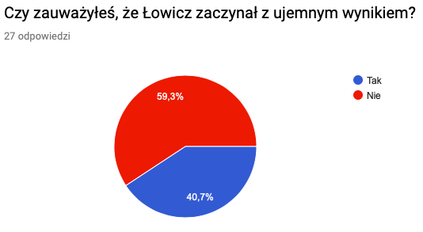
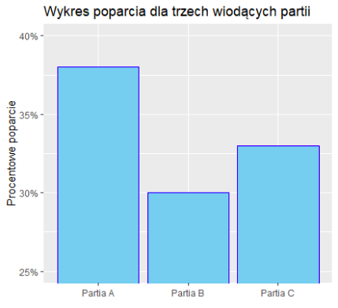
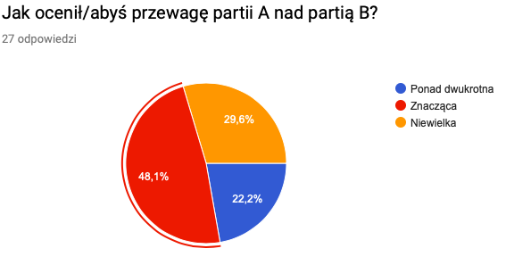
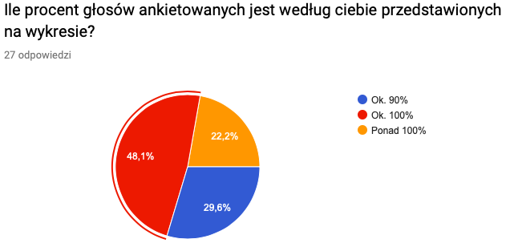

```{r setup, include=FALSE}
knitr::opts_chunk$set(echo = TRUE)
library(png)
```

## Wstęp
Celem badania było sprawdzenie jak uważnie dzisiejsze społeczeństwo obserwuje wykresy. Testowane na ankietowanych wykresy specjalnie były zrobione w sposób "błędny", aby sprawdzić, czy ich odbiorca mimo to dobrze zrozumie informacje.\
Ankieta była złożona z $2$. części. Każda z nich sprawdzała w innym stopniu uwagę odbiorcy.\
W ankiecie udział wzięło $27$ osób.\
Ankietę w pełnej okazałości można znaleść tutaj: <https://forms.gle/rx8zuYYHNtfdBVCE8>.\


# Wykres 1



## Wyniki

### Pytanie 1

Prawidłowa odpowiedź: Łowicz 




#### Wnioski

Ankietowani starali się dojrzeć, kto był ostatecznym zwycięscą meczu mimo, że było to utrudnione, ponieważ wynik był pokazany tylko przez ułamek sekundy. Wniosek: społeczeństwo jest przezwyczajone do tego wypu gif'ów i ludzie umieją wyztarczająco szybko zorientować się, co dzieje się z wykresem, żeby wyciągnąć z niego trudno dostępną, interesującą ich informację.\


### Pytanie 2



#### Wnioski
Ankietowani obserwując pnący się w górę wynik punktowy zwrócili uwagę na jego nagły spadek. Byli wystarczająco skupieni, żeby to dostrzec.\


### Pytanie 3




#### Wnioski
Ankietowani nie zauważali początkowych błędnych wartości na wykresie aż tak często jak błędów później, mimo że faktycznie dłużej były one wyświetlane na ekranie. Wnioskujemy, że nieprawidłowość statyczna jest trudniejsza dla ludzkiego oka do zauważenia, niż nieprawidłowość, która się rusza.\


# Wykres 2



## Wyniki

### Pytanie 1

Prawidłowa odpowiedź: Znacząca





#### Wnioski
Ludzki mózg jest przyzwyczajony do przypisywania wartości polom na wykresie i porównywaniu ich proporcjonalnie. Przesunięcie jednej z osi tak, by rozpoczynała się od innej wartości niż $0$, może wprowadzić odbiorcę wykresu w błąd. Ok. $22\%$ ankietowanych oceniło dane na wykresie intuicyjnie na podstawie proporcji pól. 

### Pytanie 2


Prawidłowa odpowiedź: Ponad $100\%$




#### Wnioski
Procent głosów na poszczególne partie sumuje się do nieznacznie ponad $100\%$. Tak niewielkie próby fałszowania danych są trudno dostrzegalne, szczególnie po przesunięciu osi tak, że intuicyjne wizualne sumowanie pól na wykresie wprowadza w błąd i proporcje między nimi nie odpowiadają proporcjom między wartościami. Złudzeniu temu uległa ponad połowa ankietowanych. 
