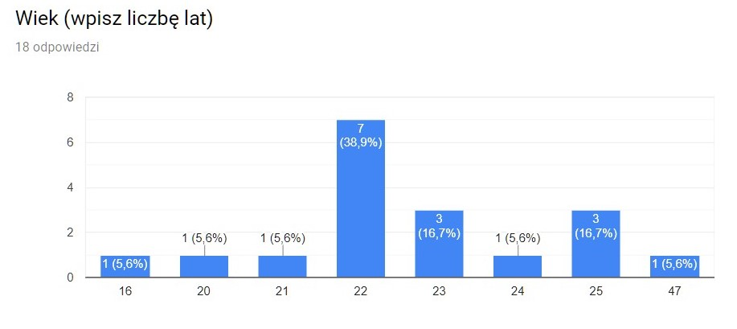
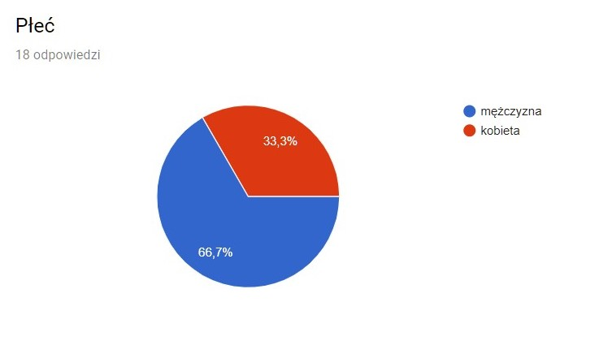
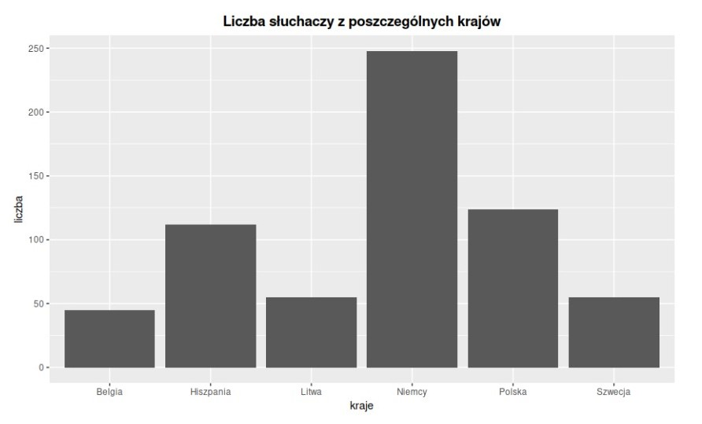
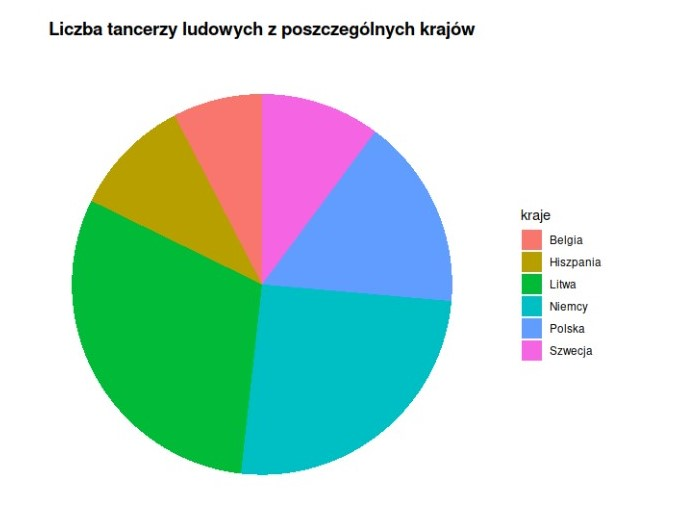
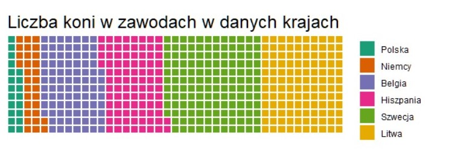
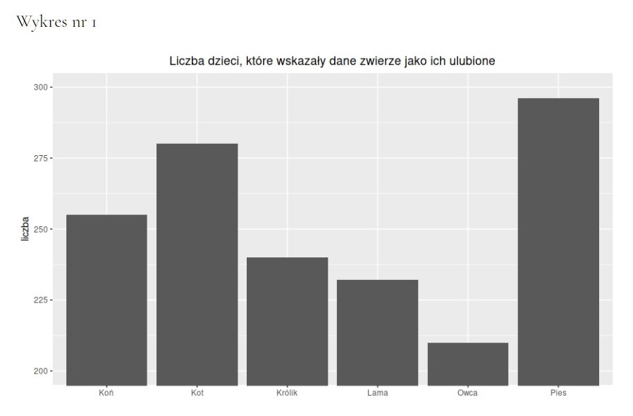
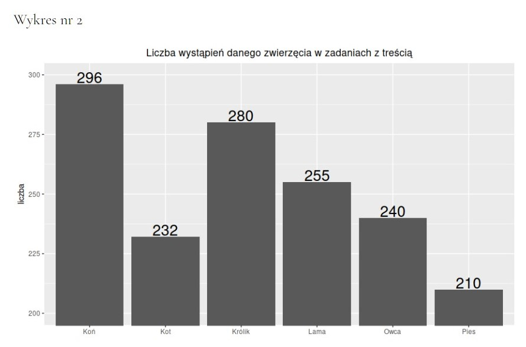
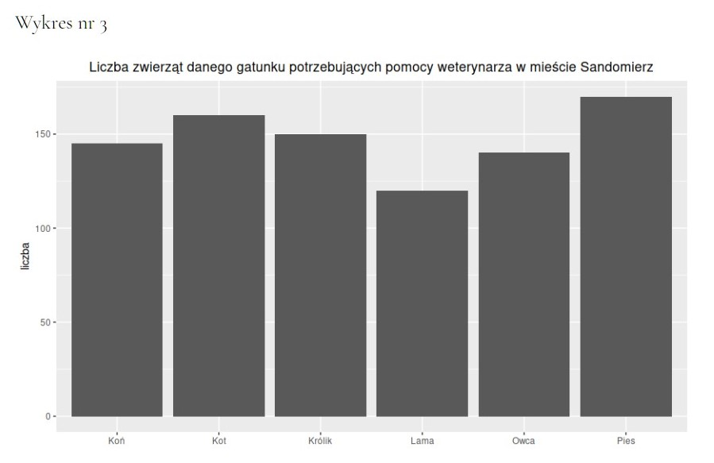

```{r setup, include=FALSE, message=FALSE}
knitr::opts_chunk$set(echo = TRUE)
```

```{r dane, include=FALSE, message=FALSE}
library(dplyr)
library(ggplot2)

wyniki <- read.csv(file = "./results/wyniki.csv")

poprawne <- c("nie", "Litwa, Szwecja", "2", "2", "Litwa", "2", "3", "Szwecja", "Belgia, Hiszpania", "2",
              "nie", "nie", "nie", "nie", "nie", "nie")

an_pytanie <- function(nr, typ, wykres) {
  data.frame(nr_pytania = nr, typ_pytania = typ, wykres = wykres, 
             procent_poprawnych_odpowiedzi = mean(wyniki[[nr]] == poprawne[nr - 1]))
}

poprawne <- an_pytanie(3, "rownolicznosc", "słupkowy") %>% 
  rbind(an_pytanie(4, "porzadek", "słupkowy")) %>% 
  rbind(an_pytanie(5, "stosunek", "słupkowy")) %>% 
  rbind(an_pytanie(6, "porzadek", "kołowy")) %>% 
  rbind(an_pytanie(7, "rownolicznosc", "kołowy")) %>% 
  rbind(an_pytanie(8, "stosunek", "kołowy")) %>% 
  rbind(an_pytanie(9, "porzadek", "waflowy")) %>% 
  rbind(an_pytanie(10, "rownolicznosc", "waflowy")) %>% 
  rbind(an_pytanie(11, "stosunek", "waflowy")) %>% 
  rbind(an_pytanie(12, "", "manipulacja")) %>% 
  rbind(an_pytanie(13, "", "manipulacja")) %>% 
  rbind(an_pytanie(14, "", "manipulacja + etykiety")) %>% 
  rbind(an_pytanie(15, "", "manipulacja + etykiety")) %>% 
  rbind(an_pytanie(16, "", "prawidlowy")) %>% 
  rbind(an_pytanie(17, "", "prawidlowy"))

```


# Wstęp

Podczas pierwszej fazy rozpoznania tematu myśleliśmy nad pomysłami, które wydawały nam się ciekawe do badania.   
Wpadliśmy w tym etapie na parę pomysłów:  
**1. percepcja kątów vs percepcja długości słupków vs percepcja pola (różne geometrie tzn. wykres kołowy, słupkowy, waflowy)**   
2. wykresy 3D i mylące porónanie wielkości  
3. jako wartości X - długie stringi - zwrócenie uwagi czy ludzie czytają dłuższe napisy  
4. wykres kołowy vs wykres liniowy  
5. czy warto używać kolorów  
**6. manipulacja skali osi**  

Wybraliśmy dwa pomysły z tej listy tj. percepcja kątów vs percepcja długości słupków vs percepcja pola oraz manipulacja skali osi (opcje pogrubione). 

# Hipotezy badawcze

## Hipoteza 1

Najlepszym wykresem do prezentacji zmiennych ilorazowych jest **wykres kolumnowy**.  

## Hipoteza 2

Ludzie **nie dostrzegają manipulacji osi** na wykresach.  

## Hipoteza 3  

**Wykres waflowy** jest wykresem czytelnym oraz powinien lepiej przedstawiać dane niż wykresy kołowe.  

# Ankieta 

## Link

Link do naszej ankiety: https://forms.gle/FmDKHoUxqBjiqvNK7

## Informacje o ankiecie

Ankieta przeprowadzona została na **18 osobach**. Staraliśmy się,aby osoby były w różnym wieku. Ankieta nie została przeprowadzona na uczestnikach przedmiotu *Techniki Wizualizacji Danych* ponieważ wierzymy, iż każdy zdawałby sobie sprawę ze zastosowanych manipulacji.  

<center>
{#id .class width=75% height=75%}
</center>

Uczestnikom prezentowane były wykresy, którym mieli się dokładnie przyjrzeć i zapamiętać je. Następnie, po każdym wykresie, wystąpiły pytania dotyczące danego wykresu **jednokrotnego wyboru**, na które badani mieli odpowiedzieć nie widząc już wykresu.  

Uczestnicy dostali najpierw **proste zadanie rozgrzewkowe** mające na celu zaznajomić ich z formą pytań w badaniu i wykluczyć ewentualnie osoby, które nie odpowiedzą na nie poprawnie. Wszyscy uczestnicy poprawnie odpowiedzili na to pytanie.  

Wśród naszych ankietowanych było 6 osób płci żeńskiej oraz 12 osób płci męskiej.

<center>
{#id .class width=65% height=65%}
</center>


# Eksperyment 1

## Zarys eksperymentu

Pierwszy eksperyment miał na celu sprawdzić, jak badani rozumieją i zapamiętują dane przedstawione za pomocą różnych geometrii: wykresu słupkowego, kołowego i waflowego (waffle chart).   
Uczestnikom zadawano po 3 pytania do każdego wykresu, poprzedzając je prezentacją tego wykresu.  
Zestaw pytań do każdego wykresu zawierał po 1 pytaniu dotyczącym:  
 - wzajemnego porządku rozmiarów zbiorów danych  
 - stosunku rozmiarów dwóch wskazanych zbiorów  
 - równości rozmiarów zbiorów  
 
 
## Wykresy do badania

Przygotowaliśmy następujące wykresy:  
1. wykres **słupkowy**   
2. wykres **kołowy**    
3. wykres **waflowy**  

Wykres słupkowy            |  Wykres kołowy           | Wykres waflowy
:-------------------------:|:------------------------:|:-------------------------:
|  | 

## Wyniki

W pytaniach dotyczących **wzajemnego porządku zbiorów wszystkie wykresy** okazały się zostać zrozumiane i **zapamiętane bardzo dobrze** - co najmniej 81.3% uczestników odpowiedziało poprawnie w każdym z nich. W pytaniu dotyczącym największego zbioru z wykresu kołowego, wbrew naszym oczekiwaniomi i mimo niewielkiej różnicy pomiędzy dwoma największymi zbiorami **100% badanych** odpowiedziało poprawnie.  

W pytaniach dotyczących **równoliczności zbiorów danych** najlepiej zrozumiany został **wykres słupkowy** - 87.5% badanych odpowiedziało na pytanie poprawnie, przy wykresie kołowym poprawnej odpowiedzi udzieliło 62.5% osób, a przy wykresie waflowym tylko 25%.  

W pytaniach dotyczących wzajemnego stosunku rozmiarów zbiorów **najlepiej zrozumiany został wykres słupkowy**, a najgorzej **waflowy** (wręcz fatalnie).  

Podsumowując, wykres słupkowy jest lepiej rozumiany i zapamiętywany, niż pozostałe dwie geometrie.

```{r fig.align='center', echo=FALSE, warning=FALSE}
ggplot(poprawne[1:9, ], aes(x = nr_pytania, y = procent_poprawnych_odpowiedzi*100, fill = wykres)) +
  geom_bar(stat = "identity") +
  ylab("Procent poprawnych odpowiedzi [%]") +
  xlab("Numer pytania") +
  scale_x_discrete(limits=c("", "", "1","2","3", "4", "5", "6", "7", "8", "9"))

```


# Eksperyment 2

## Zarys eksperymentu


Drugi eksperyment miał na celu sprawdzenie czy osoby biorące udział w ankiecie będą w stanie wychwycić pewne **manipulacje związane z wykresami**. Manipulacje stworzyliśmy za pomocą **uciętych słupków** i badaliśmy czy dani ankietowani wychwycą czy wartości zaczynają się od wartości np. 200.

Do każdego ze stworzonych wykresów zadaliśmy po **2 pytania**, poprzedzając je prezentacją tego wykresu. Zestaw pytań zawierał dwa pytania na **temat relacji: "Ile dana wielkości jest większa od drugiej?"**. Do każdego z tych trzech wykresów został stworzony **inny wykres z innymi danymi**.

## Wykresy do badania  

Przygotowaliśmy następujące wykresy:  
1. wykres 1 z **obciętymi słupkami** (zaczynającymi się od wartości 200)   
2. wykres 2 z **obciętymi słupkami + dane wartości dla danego słupka nad wykresem**    
3. wykres 3 **poprawny** (bez obciętych słupków)  

Wykres 1                   |  Wykres 2                | Wykres 3
:-------------------------:|:------------------------:|:-------------------------:
|  | 

## Wyniki

W pytaniach dotyczących: **ile razy większy jest wartość A niż wartość B** bez zaskoczenia wygrał wykres prawidłowy (w którym oś nie została obcięta). Widać, iż jeśli dodamy wartośći nad danymi wykresami ankietowani częściej dostrzegali, iż nastąpiła manipulacja danych. Około 25% ludzi przy wykresie "zmanipulowanym" uległo manipulacji.

Wyniki zgadzają się z naszymi hipotezami naukowymi.


```{r fig.align='center', echo=FALSE, warning=FALSE}
ggplot(poprawne[10:17, ], aes(x = nr_pytania, y = procent_poprawnych_odpowiedzi*100, fill = wykres)) +
  geom_bar(stat = "identity") +
  scale_x_discrete(limits=c("", "1","2","3","4","5", "6")) +
  ylab("Procent poprawnych odpowiedzi [%]") +
  xlab("Numer pytania") 


```

# Podsumowanie

Dzięki naszym badaniom widzimy, iż osoby najlepiej *czytają* wykresy słupkowe oraz fakt, iż część osób nie dostrzega manipulacji osi. **Wnioski te są zgodne z przyjętymi żałożeniami 1 oraz 2** (hipoteza badawcza). Pewnym zaskoczeniem jest fakt, iż ankietowani tak często źle odpowiadali na badania związane z wykresem waflowym. Okazał się on najmniej czytelny dla ankietowanych. Przez to **hipoteza badawcza nr 3 została odrzucona**. Warto również dodać, iż próbka ankietowanych nie jest bardzo duża (to tylko 18 osób) oraz fakt, iż główni ankietowani to osoby z naszego otoczenia - osoby studiujące oraz po studiach. Powoduje to, iż nie możemy też wyciągać daleko idących wniosków. Warto badania te również powtórzyć na bardziej zróżnicowanej próbce, aby w pełni móc wyciągać daleko idące wnioski.


