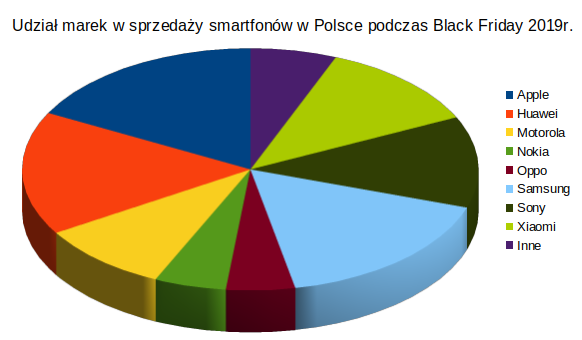
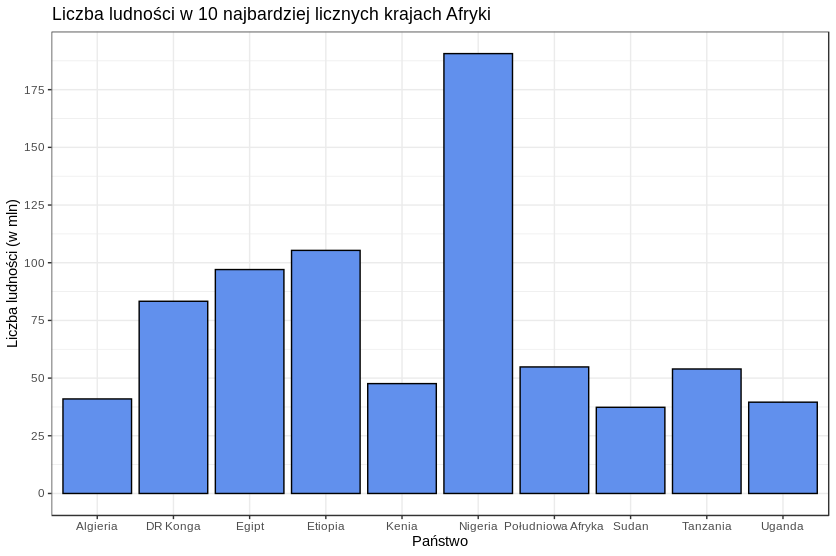

# Wprowadzenie

Celem kolejnej już pracy domowej było zbadanie czy bieżące pokolenie, które już od najmłodszych lat jest atakowane z każdej strony wszelkimi rodzajami wizualizacji danych nadal jest wrażliwe na złe praktyki w przypadku prezentacji danych wprowadzających w błąd. W tym celu należało zaprezentować próbie reprezentatywnej co najmniej 15 osób zaprezentować dwa wykresy: jeden - naszym zdaniem, wprowadzający w błąd oraz drugi, ulepszony w kwestii czytelności.

# Badane wykresy

W celu przeprowadzenia wspomnianego badanie przygotowałem dwie grafiki prezentujące dane podobnego typu. Na pierwszym z nich - wykresie kołowym, zaprezentowałem za pomocą trójwymiarowego wykresu kołowego hipotetyczny udział poszczególnych marek w sprzedaży smartfonów w trakcie niedawnego Black Friday. Oczywiście poszczególne obserwacje zostały tu przedstawione przy pomocy udziału w całości handlu.<br>Liczba obserwacji: 9<br>
<center>

</center>

Na drugiej grafice przedstawiony został wykres kolumnowy prezentujący liczbę ludności w 10 najbardziej licznych krajach Afryki. Dane zostały pobrane z Wikipedii.
<center>

</center>

# Ankieta

Treść formularza, z jakim zetknęli się respondenci znajduje się pod adresem: https://forms.gle/j695eHH2aV8c36gUA. Starałem się aby w badaniu wzięły udział zróżnicowane grupy społeczne, na co dzień niezwiązane z wizualizacją danych. Niestety, w trakcie trwania badania zmuszony byłem dokonać korekty jednego z pytań, wobec czego nie wszystkie odpowiedzi są pełne. Łączna liczba uczestników wynosi 29, a na każde pytanie zebrałem co najmniej 19 odpowiedzi. <br>
Pytania, znajdujące się pod wykresami, dotyczyły informacji zawartych na grafice. Ankietowani zostali poproszeni o wybór czterech marek oraz państw o największej wartości, porównaniu kilku obserwacji a także wybór obserwacji o najmniejszej liczbie. 

# Wyniki badania

### Wykres kołowy
Pierwszym, najbardziej zaskakującym wynikiem badania, jest liczba poprawnych odpowiedzi na pytanie 1.4: "Wybierz 4. najchętniej kupowaną markę telefonów". Właściwych odpowiedzi, jaką była marka Sony (6000), dokonało <b>0</b> osób. Najczęściej wskazywano Xiaomi (5800, różnica 3,5%) i jest to dowód na zaburzenie percepcji przez trójwymiarowe wykresy kołowe (prawdopodobnie części znajdujące się bliżej pionowej osi symetrii zdają się większe). Wobec tego, w dalszej części podsumowania, to pytanie <u>nie zostanie uwzględnione</u>. Sony sprawiło problem także w innym pytaniu, w którym należało porównać sprzedaż japońskiego producenta z Xiaomi. Jedynie <b>11%</b> poprawnie wskazała pierwszą z nich jako tę chętniej kupowaną (chociaż jedna z tych osób w poprzednim zadaniu umieściła Xiaomi na wyższej pozycji). W związku z tym <b>żadna</b> osoba nie odpowiedziała poprawnie na cały zestaw pytań dotyczący wykresu kołowego. W trzecim pytaniu właściwą odpowiedź - Oppo - wskazało <b>72,4%</b> osób.

```{r wyniki, include = FALSE}
library(dplyr)
library(tidyr)
library(wesanderson)
library(ggplot2)
options(stringsAsFactors = FALSE)
data <- read.csv("AnkietaCzytelnosci.csv")
smartfony <- data.frame(marka = c("Apple", "Huawei", "Motorola", "Nokia", "Oppo", "Samsung", "Sony", "Xiaomi", "Inne"),
                        sprzedaz = c(8500, 8100, 4600, 2500, 2400, 8200, 6000, 5800, 3000))
kraje <- data.frame(panstwo = c("Algieria", "DR Konga", "Egipt", "Etiopia", "Kenia", "Nigeria", "Południowa Afryka", "Sudan", "Tanzania", "Uganda"),
                    ludnosc = c(190632261, 105350020, 97041072, 83301151, 54841552, 53950935, 47615739, 40969443, 39570125, 37345935))
odp <- c("Apple", "Samsung", "Huawei", "Sony", 1, 1, 1, 1, "Oppo", "Nigeria", "Etiopia", "Egipt", "DR Konga", 2, 2, 2, 2, "Sudan")
data %>%
  filter(A1.4 == odp[4])
data %>%
  summarise(mean(A3==odp[18]))
data %>%
  summarise(mean(B3==odp[18]))

```

### Wykres kolumnowy
W wykresie kolumnowym nie doszło do tak spektakularnych wyników jak w przypadku kołowego. Pytaniem z największą rozbieżnością odpowiedzi okazało się 2.1 - porównanie Algierii oraz Tanzanii (różnica 31,7%). Lepszych odpowiedzi udzielono nawet na pytanie o porównanie Sudanu z Ugandą, gdzie różnica wynosiła 6% (względem "całości", tj. w tym przypadku ludności Nigerii, ludność Sudanu to 19,6%, a Ugandy 20,8%. Za "całość" przyjąłem największą z wartości). W ostatnim pytaniu poprawnej odpowiedzi - "Sudan" - udzieliło <b>82,8%</b> osób.

# Podsumowanie
Oprócz zbieranych odpowiedzi na pytania, postanowiłem zebrać kilka dodatkowych danych, takich jak grupa wiekowa czy kierunek studiów wśród studentów. Zdecydowałem się na wybór najciekawszych grup społecznych oraz porównanie ich pod względem umiejętności czytania. Wybrane grupy to: studenci medycyny, reprezentowani przez 11 osób oraz dzieci - osoby poniżej 18 roku życia, których wzięło udział 4. Wyniki prezentują się następująco (przypominam, że pytania 1.4 oraz 2.4 dot. wykresów kołowych <u>nie są brane pod uwagę</u>):

```{r podsumowanie, include = FALSE, echo = TRUE}

ovrl = c() 

ovrl[1] <- data %>%
  filter("" != A1.1 & "" != A1.2 & "" != A1.3 & "" != A1.4) %>%
  summarise(mean(A1.1 == odp[1] & A1.2 == odp[2] & A1.3 == odp[3]))

ovrl[2] <- data %>%
  filter(any(c(A2.1, A2.2, A2.3, A2.4))) %>%
  summarise(mean(A2.1 == odp[5] & A2.2 == odp[6] & A2.3 == odp[7] , na.rm = TRUE))

ovrl[3] <- data %>%
  filter("" != A3) %>%
  summarise(mean(A3 == odp[9]))

ovrl[4] <- data %>%
  filter("" != B1.1 & "" != B1.2 & "" != B1.3 & "" != B1.4) %>%
  summarise(mean(B1.1 == odp[10] & B1.2 == odp[11] & B1.3 == odp[12] & B1.4 == odp[13]))

ovrl[5] <- data %>%
  filter(any(c(B2.1, B2.2, B2.3, B2.4))) %>%
  summarise(mean(B2.1 == odp[14] & B2.2 == odp[15] & B2.3 == odp[16] & B2.4 ==odp[17], na.rm = TRUE))

ovrl[6] <- data %>%
  filter("" != B3) %>%
  summarise(mean(B3 == odp[18]))

ovrl <- unlist(ovrl)
##########
#MEDYCYNA#
##########
med <- c()

med[1] <- data %>%
  filter("" != A1.1 & "" != A1.2 & "" != A1.3 & "" != A1.4 & KIERUNEK == "Lekarski") %>%
  summarise(mean(A1.1 == odp[1] & A1.2 == odp[2] & A1.3 == odp[3]))

med[2] <- data %>%
  filter(any(c(A2.1, A2.2, A2.3, A2.4)) & KIERUNEK == "Lekarski") %>%
  summarise(mean(A2.1 == odp[5] & A2.2 == odp[6] & A2.3 == odp[7], na.rm = TRUE))

med[3] <- data %>%
  filter("" != A3 & KIERUNEK == "Lekarski") %>%
  summarise(mean(A3 == odp[9]))

med[4] <- data %>%
  filter("" != B1.1 & "" != B1.2 & "" != B1.3 & "" != B1.4 & KIERUNEK == "Lekarski") %>%
  summarise(mean(B1.1 == odp[10] & B1.2 == odp[11] & B1.3 == odp[12] & B1.4 == odp[13]))

med[5] <- data %>%
  filter(any(c(B2.1, B2.2, B2.3, B2.4) & KIERUNEK == "Lekarski")) %>%
  summarise(mean(B2.1 == odp[14] & B2.2 == odp[15] & B2.3 == odp[16] & B2.4 == odp[17], na.rm = TRUE))

med[6] <- data %>%
  filter("" != B3 & KIERUNEK == "Lekarski") %>%
  summarise(mean(B3 == odp[18]))
med <- unlist(med)
########
#DZIECI#
########
dzieci <- c()

dzieci[1] <- data %>%
  filter("" != A1.1 & "" != A1.2 & "" != A1.3 & "" != A1.4 & WIEK == "Mniej niż 18") %>%
  summarise(mean(A1.1 == odp[1] & A1.2 == odp[2] & A1.3 == odp[3]))

dzieci[2] <- data %>%
  filter(any(c(A2.1, A2.2, A2.3, A2.4)) & WIEK == "Mniej niż 18") %>%
  summarise(mean(A2.1 == odp[5] & A2.2 == odp[6] & A2.3 == odp[7], na.rm = TRUE))

dzieci[3] <- data %>%
  filter("" != A3 & WIEK == "Mniej niż 18") %>%
  summarise(mean(A3 == odp[9]))

dzieci[4] <- data %>%
  filter("" != B1.1 & "" != B1.2 & "" != B1.3 & "" != B1.4 & WIEK == "Mniej niż 18") %>%
  summarise(mean(B1.1 == odp[10] & B1.2 == odp[11] & B1.3 == odp[12] & B1.4 == odp[13]))

dzieci[5] <- data %>%
  filter(any(c(B2.1, B2.2, B2.3, B2.4) & WIEK == "Mniej niż 18")) %>%
  summarise(mean(B2.1 == odp[14] & B2.2 == odp[15] & B2.3 == odp[16] & B2.4 == odp[17], na.rm = TRUE))

dzieci[6] <- data %>%
  filter("" != B3 & WIEK == "Mniej niż 18") %>%
  summarise(mean(B3 == odp[18]))

dzieci <- unlist(dzieci)

toplot <- data.frame(nr = rep(1:3, 2), ovrl = ovrl, med = med, dzieci = dzieci)
toplot2 <- gather(toplot, Var,Value,-nr)
toplot2[,4] <- rep(rep(c("Wykres Kołowy", "Wykres Kolumnowy"), each = 3), 3)
```
<center>
```{r plot, echo = FALSE}

toplot2 %>%
  ggplot(aes(x = nr, y = Value, fill = Var)) +
  geom_col(position = "dodge", color = "#111111") +
  facet_grid(. ~ V4) +
  geom_text(label = paste0(round(toplot2$Value, 2)*100, "%"),hjust = 1.2, vjust = rep(c(2.7, 0.5, -1.77), each=6), size = 4,
            color = "black", angle = 90)+
  theme_bw() +
  scale_y_continuous(breaks = seq(0, 1, 0.25), labels = paste0(seq(0, 100, 25), "%")) +
  xlab("Numer pytania") +
  ylab("Procent poprawnych odpowiedzi") +
  theme(legend.title = element_blank(),
        legend.key.size = unit(1, "cm")) +
  scale_fill_manual(values = c("#98e690","#e6b9a1", "#e6e6ca"), labels = c("Dzieci poniżej\n18. roku życia", "Studenci\nmedycyny", "Średni wynik")) + 
  ggtitle("Porównanie odsetków poprawnych odpowiedzi w różnych\ngrupach społecznych względem różnych wizualizacji")
  
```
</center>

Odczytując informacje z powyższego wykresu nasuwa się jedynie jeden wniosek: czyżby rosło nowe, lepsze pokolenie, przygotowane do oczytywania informacji z wykresów kołowych?