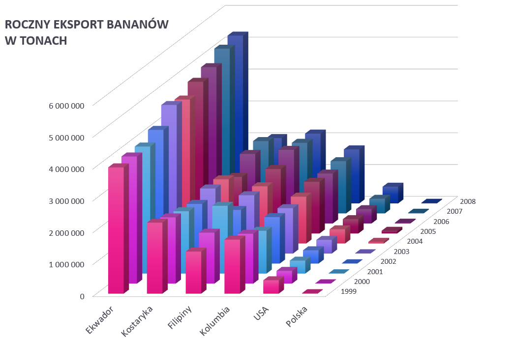
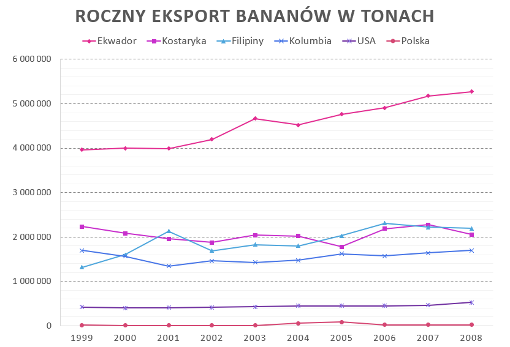

```{r setup, include=FALSE}
knitr::opts_chunk$set(echo = TRUE)
library(ggplot2)
library(patchwork)
data <- read.csv("Wykresyy.csv", sep = ";", encoding = "UTF-8")
data <- data.frame(lapply(data, as.character), stringsAsFactors=FALSE)
```

## Pierwszy wykres - 3D barplot


## Drugi wykres - wykres liniowy


## Ankieta
https://docs.google.com/forms/d/e/1FAIpQLScyPWOt0lMXjCfAfGwUG1hmmzT0btuL8xhGRe5nIs4djd3Pzw/viewform

W ankiecie zadane były następujące pytania do obu wykresów:

1. W którym roku Ekwador po raz pierwszy przekroczył 5 000 000 ton eksportowanych bananów?

2. Kto sprzedaje więcej bananów: Kostaryka czy Kolumbia? 

3. Czy w 2005 roku więcej bananów sprzedała Kostaryka czy Filipiny?

A takze zostało zadane pytanie o to, który wykres jest czytelniejszy i który ładniej wygląda.

Poniżej zamieszczone zostały odpowiedzi 16 losowych osób na pytania: zielonym kolorem zaznaczona jest poprawna odpowiedź, czerwonym błędna.


```{r, echo=FALSE, fig.width=8}
p11 <- ggplot(data) +
  geom_bar(aes(x = Pyt.1.Wykres.3D ,
              fill = Pyt.1.Wykres.3D), 
              width = 0.6 ) +
  theme(legend.position = "none", panel.background = element_blank()) + 
  scale_fill_manual(values = c('firebrick', 'firebrick', 'firebrick', 'forestgreen', 'firebrick' ))

p12 <- ggplot(data) +
  geom_bar(aes(x = Pyt.2.Wykres.3D ,
              fill = Pyt.2.Wykres.3D), 
              width = 0.7 ) +
  scale_y_continuous(breaks = c(0, 1, 2, 3, 4, 5, 6, 7, 8, 9)) +
  theme(legend.position = "none", panel.background = element_blank()) + 
  scale_fill_manual(values = c('forestgreen', 'firebrick' ))

p13 <- ggplot(data) +
  geom_bar(aes(x = Pyt.3.Wykres.3D ,
              fill = Pyt.3.Wykres.3D), 
              width = 0.7 ) +
  scale_y_continuous(breaks = c(0, 1, 2, 3, 4, 5, 6, 7, 8, 9)) +
  theme(legend.position = "none", panel.background = element_blank()) + 
  scale_fill_manual(values = c('forestgreen', 'firebrick', 'firebrick' ))

p21 <- ggplot(data) +
  geom_bar(aes(x = Pyt.1.Wykres.2D ,
              fill = Pyt.1.Wykres.2D), 
              width = 0.7 ) +
  scale_y_continuous(breaks = c(0, 1, 2, 3, 4, 5, 6, 7, 8, 9, 10)) +
  theme(legend.position = "none", panel.background = element_blank()) + 
  scale_fill_manual(values = c('firebrick', 'forestgreen', 'firebrick' ))

p22 <- ggplot(data) +
  geom_bar(aes(x = Pyt.2.Wykres.2D ,
              fill = Pyt.2.Wykres.2D), 
              width = 0.7 ) +
  scale_y_continuous(breaks = c(0, 1, 2, 3, 4, 5, 6, 7, 8, 9, 10, 11, 12)) +
  theme(legend.position = "none", panel.background = element_blank()) + 
  scale_fill_manual(values = c('forestgreen', 'firebrick' ))

p23 <- ggplot(data) +
  geom_bar(aes(x = Pyt.3.Wykres.2D ,
              fill = Pyt.3.Wykres.2D), 
              width = 0.7 ) +
  scale_y_continuous(breaks = c(0, 1, 2, 3, 4, 5, 6, 7, 8, 9, 10, 11, 12, 13)) +
  theme(legend.position = "none", panel.background = element_blank()) + 
  scale_fill_manual(values = c('forestgreen', 'firebrick', 'firebrick' ))

p31 <- ggplot(data) +
  geom_bar(aes(x = Ktory.wykres.ci.sie.bardziej.podoba. ,
              fill = Ktory.wykres.ci.sie.bardziej.podoba.), 
              width = 0.5 ) +
  scale_y_continuous(breaks = c(0, 1, 2, 3, 4, 5, 6, 7)) +
  theme(legend.position = "none", panel.background = element_blank()) + 
  scale_fill_manual(values = c('maroon1', 'darkorchid1', 'darkorchid4' ))

p32 <- ggplot(data) +
  geom_bar(aes(x = Ktory.wykres.jest..bardziej.czytelny. ,
              fill = Ktory.wykres.jest..bardziej.czytelny.), 
              width = 0.7 ) +
  scale_y_continuous(breaks = c(0, 1, 2, 3, 4, 5, 6, 7, 8, 9, 10, 11, 12, 13 ,14, 15)) +
  theme(legend.position = "none", panel.background = element_blank()) + 
  scale_fill_manual(values = c('darkorchid1', 'darkorchid4'))

(p11 + p12 + p13) / (p21 + p22 + p23)

p31 + p32
  
```


Wykresy kolumnowe dobre właśnie są do porównywania i odczytywania danych. Jednak jak widać z odpowiedzi, po przerobieniu go na wykres 3D ludzie uniwersalnie nie są w stanie trafnie określić dokładnej wartości którą przedstawiają pojedyncze kolumny. Do tego głosujący prawie jednogłośnie ocenili, że wykres liniowy jest czytelniejszy niż 3D wykres słupkowy, co mówi samo za siebie. Jedynym walorem wykresu 3D może być tylko estetyka, ale to też jest wątpliwe.

## Konkluzja

3d barploty są bezwartościowe i nie powinno się ich używać.
