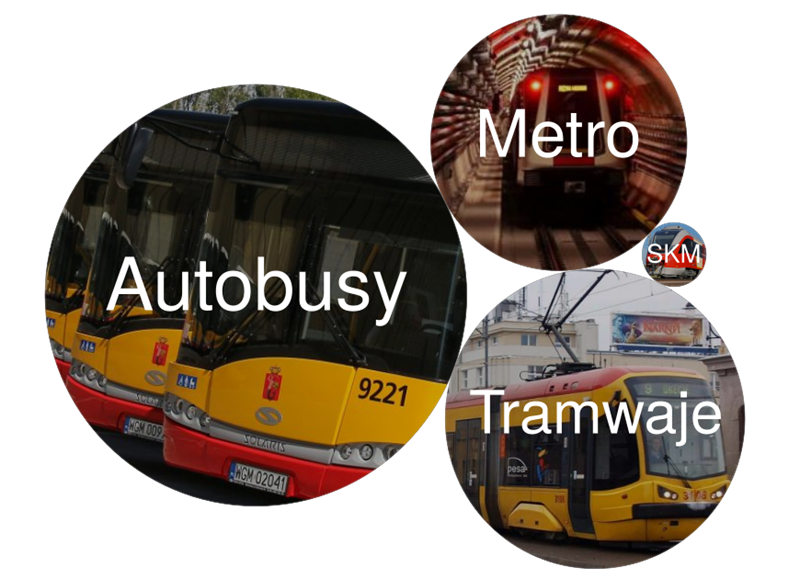
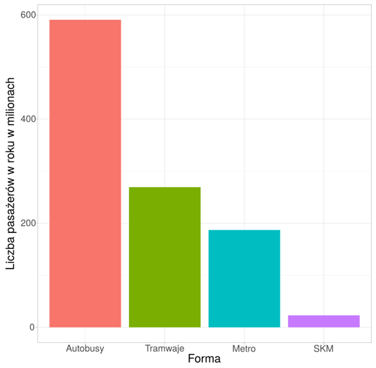
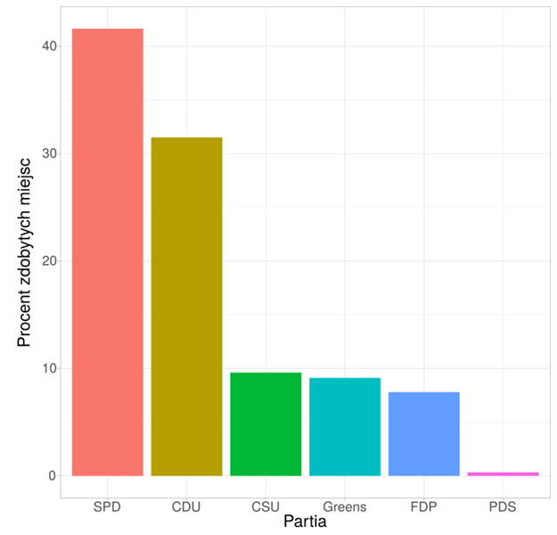

```{r setup, include=FALSE}
knitr::opts_chunk$set(echo = TRUE)
library(dplyr)
library(tidyr)
library(ggplot2)
library(scales)
library(knitr)
library(stringi)

#https://en.wikipedia.org/wiki/2002_German_federal_election
election <- data.frame(name=c("SPD","CDU","CSU","Greens","FDP","PDS"),
                      seats=c(251,190,58,55,47,2),
                      stringsAsFactors=F)
election$percent <- 100*election$seats/sum(election$seats)
election$name <- factor(election$name, election$name)
row.names(election) <- election$name

#2017 rok
#https://warszawa.stat.gov.pl/dane-o-wojewodztwie/stolica-wojewodztwa/transport/
transport <- data.frame(name=c("Autobusy", "Tramwaje", "Metro", "SKM"),
                        value=c(590739000, 269240000, 187000000, 23071000),
                        stringsAsFactors=F)
transport$percent <- 100*transport$value/sum(transport$value)
transport$name <- factor(transport$name, transport$name)
row.names(transport) <- transport$name

repl <- function(x) { stri_replace_all_fixed(x, "Zieloni - Greens", "Greens") }
answers <- read.csv(file = 'wyniki.csv', sep = ',', stringsAsFactors=F) %>%
            mutate_if(is.character, repl)
n <- nrow(answers)

correct.tra1 <- transport["Autobusy","value"] / transport["Metro","value"]
transport["Autobusy","percent"] - transport["Tramwaje","percent"] - transport["Metro","percent"]
# [1] 12.56941
correct.tra2 <- "Mniej, niż autobusy"
correct.tra3 <- transport["SKM", "percent"]
correct.ele1 <- election["Greens", "percent"]
election["CSU", "seats"]-election["Greens", "seats"]
# [1] 3
correct.ele2 <- "CSU"
correct.ele3 <- (election %>% filter(election["SPD","percent"] + percent > 50, name!="SPD") %>%
                    arrange(seats))$name[1] %>% as.character
#correct.ele3 <- (election %>% filter(election["SPD","percent"] + percent > 50, name!="SPD") %>% arrange(seats))$percent[1]
```

## Ankieta

[LINK DO ANKIETY](https://l.facebook.com/l.php?u=https%3A%2F%2Fforms.office.com%2FPages%2FResponsePage.aspx%3Fid%3DnCJQO3jNiEWbz5e3Yp4vD2G6lRiaf15ArzAoMSYSC4ZUQkNEM1RKQ1REVVRMVENOUEVDOVZCT1BWUy4u%26fbclid%3DIwAR1phq5M_qa03wPY8HHNb5x8xd3vuBzTO8DoJYyPdLxfNOwLSVNvQ6bAHa0&h=AT0UF_nMNCEbYC7EEOlkPXuohAhGKJO-splvA_7pPRwGVWBQPv5sUrhE9y8EhSgX37FluwOwvbaJ7H2amXd8vOL1WBmQsjb83LpngqRHlyLL5DjrW55FdJbNVFoHXQ)

Ankieta o środkach transportu i wynikach wyborów w Niemczech miała na celu sprawdzenie jak różne rodzaje wykresów wpływają na czytelność danych w nich zawartych oraz jakie problemy z czytaniem danych występują w przypadku określonych rodzajów wykresów.

Sprawdziliśmy jaki błąd popełniają osoby odczytujące wykresy treemap oraz bubble chart w odniesieniu do wykresu słupkowego. Wpierw pokazaliśmy im testowyany wykres i zadaliśmy 3 pytania, a następnie pokazaliśmy wykres wzorcowy - słupkowy i ponownie zadaliśmy te same pytania.

### Dane o środkach transportu
Wykres bąbelkowy|Wykres słupkowy
-|-
|

#### Pytania

1. Ile razy więzej przewozów wykonały autobusy niż metro?
2. Ile przewozów wykonały tramwaje + metro? (z dokładnością do 10% całości)

  * Mniej niż autobusy
  * Więcej niż autobusy
  * Tyle samo co autobusy

3. Jaki udział w % we wszystkich przewozach ma SKM?

### Dane o wyborach w niemczech
Treemap|Wykres słupkowy
-|-
|

#### Pytania

1. Oszacuj jaki % miejsc przypadł partii zielonych (Greens)
2. Która partia dostała więcej miejsc, CSU czy Zieloni
3. Reprezentujesz partię SPD. Koalicja z jaką najmniejszą partią zapewni ci więcej niż połowę miejsc.

## Bubble Chart

### Porównanie błędów
```{r, echo=FALSE, fig.show = "hide", fig.height=5, fig.width=3}
answers.gather <- data.frame(t1=c(answers$a1,answers$b1), t2=c(answers$a2,answers$b2), t3=c(answers$a3,answers$b3),
                             e1=c(answers$c1,answers$d1), e2=c(answers$c2, answers$d2), e3=c(answers$c3, answers$d3),
                             type=c(rep("test",n),rep("bars",n)), stringsAsFactors=F)

ggplot(answers.gather, aes(x=type, y=abs(t1-correct.tra1))) +
  geom_boxplot() +
  scale_x_discrete(labels=c(test="Bubble chart", bars="Wykres słupkowy")) +
  xlab("Typ wykresu") +
  ylab("Błąd bezwzględny")


ggplot(answers.gather, aes(x=type, y=as.numeric(t2!=correct.tra2))) +
  stat_summary(fun=function(x) { 100*mean(x) }, geom="bar") +
  scale_x_discrete(labels=c(test="Bubble chart", bars="Wykres słupkowy")) +
  xlab("Typ wykresu") +
  ylab("Procent błędnych odpowiedzi")

ggplot(answers.gather, aes(x=type, y=abs(t3-correct.tra3))) +
  geom_boxplot() +
  scale_x_discrete(labels=c(test="Bubble chart", bars="Wykres słupkowy")) +
  scale_y_log10(breaks = trans_breaks("log10", function(x) 10^x, n=10),
                labels = trans_format("log10", function(x) format(round(10^x, 1), nsmall=1))) +
  xlab("Typ wykresu") +
  ylab("Błąd bezwzględny")


plots <- rbind(sprintf("", opts_current$get("fig.path"), opts_current$get("label"), 1:3))
colnames(plots) <- c("Porównanie wartości - Pytanie 1", "Dodawanie wartości - Pytanie 2", "Szacowanie wartości - Pytanie 3")
kable(plots, align="c")
```

## Treemap

### Porównanie błędów
```{r, echo=FALSE, fig.show = "hide", fig.height=5, fig.width=3}

ggplot(answers.gather, aes(x=type, y=abs(e1-correct.ele1))) +
  geom_boxplot() +
  scale_x_discrete(labels=c(test="Treemap", bars="Wykres słupkowy")) +
  scale_y_log10(breaks = trans_breaks("log10", function(x) 10^x, n=10),
                labels = trans_format("log10", function(x) format(round(10^x, 1), nsmall=1))) +
  xlab("Typ wykresu") +
  ylab("Błąd bezwzględny")


ggplot(answers.gather, aes(x=type, y=as.numeric(e2!=correct.ele2))) +
  stat_summary(fun=function(x) { 100*mean(x) }, geom="bar") +
  scale_x_discrete(labels=c(test="Treemap", bars="Wykres słupkowy")) +
  xlab("Typ wykresu") +
  ylab("Procent błędnych odpowiedzi")

#ggplot(answers.gather, aes(x=type, y=abs(election[e3,"percent"]-correct.ele3))) +
#  geom_boxplot() +
#  geom_jitter(alpha=0.5, height=0.1) +
#  scale_x_discrete(labels=c(test="Treemap", bars="Wykres słupkowy")) +
#  xlab("Typ wykresu") +
#  ylab("Błąd bezwzględny")

ggplot(answers.gather, aes(x=type, y=as.numeric(e3!=correct.ele3))) +
  stat_summary(fun=function(x) { 100*mean(x) }, geom="bar") +
  scale_x_discrete(labels=c(test="Treemap", bars="Wykres słupkowy")) +
  xlab("Typ wykresu") +
  ylab("Procent błędnych odpowiedzi")


plots <- rbind(sprintf("", opts_current$get("fig.path"), opts_current$get("label"), 1:3))
colnames(plots) <- c("Szacowanie wartości - Pytanie 1", "Porównywanie wartości - Pytanie 2", "Precyzyjne dodawanie wartości - Pytanie 3")
kable(plots, align="c")
```

## Stosunek błędów
Podzieliśmy błąd przy odczytywaniu z wykresu bąbelkowego przez błąd przy odczytywaniu z wykresu słupkowego

```{r, fig.width=8, echo=FALSE, out.width="100%"}
error.diff <- data.frame(diff=c(abs(answers$a1-correct.tra1) / abs(answers$b1-correct.tra1),
                                abs(answers$a3-correct.tra3) / abs(answers$b3-correct.tra3),
                                abs(answers$c1-correct.ele1) / abs(answers$d1-correct.ele1)),
                         chart=as.factor(c(rep(1,n),rep(3,n),rep(4,n))))

ggplot(error.diff, aes(x=chart, y=diff)) +
  geom_boxplot() +
  geom_jitter(width=0.2, alpha=0.6) +
  scale_x_discrete(labels=c("1"="Porównywanie wartości\nBubble chart", "3"="Szacowanie wartości\nBubble chart", "4"="Szacowanie wartości\nTreemap")) +
  geom_hline(yintercept=1, color="red") +
  scale_y_log10(breaks = trans_breaks("log10", function(x) 10^x, n=7),
                labels = trans_format("log10", function(x) format(round(10^x, 1), nsmall=1))) +
  xlab("") +
  ylab("Iloraz błędów")
```

## Wnioski

W przypadku gdy trzeba porównywać wielkości niemal zawsze odpowiedzi z wykresu bąbelkowego były błędne. Treemap też nie wypadła za dobrze - około 70% pytanych odpowiedziało niepoprawnie na pytanie 2.

Konkretniej, bardzo mylące jest ‚dodawanie’  wartości bąbelków - w pytaniu 2. aż 90% pytanych odpowiedziało źle na pytanie związane z oszacowaniem wartości dwóch mniejszych bąbelków vs jednego większego.

Jeśli chodzi o szacowanie wartości to najbardziej zwodniczym okazał się wykres typu Treemap, natomiast w wykresie bąbelkowym błąd bezwzględny był skupiony wokół 3 - dużo osób odpowiadało 5, gdy poprawna odpowiedź to 2.15 może świadczyć to o pewnej skłonności wszystkich czytających wykres - wszyscy nabrali się w ten sam sposób.
