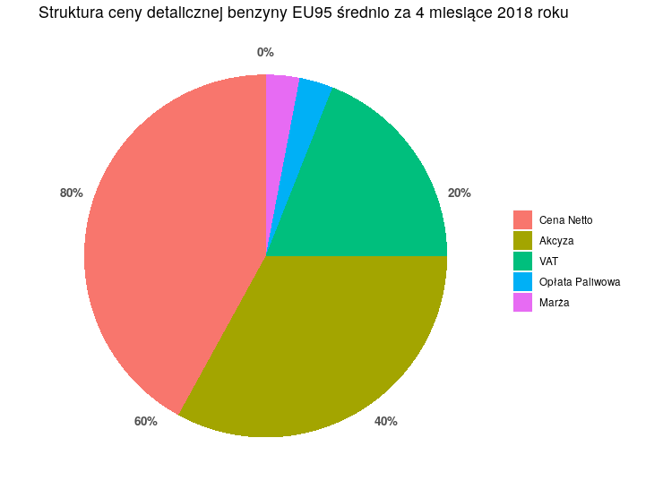
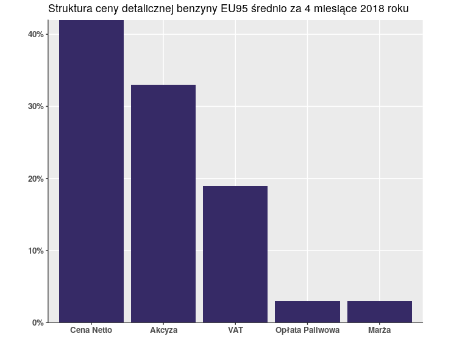
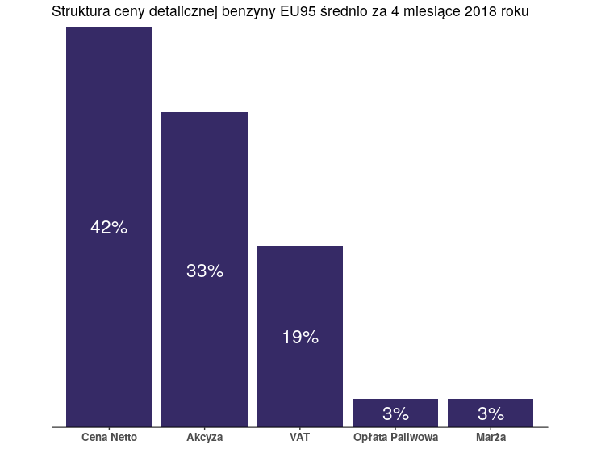
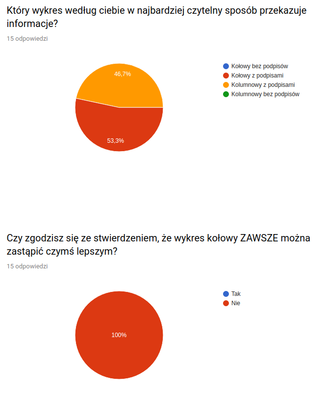

Zadaniem było przeprowadzenie eksperymentu na temat odczytywania danych z wykresów [Link](https://docs.google.com/forms/d/e/1FAIpQLScZ8O8L05DUyeYf5kjAFFCgaeyaT_T88XCtCmYANyf6VNjwGQ/viewform).

Moją grupą badawczą byli studenci uczelni wyższych, jednak w żaden sposób niepowiązani z analizą czy wizualizacją danych.

Pierwszym zadaniem dla ankietowanych było wybranie wykresu, który ich zdaniem najlepiej przedstawia pewne dane:

Następnie trzeba było wyrazić opinię, czy wykresy kołowe są zawsze gorszym wyborem.

Wyniki prezentuja się następująco:

Okazuje się, że trend nauczany na zajęciach nie jest w ogóle znany społeczeństwu. Ludzie nie znają powodów, dla których wykresy kołowe miałyby być gorszym wyborem.